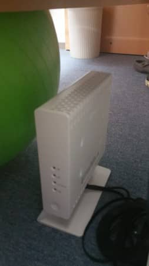

MSENの桝田です。
 
今日も快晴ですね。
 
さて、事務所移転以降、唯一悩まされていたこと・・・・。
Docomo携帯の電波が弱いこと。。
 
移転直後に、Docomoさんに相談して、[レピーター](https://www.nttdocomo.co.jp/support/area/radio_support/solution/repeater/)という機器を貸し出してもらってテストしましたが、改善せず、さらに相談すると、調査員が来てくれて電波の調査を行っていただきました。

結果、周波数帯などの問題でなかなか改善は難しいということでした。
 
それが、9月半ば頃だったのですが、その調査の時に、[フェムトセル](https://www.nttdocomo.co.jp/support/area/radio_support/solution/)というものを提案いただきました。
 
これは、インターネット回線を利用して設置できる小型の電波基地局のようで、すぐにお願いしました。
インターネット回線はNTTであることが条件のようでした。
 
法務局への登録などが必要で、少し時間がかかりやっと昨日、取り付けてもらうことが出来ました。

接続としては、
光ファイバー
　→ONU
　　→フェムトセル

という感じで、開局の設定などはDocomoの方々に行ってもらいました。
 
携帯側からは切り替わりは特に分からず、安定して電波がよくなりました。
 
これらの費用は無料・・・さすがDocomoさんです。
感謝です。
 
以上、桝田がお届けしました。

（本記事は過去ブログからの移行記事です。）