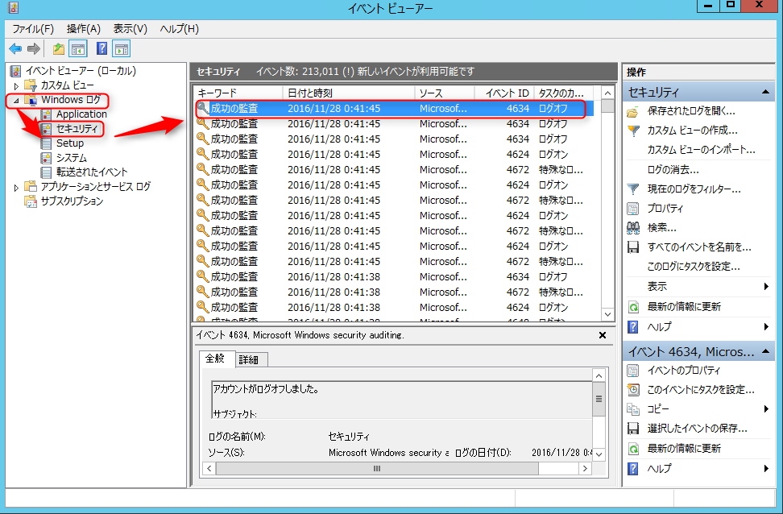
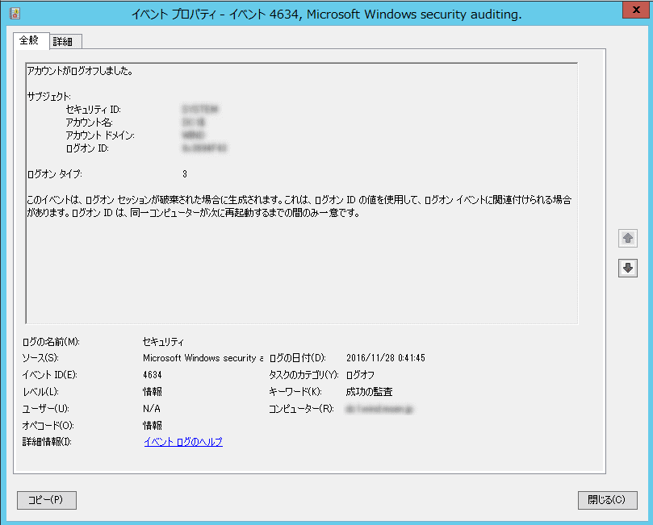
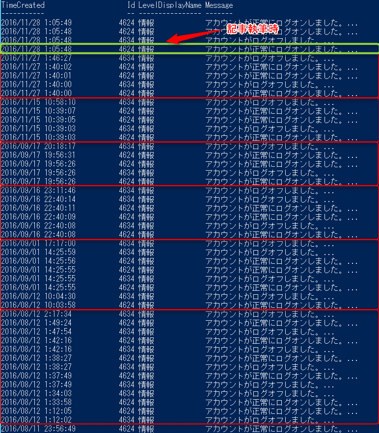

こんにちは。

最近、実際に業務で活用したのですが、 **Windows Server 2012 R2 のイベントログから、ログイン・ログオフの情報を PowerShell で抽出する**方法を紹介します。

## イベントログ

Windows Server 2012 R2 で**ログイン・ログオフのログは、イベントビューアーの Windows ログ→セキュリティに記録されます。**



上記で選択したログをダブルクリックすると、詳細のウインドウがでます。



これらのログを1行1行を追いかけ、ログイン・ログオフを追いかけるには大きな工数がかかるだけではなく精度も下がってしまいます。

## PowerShell で抽出

イベントログからログを抽出するには `get-winevent` コマンドを使います。イベントログの操作には管理者権限が必要なので、 PowerShell を**管理者として実行**で開いてください。

例えば、 administrator でログインした履歴を調査するときは、次のコマンドになります。

```
get-winevent -logname Security -filterxpath "*[System[Provider[@Name='Microsoft-Windows-Security-Auditing'] and (EventID='4624' or EventID='4634')]] and *[EventData[Data[@Name='TargetUserName']='administrator']]" -maxevents 50
```

**EventID 4624 がログオン、4634 がログアウト**です。

ユーザー名を示す `administrator` と、最大出力数を示す `maxevents 50` の数字部分は適宜変更してください。

### コマンドの簡単な説明

`get-winevent` には様々なオプションが指定できます。今回の例では、 `logname` オプションで「セキュリティ」ログを指定し、 `maxevents` オプションで最大取得数を指定しています。

また、イベントログには XML 形式の詳細情報が付加されています。今回は `filterxpath` オプションに XPath で指定することによって、この XML をフィルタリングしています。 XPath の詳細は参考サイトをご覧ください。

* [XPath | TECHSCORE(テックスコア)](http://www.techscore.com/tech/XML/XPath/index.html/)

駆使すればどんな検索にでも対応できるはずです。そんなにむずかしいものではないのですが、閉じカッコの数を間違えたりするとよくわからないエラーになって？？？となるので、ご注意ください。

## 出力結果

前項のコマンドで、以下のように採取できます。



これを見ていただければ気づいていただけるかと思いますが、ログイン・ログオフのログが複数行表示されています。
調査しましたが、はっきりとした理由がわからないので、わかる方がいらっしゃいましたら、教えてください。

## あとがき

今回のこの方法を利用したケースは、とある障害が発生し、障害発生日時付近にログインしていたユーザー名と時間の依頼があり、まとめたものです。

ログインログの調査を行うことで作業者を特定することは可能ですが、根本的な運用の決まりとして作業者ごとにユーザーIDを分けておく、ということは非常に重要だなと思いました。

Windows Serverの運用ではAdministratorアカウントのみで管理しているというケースもあると思います。単独で管理する場合には問題ならないと思いますが、複数の関係者で同じアカウントを使っていると今回紹介した方法で調査しても特定することは難しくなります。

参考になれば嬉しいです。
それでは次の記事でお会いしましょう。