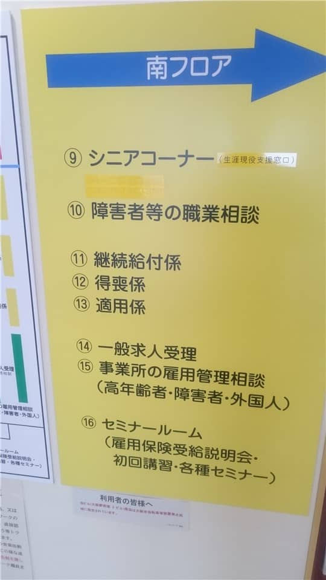
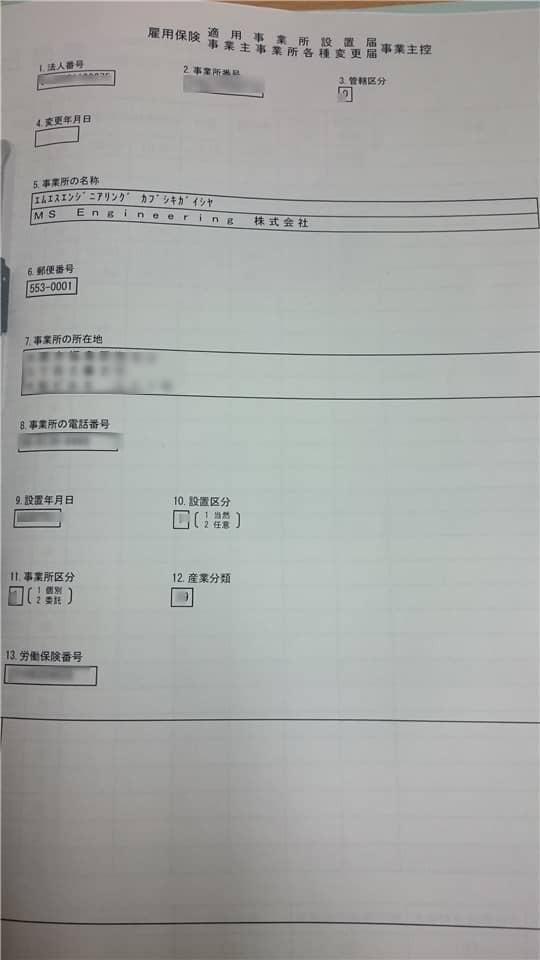

こんにちは。

先日、労災保険の事業所の設置届けを行いましたので必要書類などを紹介したいと思います。

**会社印と、会社ゴム印は必ず持参しましょう。**

## 雇用保険はハローワークで手続き
経営するまでハローワークといえば **仕事を探す場所** 程度にしか知らなかったのですが、実は雇用保険の手続きはハローワークで行います。

## 管轄をチェック
弊社は大阪市福島区設置の事業所のため、**ハローワーク梅田** です。大阪駅前第2ビル16Fにあります。

大阪の管轄は[ここ](http://www.mhlw.go.jp/kouseiroudoushou/shozaiannai/roudoukyoku/osaka/antei.html)から確認することができます。

大阪駅前第2ビルへ向かいます。弊社からだとJR東西線に乗り北新地駅を降りて目の前が第2ビルです。

16Fへ上がります。

該当部署は**適用係**で13番に向かいます。

到着！

## 適用事業所設置届の手続き
適用事業所設置届は、単独では手続きできません。会社にとって**雇用保険の対象となる最初の従業員の資格取得と同時に申請**します。

まず、適用事業所設置届申請に必要な書類は、以下の通りでした。

1. 労働保険成立届（労災保険を加入する際に必ず受け取ります。）
1. 履歴事項全部証明書
1. 事務所の賃貸契約書
1. 会社の実体証明書（会社間の契約書など一式持参し担当者に判断してもらいました。）
1. 労災保険の支払証明書

**全て原本を持参しました。**

つぎに、はじめて雇用保険の対象となる従業員の資格取得に必要な書類は以下の通りでした。

1. 資格取得届け（ハローワークに用紙があります。）
1. 労働者名簿（加入者以外に従業員がいる場合は全ての従業員分必要です。）
1. 出勤簿（資格を取得する該当者分のみで大丈夫でした。）

担当者の方が上記資料をチェックし、必要な資料はコピーされます。そして、同日に適用事業所設置届が発行されます。

## あとがき
労働保険は**労災保険（労働者災害補償保険）**と**雇用保険** の総称です。

それぞれ、加入対象者の条件が異なります。

**労災保険**は、**労働者**全てが加入対象です。
労働者には、パートやアルバイトの方も全てが含まれます。

**雇用保険**は、正社員はもちろんのこと、バイトであっても以下の適用基準を**両方**満たす場合は加入の対象になります。

1. 31日以上引き続き雇用されることが見込まれる者であること。
1. 1週間の所定労働時間が20時間以上であること。

手続きを行う前に、管轄のハローワークに確認をしてから臨まれることをおすすめします。

少しでも参考になれば幸いです。
それでは、次回の奮闘記でお会いしましょう！