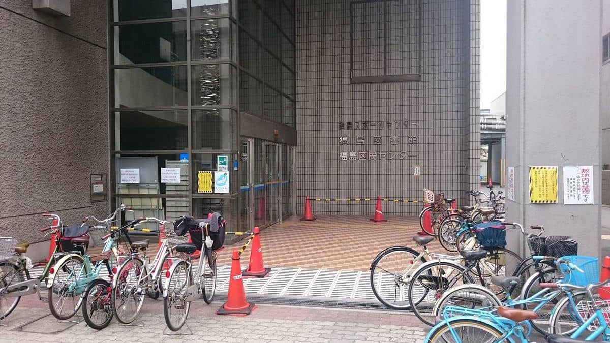
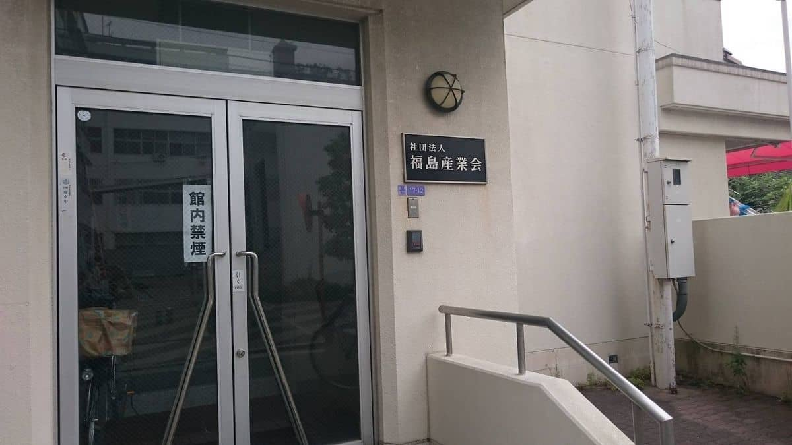

弊社も2期目になり様々な活動を視野に入れて計画を進めておりますが、[マル経融資](https://www.jfc.go.jp/n/finance/search/kaizen_m.html)獲得に向け活動をしています。

## マル経融資とは

[マル経融資（小規模事業者経営改善資金）｜日本政策金融公庫](https://www.jfc.go.jp/n/finance/search/kaizen_m.html)

>マル経融資は、商工会議所等で、経営指導（原則６ヵ月以上）を受けた方に対し、無担保・無保証人で、日本政策金融公庫が融資を行う国の制度です。

融資限度額は2000万円と多くないものの、保証人・担保が不要な上、利率も比較的低いものが適用されますので、小規模な会社にはメリットのある制度です。ただし、最低でも6ヶ月の経営指導を受ける必要がありため、顧問税理士さんと計画の大枠を準備し面談に望みました。

## 面談会場にたどりつけない

申し込みのときに、**福島区役所の南側**の**福島産業会館**へお越しください、と言われたので少し遅れ気味で税理士さんと早足で向かいました。

歩きながら、Googleマップで**福島産業会館**と調べてもヒットせず、申し込み用紙に書かれている住所から、だいたいの場所を目指すがわからない・・・。

もしかして、区民センターの中か？

区民センターに入り、係の方に聞くと**ここではありません** ・・・　このときすでに16時10分。
続けて区民センターの方に場所を聞いて向かうとやっとたどり着きました・・・。

って、

**福島産業会**ってなってるじゃないですか！

突っ込んでいる余裕もなく、駆け足で会場に向かうと、担当の方も来ないということで部屋の前で焦った様子で立っておられました。**遅れてすみません**。

## 面談開始

挨拶は早々に、早速面談が始まりました。

政策金融公庫の方は、すごく若い。商工会の方はベテラン風。

制度概要の紹介を頂いたり、1期目の決算書をチェックされ弊社側の計画概要などを説明したりと細かな話というよりは、大枠の話をさせて頂きました。

時間も早々に**（遅れたからですが）**、この日を経営指導開始の起算日とすることで面談は終了しました。

帰り際に、再度Googleマップを・・・

ばっちり出ますね。。

引き続き頑張って参りたいと思います。今後の経営指導については順次公開していきます！