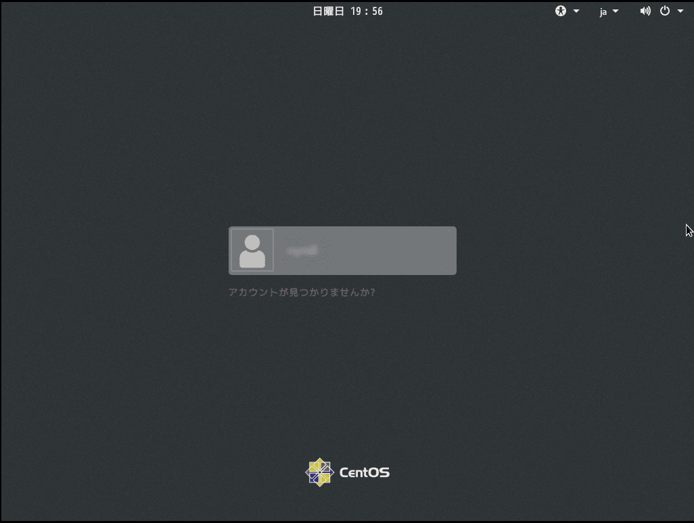
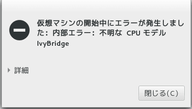
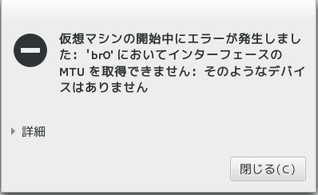
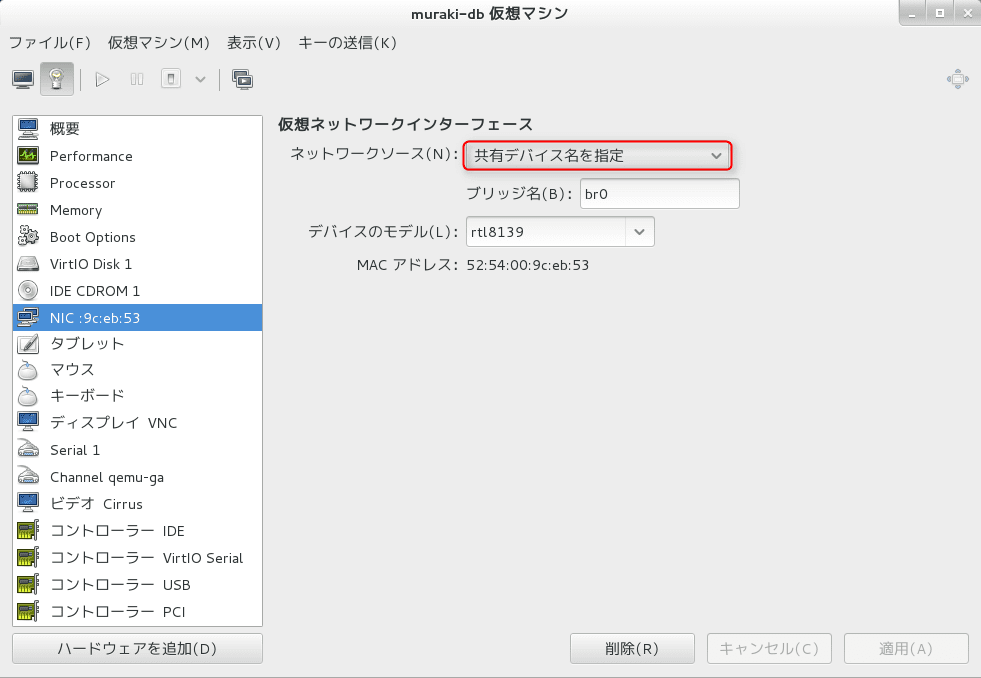

こんにちは。

今回はKVMで運用している仮想イメージをバックアップし、別のPCで動かしてみたいと思います。
KVMの構築は以前 [こちら](https://mseeeen.msen.jp/make-virtual-mac…-kvm-in-centos-7/) で紹介しました。

* ドメイン名(仮想マシン名)：centos7
* イメージ名：centos7.img
* 設定ファイル(XML)：centos7.xml
* バックアップ先：/mnt/backup　（外付けHDD)

この状態を前提として、紹介します。

## バックアップ

1. 仮想マシンを停止します。
`virsh shutdown centos7`

1. 設定ファイルをバックアップします。
`virsh dumpxml centos7 > /mnt/backup/centos7.xml`

1. 仮想イメージをバックアップします。
`cp -p /var/lib/libvirt/images/centos7.img /mnt/backup/. `
/var/lib/libvirt/images/に拡張子**qcow2**のファイルが存在する場合も同様にバックアップします。
`cp -p /var/lib/libvirt/images/centos7.qcow2 /mnt/backup/.`

## リストア
**運用しているPCとは別PCでリストアを実施します。外付けHDDを元PCより付け替えて/mntにマウントしています。**

1. バックアップした仮想イメージをリストア
`cp -p /mnt/backup/centos7.img /var/lib/libvirt/images/.`
拡張子**qcow2**をバックアップした場合は同様にリストアします。
`cp -p /mnt/backup/centos7.qcow2 /var/lib/libvirt/images/.`

1. バックアップした設定ファイルをリストア
`cp -p /mnt/backup/centos7.xml /etc/libvirt/qemu/.`

1. リストアした設定ファイルをKVMに反映
`virsh define /etc/libvirt/qemu/centos7.xml`
成功すると、以下のように出力されます。
`ドメイン centos7 が /etc/libvirt/qemu/centos7.xml から定義されました`

1. リストアされた、centos7を起動
`virsh start centos7`

無事起動できました。

## あとがき

バックアップしたPCと、復元するPCのハードウェアが異なる場合、CPUやネットワークの種別などを修正しないと動かない場合があります。

また、仮想OSに外付けHDD等をマウントしていて、/etc/fstab に静的な記述がある場合も起動しません。

そのような場合は、事前に /etc/fstab から静的な記述を削除するか、移行後に以下の画面となった後にrootのパスワードを入力し、 /etc/fstab を修正して再起動すると起動します。

続いて、今回発生したエラーのなかで、CPUとネットワーク＋α（その他）の解消方法を紹介します。

### CPUのエラー

設定値が、元PCの状態となっている。

設定をクリアする。

### ネットワークのエラー

状態を確認し、default に変更する。

↓ **以下に変更する**

### その他

手元の評価では以下が設定に残っているとエラーとなりましたので削除しました。

いかがでしょうか。
ハードウェアの考慮は必要ですが、非常に簡単な手順でバックアップとリストアができました。

一度、お試しください。
それでは、次の記事でお会いしましょう。
