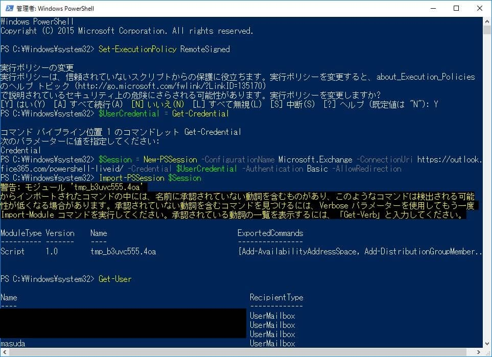
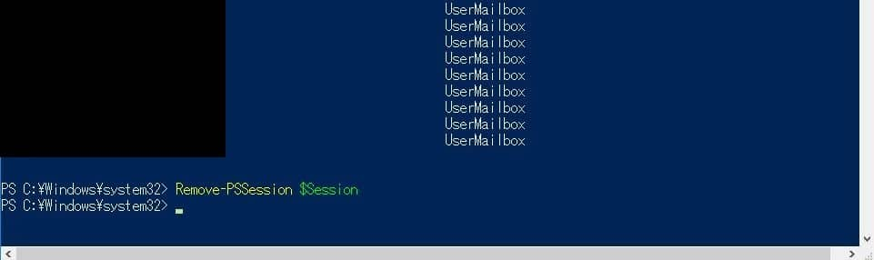

Microsoftのクラウドサービス、Exchange Online (Office 365)にPowerShellで接続する方法を紹介します。
(投稿点で動作確認しています。)

PowerShellでExchange Online (Office 365)へ接続をするきっかけになったのは、Exchange Online (Office 365)のSMTPサーバをメールリレーで利用する為です。

SMTPリレーについては今後の投稿で掲載予定です。

## 準備
・Microsoft Online Services サインイン アシスタントインストール
 [ここからダウンロード](https://www.microsoft.com/ja-jp/download/details.aspx?id=28177)

・テナント情報を確認
接続するテナントのメールアドレス(接続アカウント)とパスワード

## 接続
・PowerShell を管理者として実行し、以下のコマンドを順次実行する。
`Set-ExecutionPolicy RemoteSigned` を実行し、YESで応答する。
`$UserCredential = Get-Credential` を実行し、別ウィンドウに出る認証ポップアップに対して接続するテナントのユーザ名パスワードを入力する。

```
$Session = New-PSSession -ConfigurationName Microsoft.Exchange -ConnectionUri https://outlook.office365.com/powershell-liveid/ -Credential $UserCredential -Authentication Basic -AllowRedirection
```
を実行する。
`Import-PSSession $Session` を実行する。
*時間がかかる場合Enterを押すとエラーWarning等が出力され進む場合がある。*
`Get-User` などを実行し、接続状態を確認する。

## 切断
以下のコマンドで切断する。
`Remove-PSSession $Session`

## 全体のコマンドイメージ
 
<a href="images/connect-to-o365-with-powershell-2.jpg"></a>
<a href="images/connect-to-o365-with-powershell-3.jpg"></a>