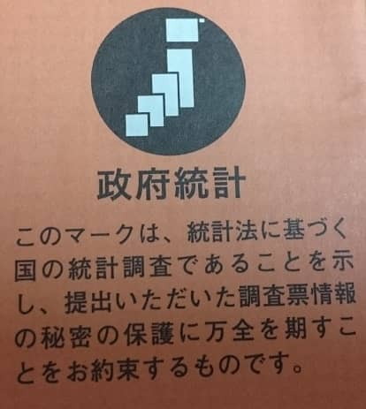
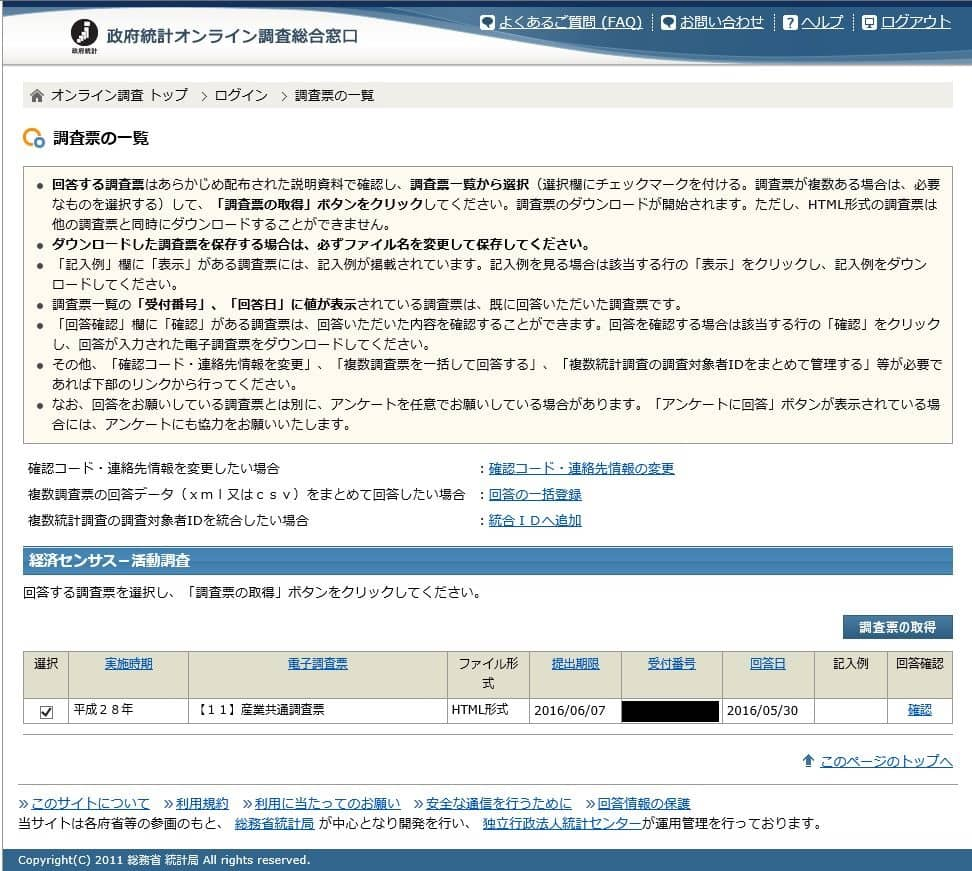

先日、事務所に訪問があり、「・・・の調査なのですが・・・」と、女性の訪問がありました。

**こんな小さな事務所**でもそれなりに訪問営業は多いものでして、てっきり営業だと思い片手間に聞いていると、「国の調査です・・・」とのことで少し態度を変えました(笑)

**こんな小さな事務所**

内容は、経済センサス活動調査というもののようで、[ここ](http://www.stat.go.jp/data/e-census/)には以下のように紹介されていました。（原文のまま）
> 経済センサスは、事業所及び企業の経済活動の状態を明らかにし、我が国における包括的な産業構造を明らかにするとともに、事業所・企業を対象とする各種統計調査の実施のための母集団情報 を整備することを目的としています。経済センサスは、事業所・企業の基本的構造を明らかにする「経済センサス‐基礎調査」と事業所・企業の経済活動の状況を明らかにする「経済センサス‐活動調査」の二つから成り立っています。経済センサスにより作成される経済構造統計は、国勢統計（国勢調査）、国民経済計算に準ずる重要な統計として、「統計法」（平成19年法律第53号）という法律に基づいた基幹統計に位置付け られています。

のようです。

まだ弊社が2期目ということもあり、タイミング的に今回が初めての調査となりインターネットでの回答に必要な情報は管轄の区役所に電話で確認してください、とのことでした。

早速　福島区役所に電話し、口頭でIDとコードを教えて頂きました。（以外に簡単）

期限が6月7日までということだったので、[ここ](http://www.stat.go.jp/)から、調査名**経済センサス**と進み回答しました。

所要時間は約25分。
決算の内容などお金に関する部分がほとんどでした。

初めて受ける調査で勉強になりました。

[総務省統計局](http://www.stat.go.jp/)