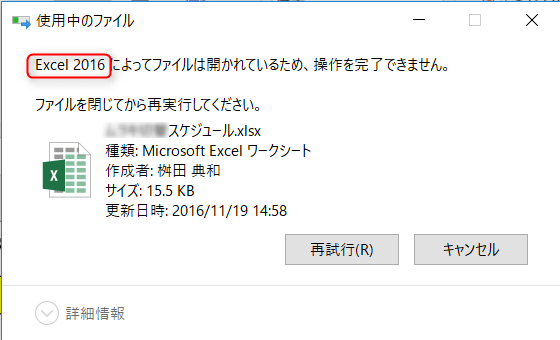

こんにちは。

今回は、開いてもいないのに何かのプロセスが掴んでいてファイルが削除できないなどのケースで、プロセスを特定する方法を紹介します。

「再起動したら直るんじゃない？」という解決案は今回においてはなしです(笑)

## 準備
以下のURLよりProcess Explorer ツールをダウンロードします。
[https://technet.microsoft.com/en-us/sysinternals/processexplorer.aspx](https://technet.microsoft.com/en-us/sysinternals/processexplorer.aspx)

ダウンロードしたファイルを解凍します。
初回起動時のみ、承諾画面が出るので**Agree**を選択します。

解凍したフォルダから、**procexp.exe**を管理者として実行します。

## 特定方法

今回はわかりやすく、Excelファイルを開いている状態で実施してみます。よって、目標は明らかでこのファイルを使っているプロセスであるExcelのPIDを特定することです。

以下の画像は、開いている状態で削除しようとしたときのエラー画面です。

1. procexp.exeを開いた状態から、ツール上部の **[Find] - [Find Handle or DLL]**をクリックし、**[Handle or DLL substring:]** 欄にスナップショットファイルの**フルパス**を入力し**Search**をクリックします。

2. Searchが完了すると指定したファイルを使っているプロセスが特定されます。

**PIDが15240**と特定ができました。

3. タスクマネージャーの詳細からPIDを検索し、確認します。

ここまでの確認から、ファイルを開いているプロセスは**Excel.exe**であることが確認できました。

今回のテストであれば、Searchの結果からExcelが利用していることは明らかですが、プロセスを特定してからの対処についてはケースによると思いますので状況に応じて追加の調査・対処を実施いただければと思います。

## あとがき

調査の概要としては、

1. ツールを作ってエラーが起きたファイルをつかんでいるPIDを調査
1. 1.で判明したPIDをタスクマネージャで調べてプロセスを確認する
1. 2.の状況をもとにどうするか判断する

という流れになります。

状況に応じては、3. 以降でさらなる調査が必要になる可能性はありますが、とりあえずの調査として覚えておいて損はないと思います。

ご覧いただきありがとうございました。
次回の記事でお会いしましょう。