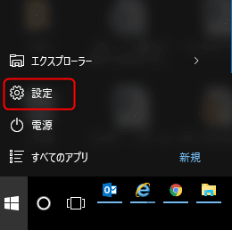
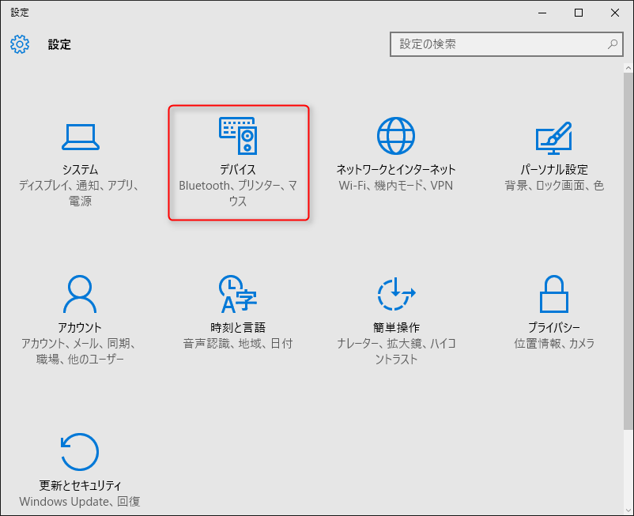
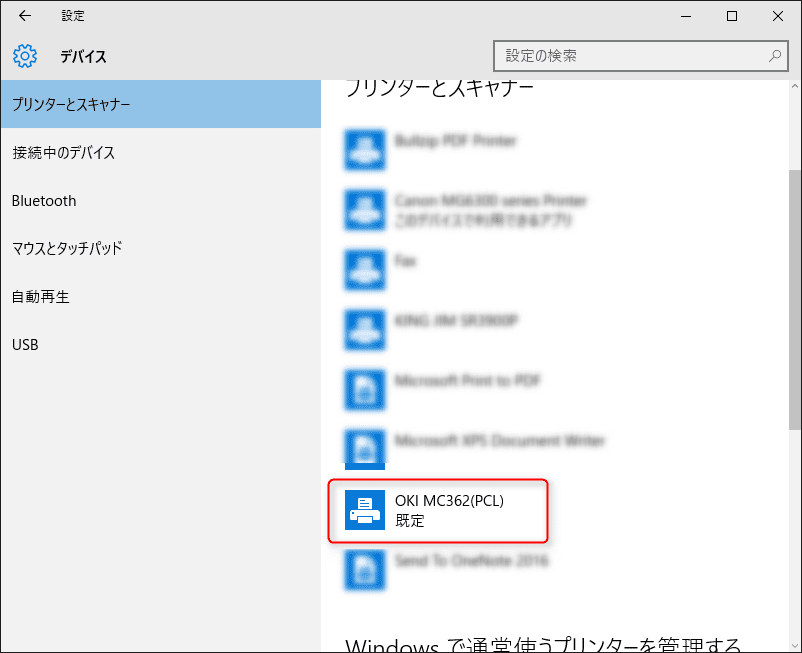
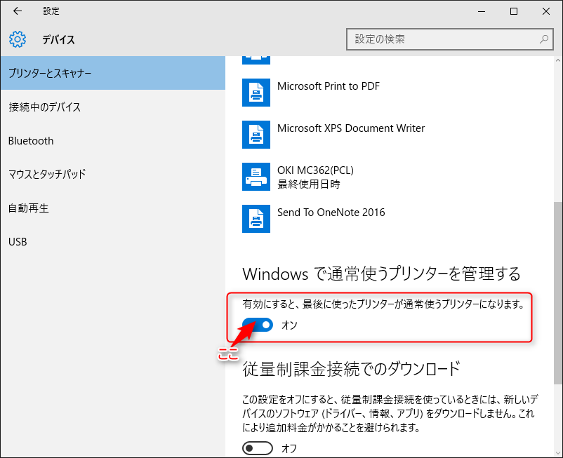
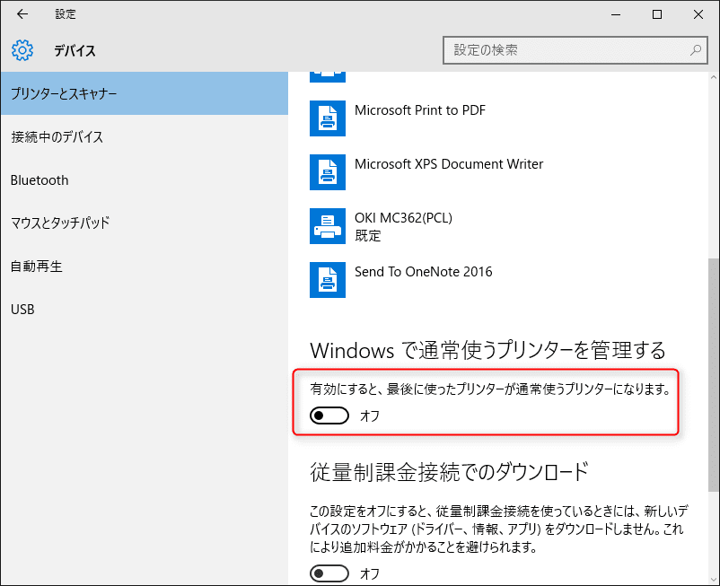
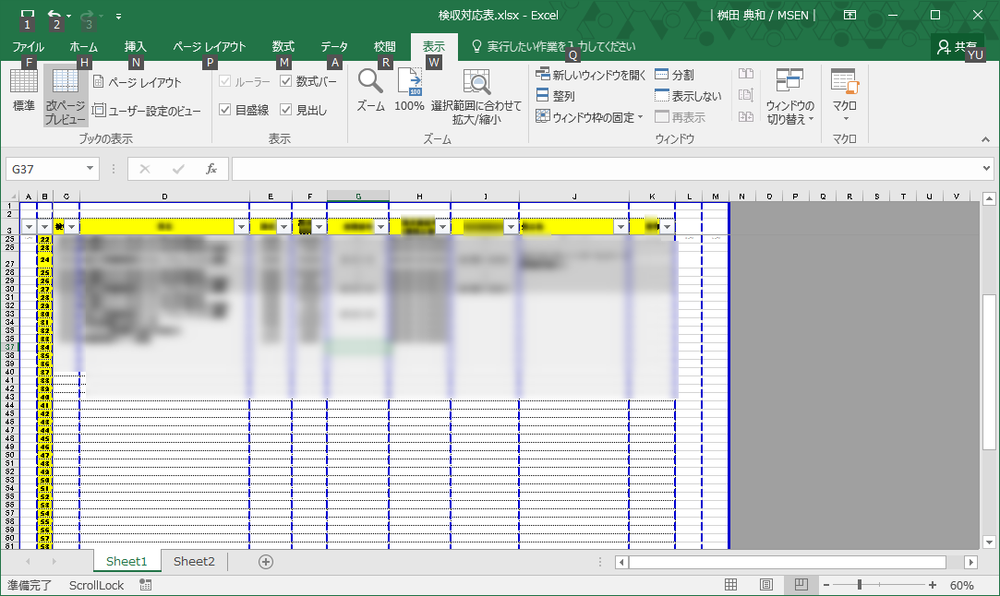

こんにちは。

今回は、最近まで解決できていなかった、**Windows 10 で最後に使ったプリンタがデフォルトプリンタに設定されてしまうこと** の解消方法です。

## デフォルトプリンタの確認方法
以下の流れでデフォルトプリンタの設定を確認します。

1. Windowsスタートアイコンをクリックして、設定をクリック

2. デバイスをクリック

3. 既定となっているプリンタを確認する

## 改善策の設定方法
Windows 10の標準設定では、前項で確認したデフォルト(既定）のプリンタが最後に利用したプリンタで常に書き換わってしまいます。

使い方によっては便利なのかもしれませんが、私は非常に不便でしたので以下の方法で書き換わらないように変更します。

前項のデバイスを開くところまでは同様の手順です。

1. **有効にすると、最後に使ったプリンターが通常使うプリンターになります。**　をオフにします。

1. **オフ**になりました。

はい、これだけです。

## あとがき
パソコンに接続できるタイプのテプラプリンタを使っているのですが、テプラを使うと勝手にデフォルトになってしまうため、そのまま下記のエクセルみたいなものを印刷してしまうと、細切れになった文書が何枚も印刷される惨事になっていました。

本記事の設定をした後はテプラを無駄にすることなく使用できています。

Windowsの気の効いた機能をOFFにして快適なプリンターライフをお楽しみください！

それでは、またお会いしましょう。