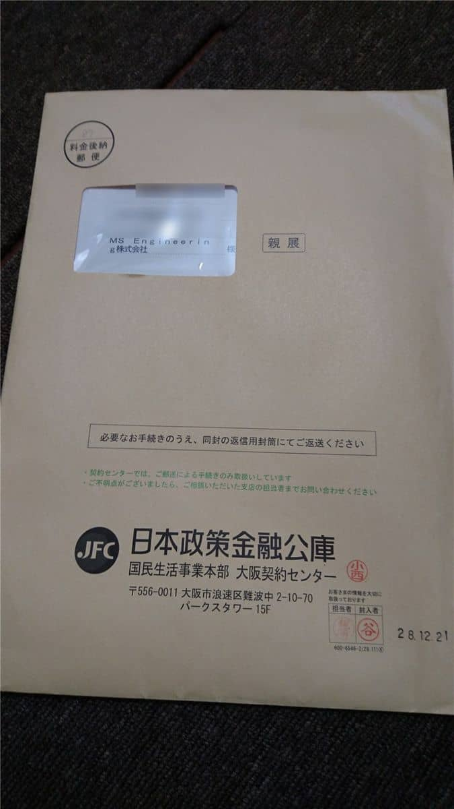

こんにちは。

2016年6月26日の記事で、マル経融資の調整を開始していることを以下の記事で紹介しました。
[/applying-for-loan-at-low-interest/](/applying-for-loan-at-low-interest/)

このたび、2016年12月21日付で無事融資決定しました！
詳細は以下より紹介します。

## 商工会議所の経営指導

マル経融資の基準として、商工会議所により6ヶ月の経営指導という前提があります。

イメージとしては、6ヶ月の間で定期的に面談などがあるのかな？と思っていましたが、そんことはなく、初回の面談の後に、1度だけ事務所に商工会議所の経営指導員の方が来られて、制度概要の説明と6ヶ月後に再度面談をするのでまた連絡する、とのことのみでした。

## 半年後の面談

12月を前に、スケジュールにも記録していたのでそろそろだと思ったある日、経営指導員の方から「申請に向けて具体的な話をしたいので日程を調整したい。」と電話がありました。
面談は、11月30日に決まりました。半年よりは少し早いスケジュールでした。

電話の際に、「直近までの残高試算表を準備してほしい。」と指示があったので顧問税理士先生に依頼し、当日を迎えました。

残高試算表を確認いただき、「特に問題ないですね。」と言っていただき。
申請に必要な書類をその場で指示のもと、コピーで準備しました。

面談の際に渡した資料は以下のとおりでした。

1. 残高試算表
1. 決算書（コピー）
1. 事務所賃貸契約書（コピー）

その場では準備ができなかった資料については、メール添付で連絡がほしいと指示された資料は以下のとおりでした。

1. 履歴事項全部証明書
1. 法人メイン銀行口座の取引証明書
1. 代表者(私)の不動産の登記簿謄本　※マンションの場合建物のみ、一軒家の場合土地と建物両方
1. 2014年分と2015年の個人確定申告控え

以下に補足します。

1. については、後日原本を指導員の方に手渡ししました。

2. については、ネットから申請ができましたので取引証明をPDFで準備しました。

3．ですが、上記にも記載しましたがマンションの場合は建物のみでOKです。建物の登記簿は初めてとりましたので戸惑いました。また、この資料はスキャンの上メール添付のみで原本不要でした。

4．については過去3年分の決算書が必要ということで、2015年2月いっぱいまで個人事業主であったため、2014年と2015年1月～2月は個人の申告書控えが必要であった、という流れになります。2015年3月から2016年2月の法人分についてはコピーで手渡ししました。

## 申請書類作成の面談

前項のとおり、必要書類をコピーで手渡しとメールで事前送付を済ませ問題ないことを連絡いただき、12月12日に申請書類作成の面談をしました。

履歴事項全部証明書原本を手渡し、指導員の方から経営状況や今後の展望などのヒヤリングを受け、なれた手つきでメモをとられていました。

必要書類にも記載、捺印を済ませ15分程度で終了。
「これで必要な書類を書いて早速申請しておくので、年内審査に間に合うと思いますよ。」とのことでした。

日本政策金融公庫も年末はノルマなどの関係で決済が早い傾向にあるようで、弊社の状況であれば年内に決定がでるだろうとのことでした。

申請内容に不明点があれば日本政策金融公庫より電話連絡があるかもしれないがその場合は対応してください、とも指示をいただきました。

## 日本政策金融公庫から決定通知

日本政策金融公庫から電話確認はなく、12月26日に帰宅してポストを確認すると封書が。

早速開封すると、**あなた様からのお申し込みにつきましては、次のとおりご融資することになりましたので、お知らせいたします。**

との文字が。少し感動しました。

## 日本政策金融公庫へ返送書類

決定通知に同封されている、契約のために必要な返送書類の準備を進めます。

12/26に公庫担当者の方より丁寧なお電話もいただきました。
こちらからも不明点の電話をしたのですが想像より公庫の方は親切でした。

以下を準備します。

1. 融資額に応じた収入印紙　※借用証書に貼り付け割り印します。
1. 法人印鑑証明書 x1
1. 預金口座振替利用届　※銀行窓口で受け付けする必要があります。
1. 口座の表紙と、見開きのコピー
1. 借用証書
1. お客さまの情報の利用に関する同意書

提出資料のチェックリストも同封されているので進めることができると思いますが、不安あれば電話で確認することをお勧めします。

12月28日に同封の封筒にて、簡易書留で郵送しました。

## 融資までの流れ

融資までの流れは以下のとおりでした。

1. 2016年06月09日　商工会議所にマル経融資を受けたいことを電話問い合わせ
1. 2016年06月10日　商工会議所経営指導員と日本政策金融公庫と面談
1. 2016年06月23日　経営指導員の方からマル経融資についての説明を受ける
1. 2016年11月24日　経営指導員の方から電話があり申請にむけた打ち合わせを調整
1. 2016年11月30日　経営指導員の方と申請準備の面談
1. 2016年12月03日　必要書類を経営指導員の方にメール送付
1. 2016年12月12日　経営指導員の方と申請書類作成にむけた面談
1. 2016年12月21日　融資決定
1. 2016年12月26日　日本政策金融公庫からの封書を受け取り書類作成
1. 2016年12月28日　日本政策金融公庫に借用書等必要資料返送

このような流れでした。

不備がなければ融資実行となり現在は実行待ちの状態です。

## あとがき

一連でお世話になった、商工会議所の経営指導員に聞いたのですが、弊社管轄の法務局出張所は北出張所になるのですが、大阪のなかで一番接客が悪い窓口だったようです(笑)（最近は少しマシになったとのことでしたｗ）

なぜこのような話になったかというと、必要書類を申請にいったときに、建物の登記簿をどこで取得するのか分からず、窓口に「建物の登記簿を申請する資料ってどれになりますか？」と何枚かおいてある申請用紙もって聞くと、「その用紙ではないですし、ここではないので、○番受付いってください。」とばっさりした感じで言われた話題をすると、そのようなことを教えていただきました。(笑)

さておき、手続きをはじめた時は「6ヶ月って長いな」って思っていましたが、想像よりスムーズに融資実行を迎えることができたな、と思っています。

これも、活動をはじめた面談に顧問税理士先生に同行いただいたこと、その後の必要書類も迅速に準備いただけたこと、商工会議所経営指導員の無駄のない確認と指示があったからだな、と振り返って感じています。

長文になりましたが、マル経融資をこれから受けようとされている方の参考になれば幸いです。

早いもので、本年最後の記事となりました。
いつもご覧いただきありがとうございます。
来年もよろしくお願いいたします。

それでは、次回記事でお会いしましょう。
