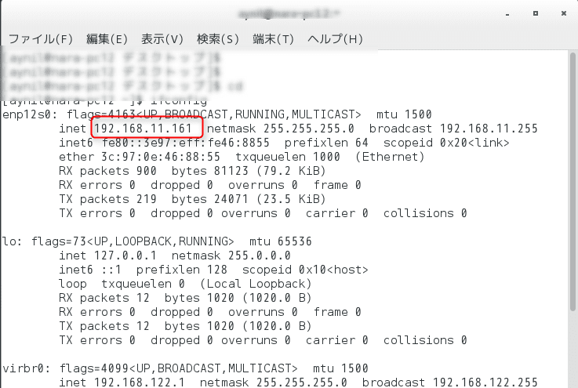
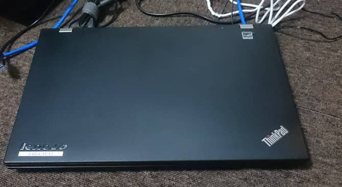
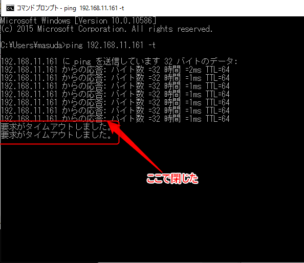
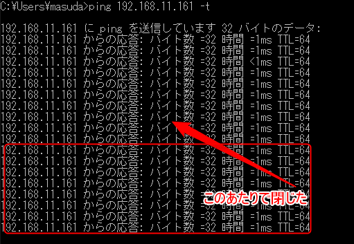

こんにちは。

今回は、**ノートPCにインストールしたCentOS 7の環境で、ノートPCを閉じてもスリープにさせない**（起動させた状態を維持する）方法を紹介します。

## 閉じるとスリープになる

初期状態はどうなるか確認してみます。



IPアドレスが、192.168.11.161 と分かったので、同じネットワークのWindowsマシンからPingを飛ばします。

そして、ノートPCを閉じます。



Pingの結果、



閉じたあとは、Pingが飛ばなくなってスリープしていることが分かります。

## 設定変更

ノートPCを閉じてもスリープさせないために実施する設定は、`/etc/systemd/logind.conf`の設定を変更します。

以下の流れで実施します。

・設定ファイルのバックアップ
 `# cp /etc/systemd/logind.conf{,.org}`

・設定ファイルの編集
 `# vi /etc/systemd/logind.conf`

#HandleLidSwitch=suspend
この行を以下のように変更します。
`HandleLidSwitch=ignore`

変更後、以下のコマンドで反映します。

`systemctl restart systemd-logind.service`

## 確認

再度Pingを飛ばし、ノートPCを閉じます。



途切れずPingが飛んでいることが確認できました。

## あとがき

/etc/systemd/logind.conf の設定のなかでサーバ用途としては無効にしておくほうが無難な設定をあとがきに書きます。

```
#HandlePowerKey=poweroff
#HandleSuspendKey=suspend
#HandleHibernateKey=hibernate
```

この三つの設定を、

```
HandlePowerKey=ignore
HandleSuspendKey=ignore
HandleHibernateKey=ignore
```

とすることをおすすめします。

英文そのままですが内容は上から順に、

* パワーキーを押した場合の動作
* サスペンドキーを押した場合の動作
* ハイバネートキーを押した場合の動作

となっています。

利用していないノートPCがあればCentOSをインストールして遊んでみるのも楽しいものです。

それでは次回の記事であいましょう。