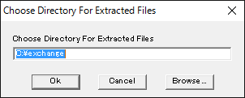
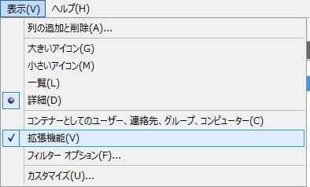
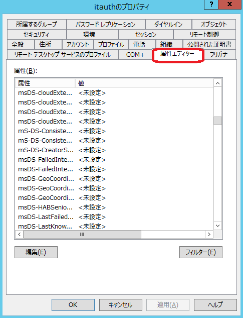

Active Directory スキーマを拡張する方法を紹介します。

Microsoftが提供しているOffice365サービスとActiveDirectory連携のために社内評価を実施しました。

## 前提
1. ActiveDirectoryが複数ある場合は、スキーママスターとなっているサーバーで実行します。
1. 拡張を実行するユーザーはSchema Admins権限を持っていることが必要です。

## 手順
1. [こちらのリンク](https://www.microsoft.com/ja-jp/evalcenter/evaluate-exchange-server-2013)から、Exchange Server 2013 の評価版をダウンロードします。**ダウンロードはサインイン後に可能となるため、Microsoftアカウントの登録が事前に必要です。**
1. C:\exchange 等任意のフォルダを作成します。
1. ダウンロードしたファイルを実行し、c:\exchange を指定し展開します。**デスクトップなどに展開してしまうと大量のファイルが展開されてしまいますので注意が必要です。**

1. コマンドプロンプトを実行し、以下のコマンドにてスキーマを拡張します。
```
cd c:\exchange
c:\exchange>setup /PrepareSchema /IAcceptExchangeServerLicenseTerms
```
出力結果は以下となります。
```
Microsoft Exchange Server 2013 無人セットアップへようこそ
ファイルをコピーしています...
ファイルのコピーが完了しました。インストールに必要な追加情報を収集します。

Microsoft Exchange Server の前提条件を確認しています

    前提条件の分析                                                   完了
(メッセージについては省略)

Microsoft Exchange Server を構成しています

    Active Directory スキーマを拡張しています                        完了

Exchange Server のセットアップは正常に完了しました。
```

## 確認
1. ActiveDirecotryユーザとコンピュータを開き、**表示→拡張機能をクリック**し有効にします。

1. ActiveDirecotryユーザとコンピュータを開き、任意のユーザープロパティから、属性エディタータブを開きます。


**msDS-oo**が複数追加されていることが確認できればスキーマ拡張は成功です。