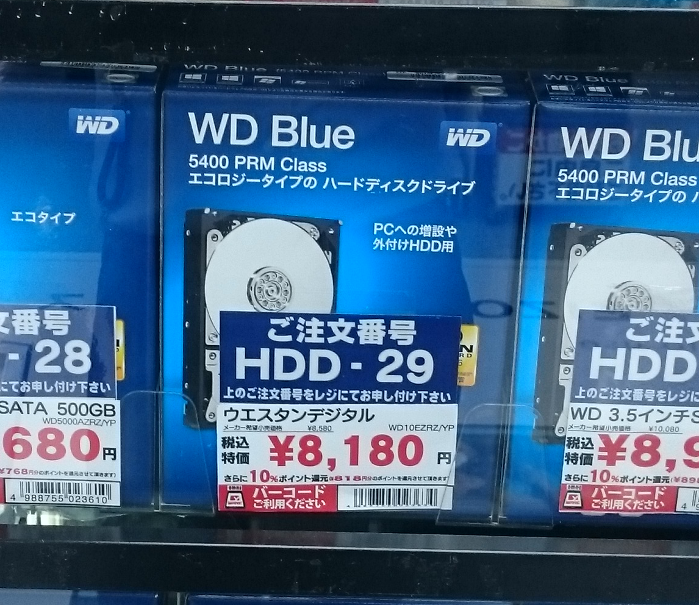
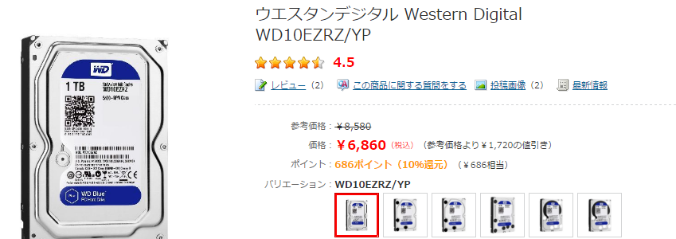

インフラ強化中のため、ハードディスクを**ヨドバシカメラ梅田**に探しに行きました。

## ヨドバシ・ドット・コムのほうが安いことがある

これぐらいの容量でいいか、と写真の1TBの（8,180円)に決めました。

念のため、ネットではどれぐらいの値段かな？と型番（WD10EZRZ/YP）で検索すると、一番上にヨドバシドットコムが出てきてなんと・・・・！

ネットで買うと、6,860円と1,320円も安い！16％という驚異の割引率！(笑)

さらに10％のポイント還元もそのままです。

しかも、ヨドバシドットコムには、ネットで注文して店頭で受け取るというサービスがあります。

在庫があるのは目の前にいるので明らかなので、その場で店頭受け取りで購入しました。

確定から、15分程度で準備完了のメールが到着し1Fのネット受け取りカウンターで無事受け取り、安く買えました！

店員さんに言っても割り引いてくれたのかもしれないですが、お得？に買うことが出来ました(笑)

## 実は戦略...？

と、思って社内でも自慢げに話していると、副社長にそれは戦略みたいだよ、と教えられました。。

調べてみると、これは**店舗に来た客にネットで買わせる**というヨドバシカメラの戦術のようでした。
リアルからバーチャルに誘導し、売り場でみた商品をネットで買われても全体的に売り上げがあがればそれでOK、という戦略のようです。

[card url="http://biz-journal.jp/2015/05/post_9959_2.html"]

確かに、**これいいな**と思った商品もとりあえずネットのほうが安いかどうかを調べてしまうことよくあります。

そんなときにAmazonなど他のサイトで安ければ、そちらで購入されてしまいますからね...

必ずしもドットコムだと安いというわけではないですが、電化製品買う前には1度スマホ片手に型番検索してみると、ゴールドポイントの割引より安く買えるかも!?

お試し下さい！