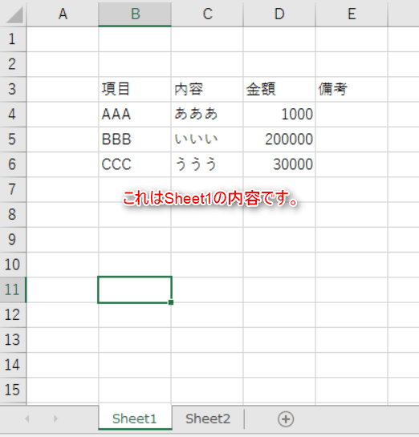
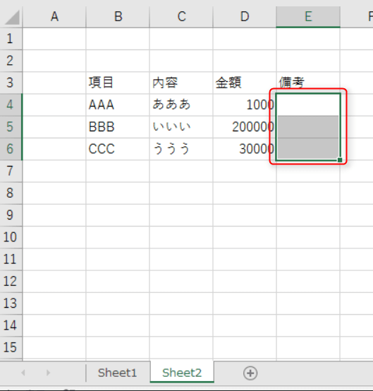
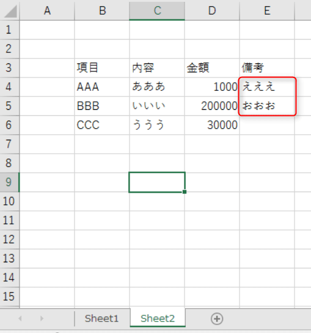
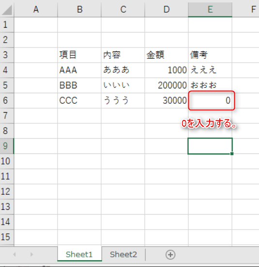

こんにちは。

タイトルが長くなってしまいましたが、Excelで請求書や納品書を作成する際に1つのシートの内容をそっくり別のシートに反映させたいようなケースはないでしょうか。

このような時に、単純に空欄セルを参照すると参照側のセルでは0と表示されてしまいます。

## このようなケースです

**Sheet1**を以下のような内容とします。



**Sheet2**で**Sheet1**のB3:E6の範囲を参照します。

Sheet2の各セルの値
```
B3=Sheet1!B3
B4=Sheet1!B4
B5=Sheet1!B5
B6=Sheet1!B6
C3=Sheet1!C3
C4=Sheet1!C4
C5=Sheet1!C5
C6=Sheet1!C6
D3=Sheet1!D3
D4=Sheet1!D4
D5=Sheet1!D5
D6=Sheet1!D6
E3=Sheet1!E3
E4=Sheet1!E4
E5=Sheet1!E5
E6=Sheet1!E6
```

すると以下のようになります。


**Sheet1**の空欄セルが**Sheet2**では**0**となってしまいました。

## 0を消す方法

このままでは、0と印字されてしまうので消したいですよね。

対処は**Sheet2**で以下の画像のように赤枠部分を選択し、右クリックから**セルの書式設定**を選択します。


↓


セルの書式設定から、ユーザー定義を選択し、赤枠の部分を一旦全て削除し、 `#` と入力し、OKをクリックします。


消えました！ `#` はゼロのときに不要な桁を表示しない記号なので、 0 の場合はなにも表示されなくなります。



## あとがき

試しに、**Sheet1** の備考欄に文字を入力してみます。


**Sheet2**でもばっちり反映されました。



ただし、以下のようなケースで注意が必要です。



↓


上記のように、Sheet1 で **0** と入力すると、Sheet2では空欄になってしまいます。
0を表示したい場合は書式設定を標準や数値に変更する必要があります。


何かの参考になれば嬉しいです。
それでは次の記事でお会いしましょう。
