現在、社内インフラを強化中で、久しぶりにESXiのカスタムディスクを作成したので記事にしたいと思います。

>VMware ESXiとはVMware社による、コンピュータを仮想化するためのハイパーバイザー・ソフトウェア。VMware ESXは仮想化ソフトウェア製品パッケージ「VMware vSphere」の一部として有償で販売されており、サービスコンソールなどの機能を制限したVMware ESXiは無償で入手して利用することができる。仮想化の機能自体は両者で違いはない。
VMware ESXはハードウェア上で直接動作し、仮想的に構築されたコンピュータ上で様々な種類のOS（ゲストOS）を動作させることができる。ゲストOSに仮想化のための修正を必要としない「完全仮想化」型のハイパーバイザーで、通常のOS製品を仮想マシンにそのままインストールして利用することができる。
**e-Words参照**

## 概要
VMware ESXiをインストールしようとすると、ネットワークドライバがなくインストールが途中で止まることがあります。

VMware社より公開されているインストールISOの中にネットワークドライバが含まれていないことが多いのですが、そのような場合には手動でドライバを入手しカスタムインストールディスクを作成する必要があります。

事前準備として、**ESXiのインストールISOを準備します。**
今回の例では、ESXi 5.5 U2 なので、**VMware-ESXi-5.5U2-RollupISO2.iso**というISOファイル名です。

## ドライバの特定
まずはそのドライバが何かを特定する必要があります。

今回、マザーボードに使用したのは、**ASRock H97M Pro** なので[公式ホームページの仕様](http://www.asrock.com/mb/Intel/H97M%20Pro4/index.jp.asp?cat=Specifications)から調査しました。

ふむふむ、なるほど**Intel社のI218V**やな、ということが分かりました。

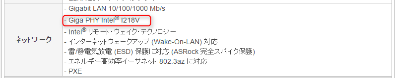

## ドライバの入手
次に、ESXiに組み込むためのドライバを検索します。

[v-front.de](https://vibsdepot.v-front.de/wiki/index.php/List_of_currently_available_ESXi_packages)に行きます。

上部に、I218がありました。
リンクをクリックし、進みます。

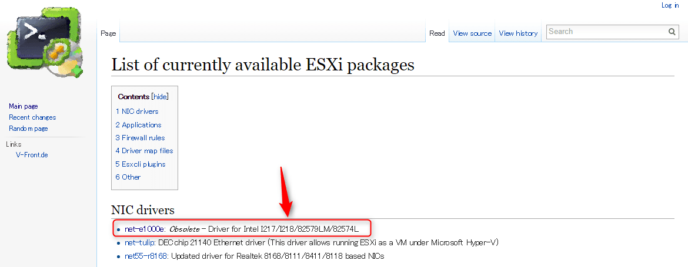

ダウンロードリンクをクリックし、任意の場所にダウンロードします。

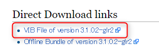

## カスタムディスク作成ツール
カスタムインストールディスクを作成するためのツールを入手します。

[ここ](http://www.v-front.de/p/esxi-customizer.html)から入手します。

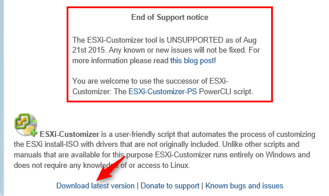

↓

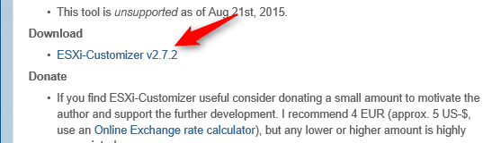

## カスタムディスクの作成
ダウンロードしたツールを解凍し、解凍して出来たフォルダの中の**ESXi-Customizer.cmd**を実行します。

って、ん？えーーー！？
**Windows 10では動かんのかい！**

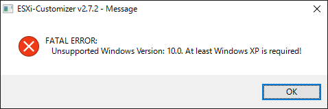

記事書きながらやってたので。。

仕方がないので、Windows7に諸々ファイルをコピーして気を取り直して進めます。

起動直後はこんな画面になります。

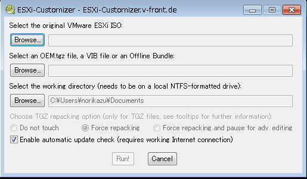

続けて、ISOとドライバを指定して**Run**をクリックします。

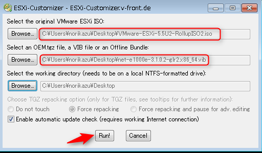

このメッセージは**いいえ**で進めます。

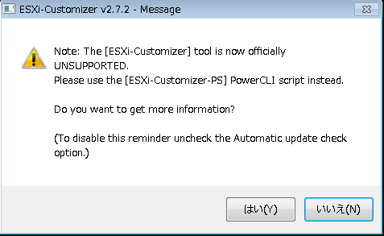

このメッセージは**はい**で進めます。

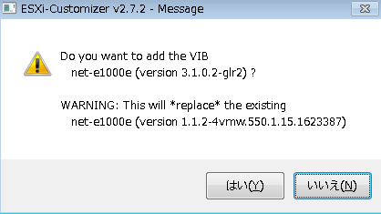

完了しました。

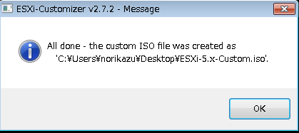

出来たISOはライティングソフト書き込みを行います。
**340MBだったので、十分CD-Rで足りますね！**

この手順で作成したカスタムインストールディスクで無事インストールが完了しました！