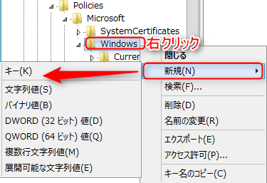

Active Directoryを運用しているとオブジェクトの検索を実施する機会が多いと思います。

今回は、既定では10,000オブジェクトまでしか検索できない状態から最大サイズを増加する方法を紹介します。

## 概要

Active Directory のオブジェクトを検索すると、既定では 10,000 オブジェクトに限定されているため、それ以上の検索ができません。

検索を実行すると、以下のようにエラーになります。

これが既定の動作となります。

## 増加方法
Windows Server 2012 R2での方法を紹介しますが、読み替えればどのOSでも設定可能かと思います。

レジストリを操作することになりますので自己責任でお願いします。

1. レジストリエディタを起動します。

2. HKEY_CURRENT_USER\Software\Policies\Microsoft\Windows を開きます。

3. Directory UI キーを作成します。

4. QueryLimit をという名前 DWORD 値を作成します。

5. 作成した QueryLimit を修正し、10進数を指定し値10,000以上に設定します。今回は20,000と設定します。

## 設定の確認

概要で掲載した方法と同様に検索をかけます。

レジストリの設定後はエラーが出ず10,000オブジェクト以上の検索が完了していることが確認できます。

QueryLimitの値設定で、20,000の部分を調整することで任意に調整することが可能です。

運用管理などで、検索が全て出ないことでお悩みの方々のお役に立てれば嬉しいです。