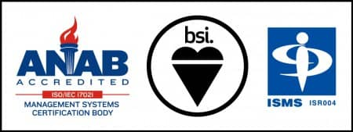

こんにちは。
MSENの桝田です。
 
だんだん暖かくなり、桜も開花し、いよいよ春に訪れですね。
 
さて、最近の投稿はISMSネタばかりで、今回もISMSネタなのですが、無事2016年3月23日付けでISO認定を受けました！

昨年2015年9月から始まったコンサルティング講習は、2月までで9回を数え、審査は2回に渡り合計3回。
 
サボり気味だった資料整備に追われる後半戦・・・。
印刷枚数は1,000は軽く超えたような気が・・・。
 
色々ありましたが、無事運用を始めるスタートラインに立てました。
これからも良い運用が出来るように努めていきたいと思います。

IS 643392 / ISO 27001
 
以上、桝田がお届けしました。

（本記事は過去ブログからの移行記事です。）
