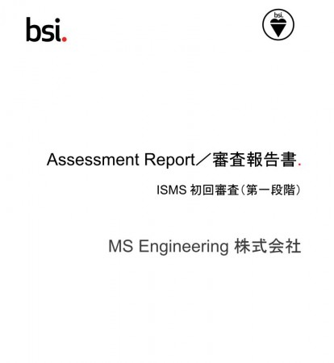

こんにちは、MSENの桝田です。
 
先週2/6(土)に長らく講習を続けていた、ISMSの1段階目の審査が行われました。

結果は、無事通過（2段階目に進める）しました。
 
ただ、このままでは不適合なので是正もしていかないと。。
 
取締役と２人で話をしていたのですが・・・
受けての感想は、想像以上にきっちり見られる。。
そりゃそうか。。
 
でも、きっちりとその先を指摘してくださるので、途中からは「あーなるほど、そのほうがいいですよね」と実体を意識して受け止めることが出来ました。
 
審査員の方もホームページを見ていると言っていたので、もしかしたらこれも見て頂いてるかも・・・(笑)
（来月も宜しくお願いします）
 
以上、桝田がお届けしました。

（本記事は過去ブログからの移行記事です。）
