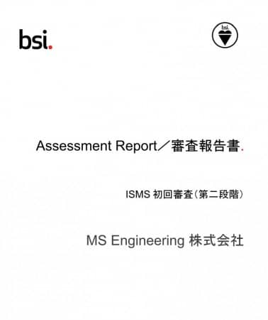

MSENの桝田です。

先週、3/12 , 13 の2日間の2次審査を無事終え、、長かったISMS審査が終了しました。

結果は、不適合にはならず、無事推薦してもらえることになりました。
約3週間頃で最終的な認証結果が出るようです。
 
無事認証を受けることが出来れば、次は運用となります
7ヶ月に渡る取り組みで気づいたこと、取り組むべきことがたくさん見えました。
 
とりあえず、ほっとしました。
以上、桝田がお届けしました。

（本記事は過去ブログからの移行記事です。）