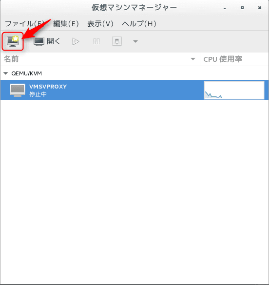
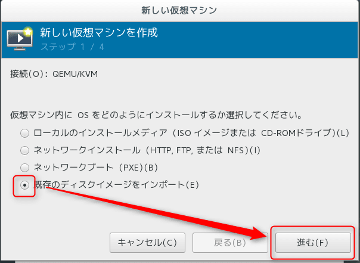
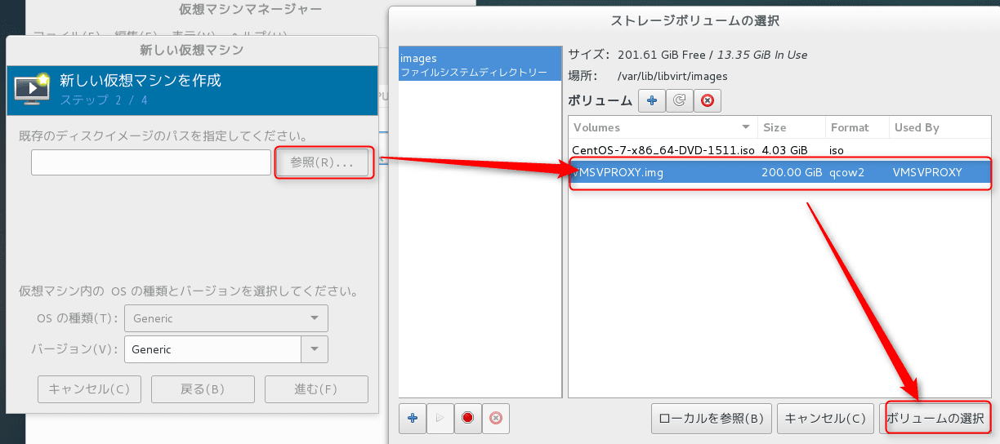
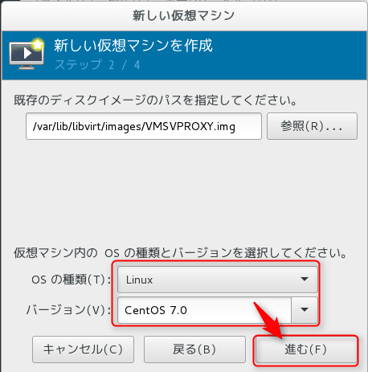
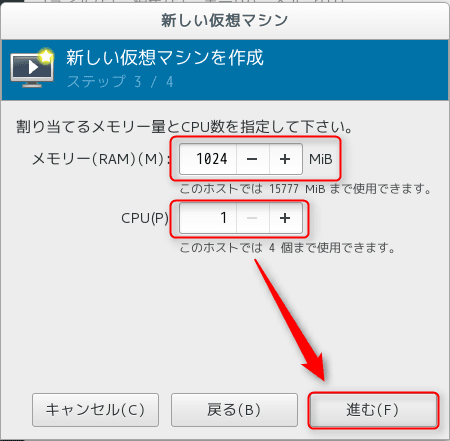
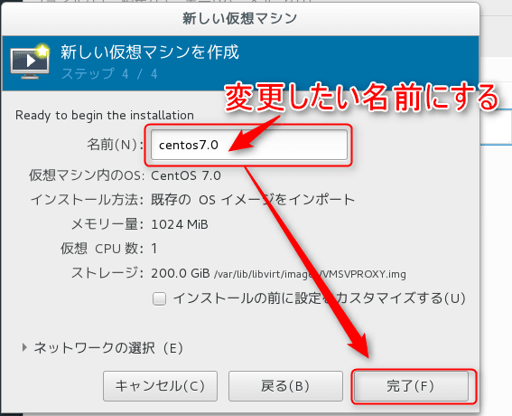

こんにちは。

先日、KVMの仮想マシン名を設定ファイルから変更する方法を紹介しました。（リンクを貼る）

今回は、既存のイメージから新規で仮想マシンを作成する際に変更する方法を紹介します。

## 変更の流れ

### 名前の変更
jv-proxy　→　CentOS7.0 に変更する。


### 変更前の仮想マシンを削除する
```
# virsh undefine jv-proxy
ドメイン jv-proxy の定義が削除されました
```
※undefine すると、xml設定ファイルが削除されてしまうため念のためバックアップを採取することをおすすめします。


### 仮想マシンマネージャーから新規作成する

以下の流れで既存のイメージを利用して仮想マシンを新規作成します。

1. 仮想マシンマネージャー(virt-manager)を起動します。
2. 赤枠の新規作成マークをクリックします。

3. 既存のディスクをインポート　を選択し進みます。

4. 参照を選択し、仮想イメージファイルが配置されているパスから選択します。デフォルトでは、画像のように `/var/lib/libvirt/images`です。

5. OSの種類とバージョンを適切に選択します。

6. 仮想マシンに設定するメモリ、CPUコア数を適切に設定し進みます。

7. 変更したい名前を設定し、作成を完了します。


## あとがき

直近の案件で仮想関係の評価をすることが多く、仮想関連のネタが多くなっています。

先日、じんないも書いていましたが、ハイパーバイザー型としてはVMwareのESXi、MicrosoftのHyper-V、OSSのKVMこれらがほとんどのシェアを占めていると思います。

[無償の仮想化基盤 VMware vSphere Hypervisor 6.0 (vSphere ESXi) を使ってみる。【 導入編 】](/vmware-vsphere-hypervisor-6-esxi-intro/)

当方の関与する案件では、ここ最近VMwareよりHyper-Vのほうが優勢と感じています。
その中で、予算削減を要望されるお客さまはOSSのKVMを選択されることが多いです。

ただ、どれも技術的には安定していて仮想基盤が起因するトラブルはほぼ発生していません。

オンプレミスから仮想化・クラウドの時代に移り変わり、次はどの時代が生まれるのでしょうか。

ご覧いただきありがとうございました。
それでは次の記事でお会いしましょう。