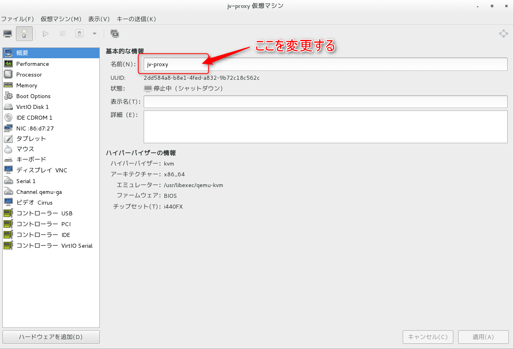
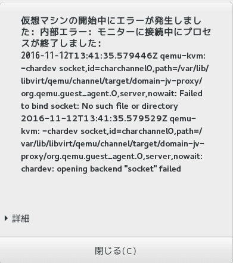
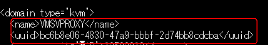
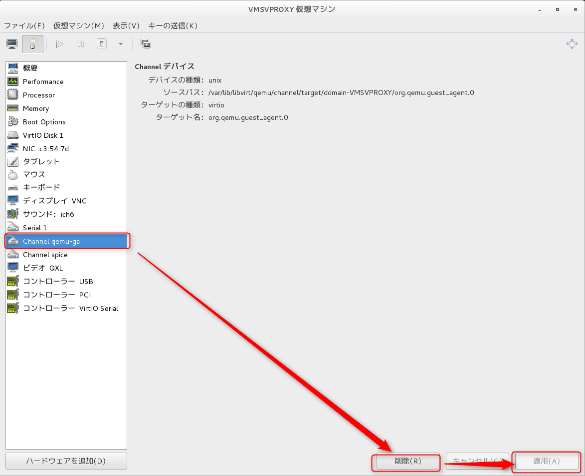

こんにちは。

今回はこれまでも掲載してきたKVM仮想化ですが、仮想マシン名の変更にはちょっとした手順が必要となりますので紹介したいと思います。

KVM構築の記事は以下を参考にしてください。

* [CentOS 7にKVMでコマンドラインのみで仮想マシンを構築する](/make-virtual-machine-with-kvm-in-centos-7/)
* [KVMの仮想イメージをバックアップ・リストアする方法](/backup-and-restore-virtual-image-for-kvm/)


## 単純に名前を変更すると動かなくなる

KVMの管理画面(virt-manager)から、単純に名前を変えてみます。




変更後、起動すると以下のようなエラーで動作しなくなります。**再度同じ名前に戻せば動きます。**

>仮想マシンの開始中にエラーが発生しました：内部エラー：モニターに接続中にプロセスが終了しました：




## 変更の流れ

### 名前の変更

jv-proxy　→　VMSVPROXY　に変更する。

### 設定ファイルをコピーする

```
# cd /etc/libvirt/qemu
# cp -rp jv-proxy.xml VMSVPROXY.xml
```

※ .xml の前の部分は仮想マシン名と同名になる。

### uuidを作成する

```
# uuidgen
bc6b8e06-4830-47a9-bbbf-2d74bb8cdcba
```

### 仮想イメージファイル名を変更する

```
# cd /var/lib/libvirt/images/
# mv jvproxy.img VMSVPROXY.img
```

※ 必須ではありませんが、名前と一致させることをおすすめします。


### 新規作成した設定ファイルの仮想イメージファイルへのパスを変更する

```
# cd /etc/libvirt/qemu
# vi VMSVPROXY.xml
```

名前と、UUIDを変更します。UUIDの部分は `uuidgen` で出力された値を設定します。以下の画像は変更後となります。



仮想イメージファイル名を変更します。
以下の画像は変更後となります。


### 変更前の仮想マシンを削除する

```
# virsh undefine jv-proxy
ドメイン jv-proxy の定義が削除されました
```

※ undefine すると、xml設定ファイルが削除されてしまうため念のためバックアップを採取することをおすすめします。


### 変更後の仮想マシンを登録する

```
# virsh define /etc/libvirt/qemu/VMSVPROXY.xml
ドメイン VMSVPROXY が /etc/libvirt/qemu/VMSVPROXY.xml から定義されました
```

### channelデバイスの調整

ここまでの流れで名前が変更され、動作するはずだったのですが、channelデバイスの設定に仮想マシンの名前が埋め込まれているため、起動時にエラーとなってしまいました。

今回は、以下の画像のようにデバイスを削除して起動することを確認しました。
※以下の画像は名前変更後のchannelデバイスです。



設定ファイルの編集で、以下のように書き換えることで削除しなくても起動が可能になると思います。

```
# cd /etc/libvirt/qemu
# vi VMSVPROXY.xml
```


## あとがき

名前を変更するという単純な作業ですが、仮想マシンの設定ファイルに埋め込まれていたり少し手間がかかります。

今回紹介した手順とは別で、undefine した後に、仮想イメージから新規で設定ファイルを作成する方法も可能です。次回の記事で紹介したいと思います。

ご覧いただきありがとうございました。