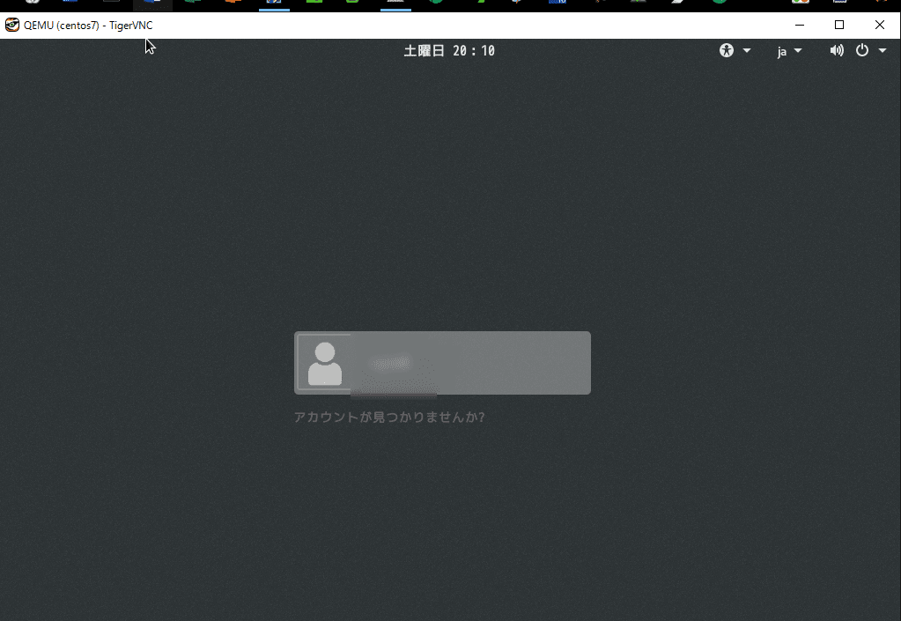

こんにちは。

今回はCentOS7+KVMで仮想マシンを構築します。

【ノートPCサーバのOS概要】


【全体概要】


ノートPCサーバのCentOS7は事前に開発環境としてインストールを実施しています。
そのため、インストール直後からKVM(libvirtd)関連のパッケージはインストール済みです。


ノートPCサーバ側の操作は全てコマンドラインで実施していきたいと思います。


## 準備

### ノートPCサーバ側

1. CentOS7のISOをダウンロード

```
# wget http://ftp.riken.jp/Linux/centos/7/isos/x86_64/CentOS-7-x86_64-DVD-1511.iso
```
**※2016年9月下旬のバージョンです。**

1. ダウンロード後、`/var/lib/libvirt/images`に移動します。
```
# mv /root/CentOS-7-x86_64-DVD-1511.iso /var/lib/libvirt/images/
```

1. BIOSの設定変更
BIOSの設定でVirtualization TechnologyをEnableにする。
**これを忘れるとKVMが動作しません。**

### 操作用Windows端末側

1. Tiger VNCのインストール

今回はVNCで接続出来ればなんでもよかったので、ぱっと思い出したTiger VNCにしました。

[ここ](http://tigervnc.org/)からダウンロードし、インストールします。


ダウンロードの流れは以下を参考にしてください。

1.1 赤枠のリンクへ移動


1.1 赤枠のリンクへ移動


1.1 赤枠からEXEをダウンロード


インストールは複雑ではないので、直感でインストール出来ると思います。
起動すると、このような画面が出てきます。


## 仮想OS構築

### ノートPCサーバに接続
操作用Windows端末からTeratermなどのターミナルソフトでノートPCサーバに接続します。

### 仮想マシンの作成と起動
以下のコマンドを実行し、仮想マシンの作成と起動を実施します。
```
virt-install \
  --name centos7 \
  --hvm \
  --virt-type kvm \
  --ram 2048 \
  --vcpus 2 \
  --arch x86_64 \
  --os-type linux \
  --os-variant rhel7 \
  --network network=default \
  --graphics vnc,listen=0.0.0.0 \
  --noautoconsole \
  --disk path=/var/lib/libvirt/images/centos7.img,size=150,sparse=true \
  --cdrom /var/lib/libvirt/images/CentOS-7-x86_64-DVD-1511.iso
```
**CPUコア＝2コア、メモリ＝2G、HDD＝150GB　という条件で作成。**

実行すると、以下の出力になります。

```
# virt-install \
   --name centos7 \
   --hvm \
   --virt-type kvm \
   --ram 2048 \
   --vcpus 2 \
   --arch x86_64 \
   --os-type linux \
   --os-variant rhel7 \
   --network bridge=virbr0 \
   --graphics vnc,listen=0.0.0.0 \
   --noautoconsole \
   --disk path=/var/lib/libvirt/images/centos7.img,size=150,sparse=true \
   --cdrom /var/lib/libvirt/images/CentOS-7-x86_64-DVD-1511.iso

インストールの開始中...
割り当て中 'centos7.img'                            | 150 GB     00:00
ドメインを作成中...                              |    0 B     00:00
仮想マシンのインストールが進行中です。インストール
が完了するまでコンソールの再接続を待っています。
```

Tiger VNCからノートPCサーバに接続するため、VNCポートを以下のコマンドで確認します。

```
#  netstat -tanp | grep kvm
tcp        0      0 127.0.0.1:5900          0.0.0.0:*               LISTEN      11645/qemu-kvm
```

5900ポートで待ち受けていることが分かりました。


## OSインストール及び仮想マシンの操作

### Tiger VNC起動
操作用Windows端末で、Tiger VNCを起動します。

### 仮想OSに接続
Tiger VNC で接続します。


### 仮想OSのインストール
Tiger VNCで接続後、CentOSのインストールを進めます。
※ここではCentOSのインストール詳細は割愛します。


操作感は遅延などの違和感はほぼ感じませんでした。

### インストール完了

インストールが完了すると、再起動をしますがなぜか再起動なのに停止します。
以下のコマンドで起動します。

``virsh start centos7``

起動後、再度 Tiger VNCで接続します。
すると、ライセンス同意の画面となっていますので以下を参考に進めます。
**入力部分を赤枠で囲っています。**


ログイン出来ることを確認しました。




## あとがき

仮想化するメリットは、1台の物理マシンで複数の仮想OSを稼働させることでコストダウンが出来るなどあると思いますが、今回は1台の物理マシンに1台の仮想OSを構築しました。

その理由は、仮想化することでスナップショットが採取できることとバックアップから復元するのが容易なことです。

現在はハードウェアの価格が非常に安くなってきているので、安価なサーバを複数台購入して、今回のような構築を行い、万が一 サーバが故障でつぶれた場合にはサーバは直さず（保守も入らず）予備のサーバに仮想OSを復元して運用を継続したい、というお客さまもおられます。

ミッションクリティカルなシステムではそうはいかない部分もあると思いますが、このような手法があることも知っておけば提案の幅は広がるのではないでしょうか。

それでは次回の記事でお会いしましょう。
