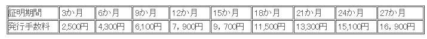

【社長奮闘記】シリーズ化を目指します(笑)

さて、労働保険の年度更新時期となりました。

## 労働保険の電子申告

弊社は給与計算にfreeeを利用しておりますが、準備を進めているとfreeeでは電子申告ができる、ということで便利だしやってみようと思ったところ、電子申告には電子証明書が必要ということがわかり、取得にむけてアプローチしてみました。

電子申告に進んでみると、・・・

電子証明が必要だとエラーが出ました。

## e-Gov対応の電子証明書

確認すると、**e-Govで利用可能な電子証明書**が必要なようです。
>e-Gov は、電子政府の総合窓口で、総務省行政管理局が運営する総合的な行政情報ポータルサイトです。

早速、どうしたら取得出来るのかなと確認すると、[こちらのページに](http://www.e-gov.go.jp/faq/shinsei-mhlw/0013/index.html)一覧が公開されていました。

一覧の中の、**商業登記に基礎を置く電子認証制度(電子認証登記所)**[http://www.moj.go.jp/ONLINE/CERTIFICATION/index.html](http://www.moj.go.jp/ONLINE/CERTIFICATION/index.html)を確認してみました。

## でも有料です

リンク先の、[**電子証明書の取得のご案内**](http://www.moj.go.jp/MINJI/minji06_00028.html)に進むと・・・

**有料**か・・・取得だけに費用が発生するなら仕方ないなと思うけど、期間で費用が発生するのか・・・。

現状では電子申告している業務が少ないため、今回は諦めました。足を使って労働局に払い込みに行こうと思います！