こんにちは。

今回、Web アプリケーション脆弱性診断ツールの **OWASP(Open Web Application Security Project)　ZAP** を使ってみた感触をレポートします。

## インストール
インストール環境は、Windows Server 2012 R2 です。

前提として JRE が必要となりますので、インストールされていない場合は、[ここ](https://java.com/ja/download/)からインストールしてください。

前提を満たした上で、[ここ](https://github.com/zaproxy/zaproxy/wiki/Downloads) から OWASP ZAP をダウンロードします。

<a href="images/owasp-zap-1.png">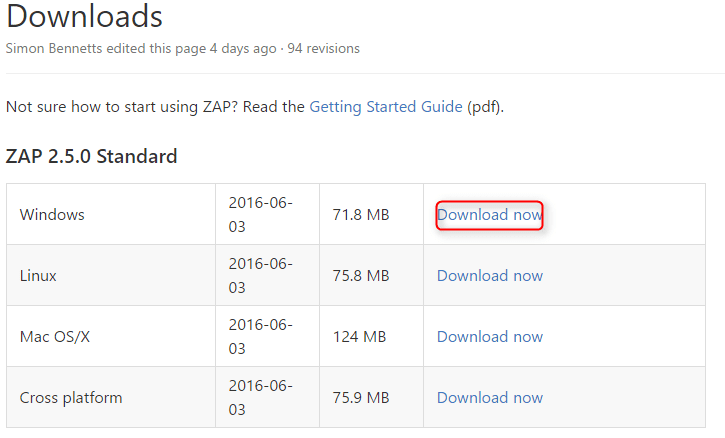</a>

その後は以下の流れでインストールします。

<a href="images/owasp-zap-2.png">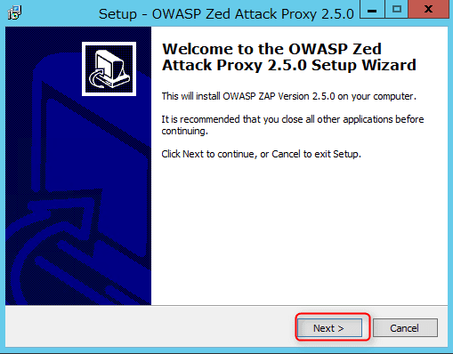</a>

<a href="images/owasp-zap-3.png">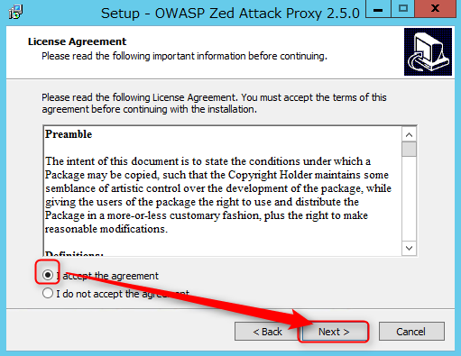</a>

<a href="images/owasp-zap-4.png">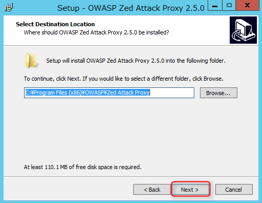</a>

<a href="images/owasp-zap-5.png">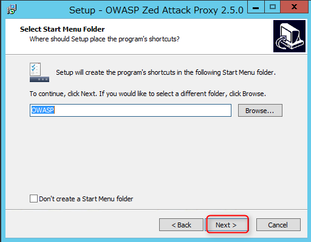</a>

<a href="images/owasp-zap-6.png">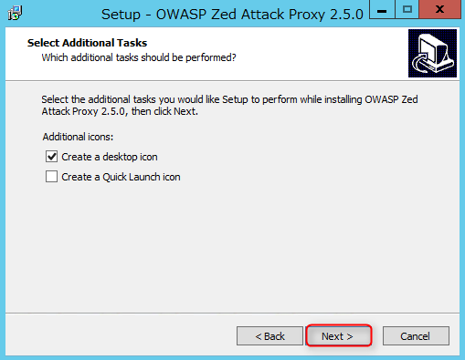</a>

<a href="images/owasp-zap-7.png">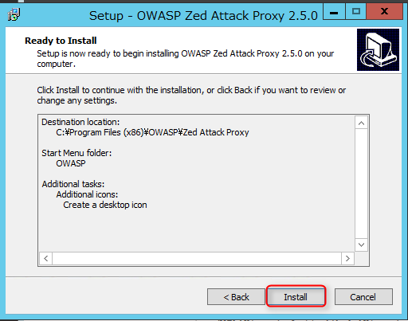</a>

<a href="images/owasp-zap-8.png">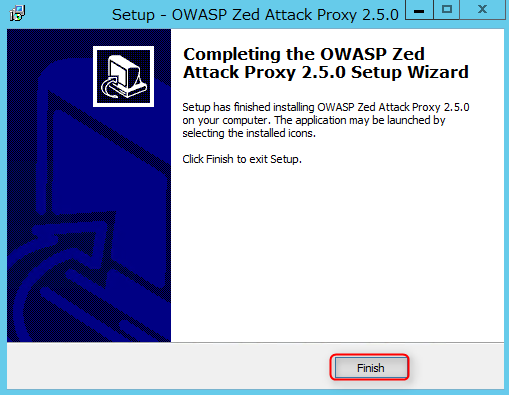</a>

インストールが完了すると、デスクトップ上に以下のアイコンが作成されます。

<a href="images/owasp-zap-9.png">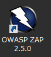</a>

## 使ってみる

デスクトップに作成されたアイコンをダブルクリックします。

利用許諾を同意(Accept)します。

<a href="images/owasp-zap-10.png">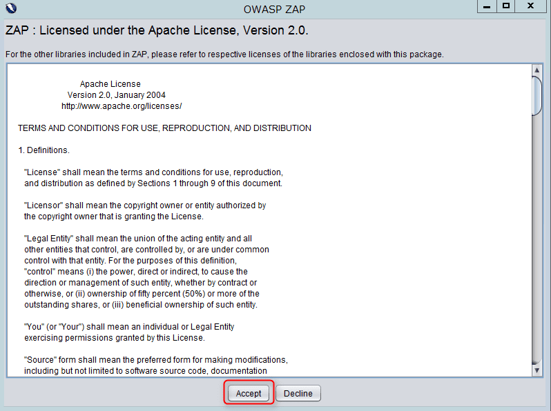</a>

起動中。

<a href="images/owasp-zap-11.png">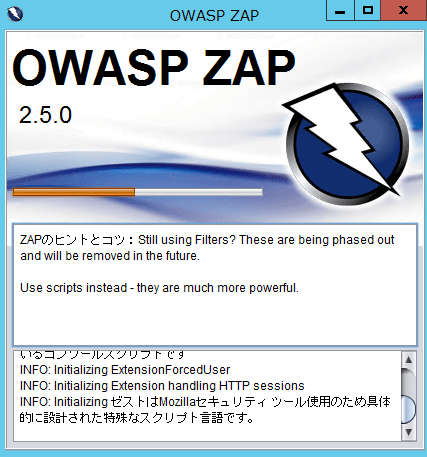</a>

初回の問い合わせは以下のように設定してOKをクリックします。

<a href="images/owasp-zap-12.png">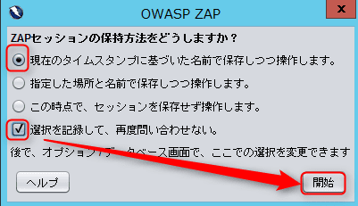</a>

弊社Blogに対して、攻撃をしてみます。（みなさんはマネしないでくださいね！）

<a href="images/owasp-zap-13.png">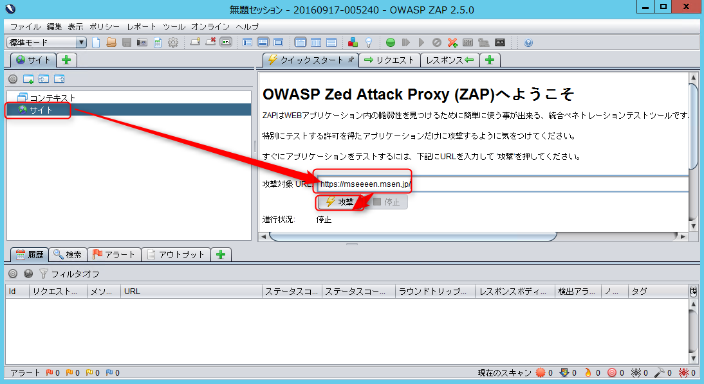</a>

進行します。（ちょっとどきどき）

<a href="images/owasp-zap-14.png">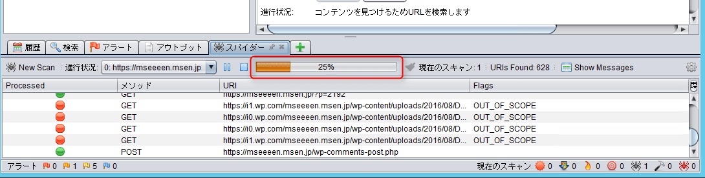</a>

完了すると、アラートの部分で確認できます。説明も日本語で非常にわかり易いです。

<a href="images/owasp-zap-15.png">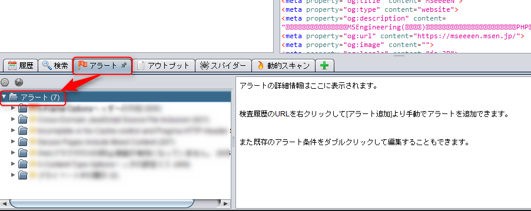</a>

## あとがき

前項のアラート画像は、セキュリティをさらすことになるのでボカシを入れさせていただきました(笑)

大きな脆弱はなく安心でした。

このように手軽に基本的なチェックができるオープンソースがあることは助かりますね。

これらのチェックを実施することで安心はできませんが1つの指標になると思います。

注意点は、これらは攻撃と同じようにチェックするため ZAP を起動してすぐの注意書きにもありますが、チェック対象にするサイトへは必ず同意の上実施してください。

<a href="images/owasp-zap-16.png">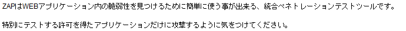</a>

それではまた次回お会いしましょう。