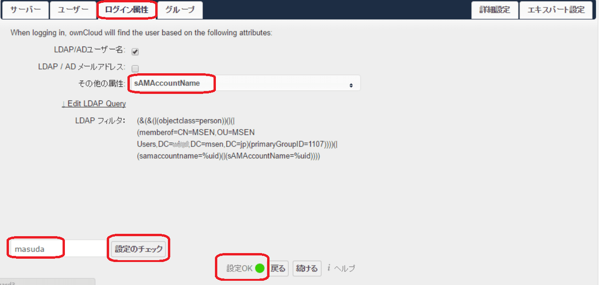
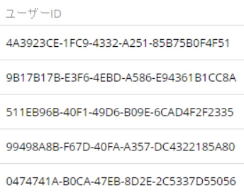

ownCloudをActiveDirectory(AD)認証に対応する方法を紹介します。

ownCloudは、Dropbox のようなオンラインストレージサービスを構築することができるオープンソースソフトウェアです。

## 前提
1. ActiveDirectoryが構築されていること。
1. ownCloudが構築されていること。

## 手順
1. 管理者権限を持つユーザでログインします。
1. 左上メニューの、**ファイル→アプリ**を選択します。

1. 左メニューの**無効**を選択し、**LDAP User and group backend**を有効にします。

1. 有効にした後、右上メニューの**admin→管理**と進みます。

1. 左メニューの**LDAP**を選択します。

1. サーバータブを設定します。以下で設定しているドメイン名は**mydomain.msen.jp**です。
  - 1行目：サーバーのIPアドレスを入力し、ポート検出をクリックします。正しい場合は検出に成功します。
  - 2行目：管理権限のDNを記載します。特に制約がないため、administratorとしています。
  - 3行目：2行目で記載したユーザーのパスワードを入力します。
  - 4行目：ベースDNを記載します。

1. 入力後、**ベースDNをテスト**のボタンをクリックし**設定OK**と出ることを確認します。
1. ユーザータブを設定します。以下は一例ですが、環境や絞り込み条件によって読み替えてください。
  - only these object classes には、**person** を設定します。
  - さらにグループで特定するため、グループを設定します。

1. 前項の下部に進み、**設定を検証し、ユーザを数える**ボタンをクリックし検索されたユーザー数と設定OKが出ることを確認します。

1. ログイン属性を設定します。
  - sAMAccountNameを設定し、ユーザー名を入力の上 設定のチェックをクリックし設定OKが出ることを確認します。

1. ここまでの設定で、前項で検索されたユーザーが登録されますが、現状ではユーザーIDがUUIDという長い文字列となるため、続けてエキスパート設定を行います。

1. エキスパート設定を選択し、内部ユーザー名属性に **sAMAccountName**を入力します。

1. 前項の下部に進み、**ユーザー名とLDAPユーザーのマッピングをクリアする**と**グループ名とLDAPグループのマッピングをクリアする**をクリックし、続けて**設定をテスト**をクリックし成功することを確認します。

1. 右上メニューの**admin→ユーザー**と進みます。

1. ユーザーIDが正しく名前で出ていることと、ActiveDirectoryのユーザーが自動で登録されていることを確認します。

上記までの設定により、ownCloudをAD連携にすることができました。