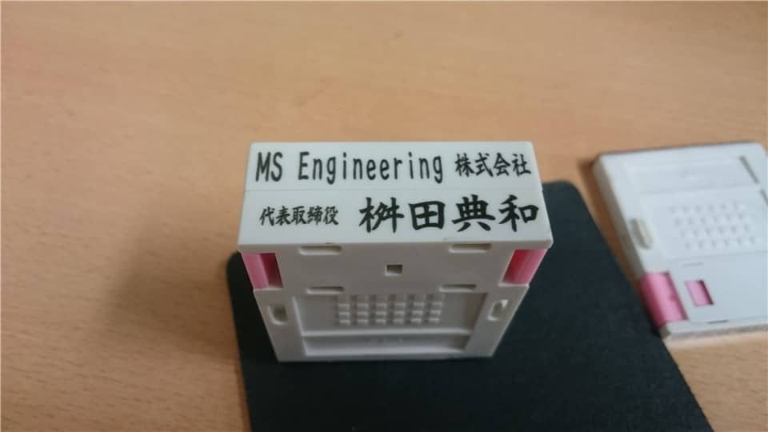

こんにちは。

今回は、会社でよく使うゴム印について最近感じたことを記事にしたいと思います。

## 意外にも重要なゴム印
早いもので会社を設立してから1年と6ヶ月が過ぎました。

弊社はミニマムな会社なので簡単な事務手続きは私自身がやっています。ここまでにいろいろな手続きをこなしていますが、想像以上にゴム印は重要だな、と感じています。

例えば、某社で機材を購入した際にサインしてほしいと渡された資料（注文書と受領書）の会社欄には**ゴム印でないとダメなんですよ**と言われました。

また、ハローワークで手続きする雇用保険の手続きでも同様に会社欄には**ゴム印**でお願いします、と言われその場で手続きできず持ち帰ったこともありました。

## 組み合わせタイプのゴム印を推奨
会社を設立するとき、実印や銀行印・住所の入ったゴム印などまとめて作ることが多いと思います。

弊社も実印などと一緒にゴム印を作りました。

そのときのタイプはシャチハタタイプでした。
(下記のようなタイプ)

当初作成した並び順は、**住所**、**会社名**、**代表名** でした。

このタイプは封筒などに決まった形で押す場合には重宝なのですが、フォーマットの変更に対応できないのが致命的です。

色々な手続きをこなしていくうちに **電話番号が必要** な資料を目の当たりにすることが多くなり、電話番号だけ手書きで書き続けるか、それとも買い換えるか、と悩むようになりました。

追い打ちは、銀行での手続きで **会社名**、**代表名**、**住所**、**電話番号** という順番のゴム印を求められたときでした。

「これは、無理だ買い換えよう・・・」

そこで、組み合わせタイプを検討し買い換えました。実際使用中のゴム印がこちらです。

**ASKULの幅52mmタイプ**
[https://spc.askul.co.jp/cstamp/cs0211.30570](https://spc.askul.co.jp/cstamp/cs0211.30570)

これでいろいろな組み替えに対応できるようになりました。しかもASKULのこのタイプはワンタッチで取り外せるようになっているので便利です。

幅は52mm～62mmまで選べるのですが、文書によって押印欄のサイズが違うので、「小は大を兼ねる」で一番幅の狭い52mmタイプにしています。

もし今後事務所の移転などが発生しても住所部分だけを買い足せば対応できるのでコスト的にもメリットがあると思います。

## あとがき
このタイプで非常に満足なのですが、1点だけ欠点があります。シャチハタタイプではないのでインクスタンプを一緒に持ち歩かないといけないのですが、押印した後、きれいにインクを拭き取ることができずケースや手にインクがついてしまうことです。

業種によりニーズは変わると思いますが何かの参考になれば嬉しいです。

それでは、また新たな奮闘記でお会いしましょう。