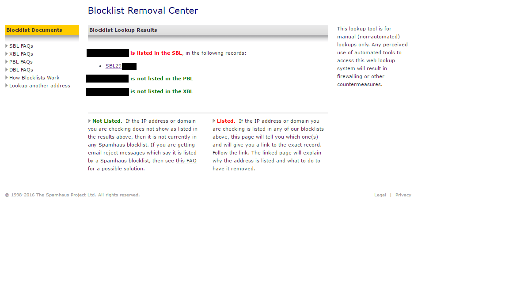

## 概要
- とある日、弊社の顧問税理士さんから「桝田さんへのメールがエラーで返ってる」と連絡がありました。エラーメールを確認すると、以下のようなメッセージが確認できました。(メールアドレスとIPアドレスは伏せ字にしています。)

> ----- The following addresses had permanent fatal errors -----<社長@xx.xx>　(reason: 550 5.7.1 Service unavailable, Client host [xx.xx.xx.xx]　blocked using Spamhaus. To request removal from this list see　http://www.spamhaus.org/lookup.lasso (AS16012611)

## 調査
- 確認をすると、SPAMHAUSが公開しているBlack Listに掲載されていることが分かりました。以下の流れで調査しました。
   - [SPAMHAUSのBlock List検索ページへアクセス](http://www.spamhaus.org/)
   - 概要に記載した、host [xx.xx.xx.xx]に記載されているIPアドレスxx.xx.xx.xxを入力する。（これが税理士さんの利用しているメールが利用されているサーバのIPアドレスとなる。）
   - 結果、SBL(Spam Block List)に掲載されていることが分かる。

## まとめ
- 弊社はMicrosoft Office365のメールを利用していますが、Office365がSPAMHAUSが提供するBlock List情報を参照してSPAM判定をしているようで、税理士さんが利用するメールサービスのメールサーバが知らないうちにSBLに登録されたことが原因と推測されます。
- これらを解除するには、[ここ](https://www.spamhaus.org/sbl/)から、英語でクレームを送付し解除を申請しないといけないようです。解除されたかの確認は調査と同様の手順になります。
- 一般情報を見る限りでは、SPAMHAUSの精度はそれほど高くなく困っている方々も多いとのことでした。
- 本現象が発生条件としては、
  1. 送信先（ここでは税理士さん）のメールサーバがSBLに登録されている。
  1. 送信先（ここでは弊社）のメールサービスがSPAMHAUSのSPAM判定を利用している。 

  が考えられると思います。
- 税理さんは月額課金のメールサービスを利用されているのでそちらへの問い合わせをお伝えしました。進展あればまた更新したいと思います。
