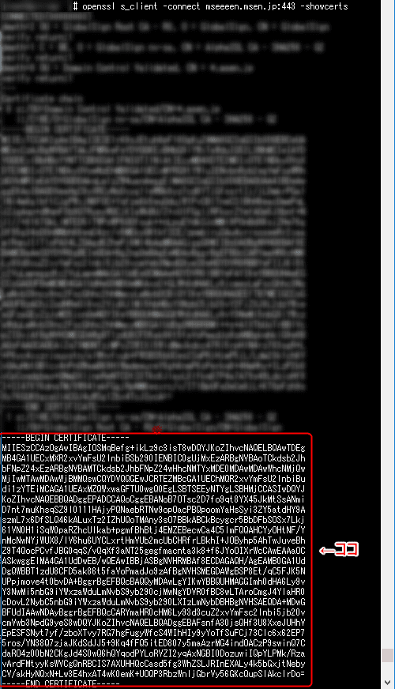

こんにちは。

先日、[こちらの記事](https://mseeeen.msen.jp/suddenly-expired-with-ssl-cert-by-global-sign/)で突如「この組織の証明書は失効しています。」となる現象を紹介しました。

また、GlobalSignが公開している[障害情報](https://jp.globalsign.com/info/detail.php?no=1476381069)を実施しても改善しなかったと紹介しました。

## 原因は設定ミスだった・・・ 
GlobalSignとやりとりをしたところ、**「中間証明書が古いままです。」**と指摘をいただきました。

差し替えたはず・・・。と、よく考えました。

そこで気づきました。

弊社はWebサービスにnginxを利用していますが、nginxの証明書は、**証明書＋中間証明書の結合ファイル**となっており、Apacheのように**証明書と中間証明書が独立**している仕様ではありません。

この部分を失念していたため、Apacheのように中間証明書だけの差し替えだけを実施していました。

では、なぜ差替対象の中間証明書ファイルが独立してあったかというと、中間証明書だけ参照できるようにバックアップしていたためでした。

気づいたところで、結合している中間証明書の文字列を置き換え、サービスを再起動することで改善しました。


## あとがき

中間証明書の確認は以下のコマンドで可能です。

```
openssl s_client -connect "確認するコモンネーム":443 -showcerts
```

コモンネームの部分は、当ブログであれば mseeeen.msen.jp となりますので、
```
openssl s_client -connect mseeeen.msen.jp:443 -showcerts
```
となります。

そして、BEGIN CERTIFICATE　から始まるセクションの2段目が中間証明書となります。



この確認を直後に実施していれば、前回のブログで解決も合わせて紹介できたのに・・・。
結論、ミスでした・・・。（反省）
確認は怠らず！（教訓）

それでは、次回の記事でお会いしましょう。