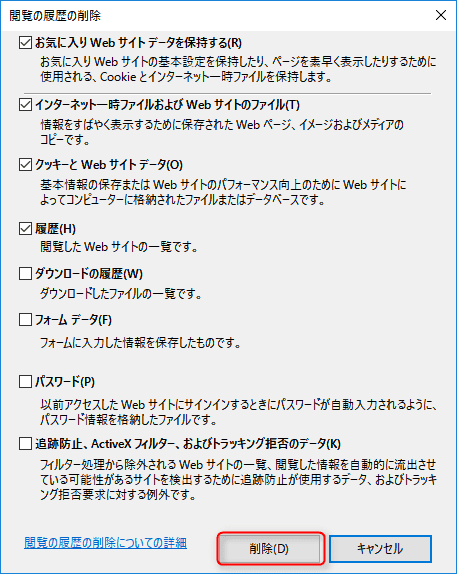

こんにちは。

2016年10月14日　21時ごろ。

弊社のサイトを確認しようとすると・・・

え・・・？

あわてて、chromeでも確認すると・・・

えーーーー
何もしてないし、まだまだ期限あるし・・・。

すぐにメンバーに確認すると、「ん？普通につながるよ。」と言われました。。
少し安心して、自分のスマホでみると見れました。

## 原因判明

IEのキャッシュや、SSL証明書のキャッシュクリアをしても直らず。

いろいろと検索していると、ありました。

[【10月14日14:30更新】一部環境における証明書エラーについて | SSL・電子証明書ならGMOグローバルサイン](https://jp.globalsign.com/info/detail.php?no=1476381069)

弊社利用している中間証明書はまさに、Global Sign なので完全にヒットです。

説明をみると、
>この度、弊社において使用を停止するルート証明書についてクロスルートの設定を解除いたしました。本来お客様のご利用には影響が無い変更でございましたが、一部のご利用環境（ブラウザおよびOS）（※3）において中間CA証明書の処理を正常に行うことができず、解除されるべきでないルート証明書との繋がりも解除された挙動となるケースが発生しております。※3：お客様の環境に依存するため、詳細は判明しておりません。

キャッシュの関係で発生は確実ではないようです。

回避策も書かれています。

>■回避策
以下より、中間CA証明書（SHA256）を取得し、サーバ側で現在の中間CA証明書と入れ替えていただくことで、キャッシュが更新されるのを待たずに復旧いただくことができます。

もしSHA256の証明書でなければ上記の回避策は使えないとのことです。

>また、今回の事象はキャッシュの影響によるため、4日間経過すればエラー表示は解消されます。大変ご迷惑をおかけしますが、SHA256にて再発行が難しい場合、4日間お待ちくださいますようお願いいたします。

4日待てと(笑)

## 対策実施

弊社はSHA256で発行しているので、早速上記リンクに書かれている手順どおりに実施してみました。

中間証明書をリンクに書かれているものと差しかえ、利用しているWebサーバのサービスを再起動します。

そして、再接続してみます。

・・・

まだあきらめない。

IEのインターネットオプションから、キャッシュのクリア実施。

↓

同じくIEのインターネットオプションから、SSLキャッシュのクリア実施。

**はい、同じ現象でだめ。**

最後に・・・再起動・・・

**はい、同じ現象でだめ。**

おそらく、**ユーザープロファイルに依存**しているだろうと思い、失敗する自身のユーザーからログアウトして、**他のユーザでログイン**して接続したところ**正常に接続**できました。

諦めてあとがきをかこう。。

## あとがき
ウィルスバスターを入れていると、検索でヒットしたURLが信頼されているかチェックしてくれます。

結果は文字がグレーの網掛け(安全ではない）になるか、緑の網掛け(安全)になるか、なのですが影響受けているところは多そうでした。

進展があれば更新します。
そのときにお会いしましょう。
