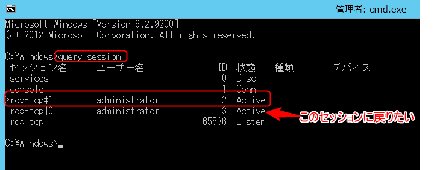

こんにちは。

今回はリモートデスクトップで Windows Server 2012 R2 などに**ログインした際にセッションを切り替える**方法を紹介します。

## 概要

Windows Server は標準の状態では1セッションしかログインできませんが、設定により2セッションまでリモートデスクトップが利用できます。

その方法は下記の記事で紹介しています。

[リモートデスクトップで2セッション有効にする方法 – Windows Server 2012 R2](https://mseeeen.msen.jp/enable-multiple-session-in-windows-server-2012-r2/)

サーバー構築やメンテナンスの際、複数人で作業をしていると誰かに奪ったり奪われたり、ということが発生しますが、書きかけのメモや作業中のコンソールがある場合など、もう一度その環境に戻りたいことがあります。

次項でその方法を紹介します。

## 方法

セッションを確認するには、
```
query session
```
というコマンドを使います。

<a href="images/switch-remote-desktop-session-in-windows-1.png"></a>

**rdp-tcp#1 がコマンド実行時に利用しているセッションです。**

ひとつ下にある、rdp-tcp#0(ID3) に戻りたい場合、```tscon 2```を実行します。
数字の部分は**ID**部分の数字です。

<a href="images/switch-remote-desktop-session-in-windows-2.png"></a>

この手順でセッションの切替を実行することができます。

## あとがき

リモートで作業することは格段に効率を上げます。しかし、時としてリモートで作業をしたが故にトラブルになることもあります。

私も10年ほど前ですが、コマンド1つたたいた瞬間に反応しなくなり、大きな障害に発展した経験があります。

今回紹介の記事など、様々な機能について知り、注意を怠らないことでお客さまの満足度と効率も合わせて上がるものだと考えています。

それでは次の記事でお会いしましょう。