こんにちは。

新たなPCをセットアップしていると、Windows 10の指紋認証であるWindows Helloがグレーアウトしていて設定できないことではありませんか。

無事解決できましたので紹介します。

Windows 10は2016年10月25日の時点で最新となっています。

## Windows Hello がグレーアウト

Windows Helloは、スタートメニューの設定から開きます。

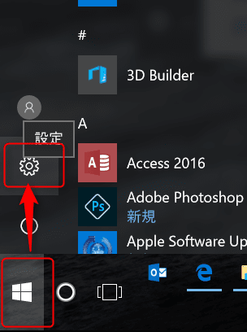

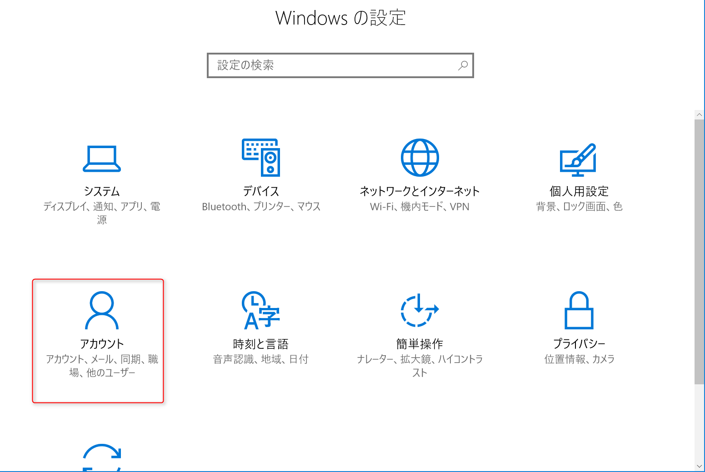

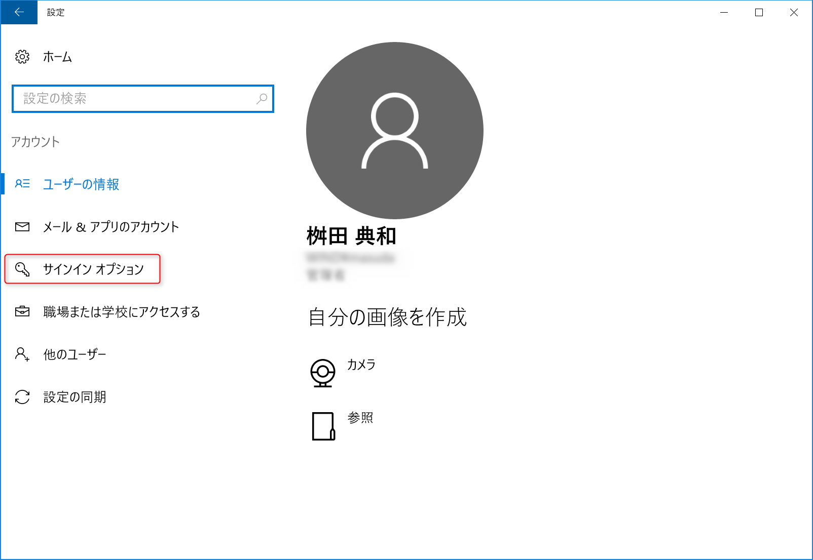

以下のように設定する部分がグレーアウトしていて、設定ができません。

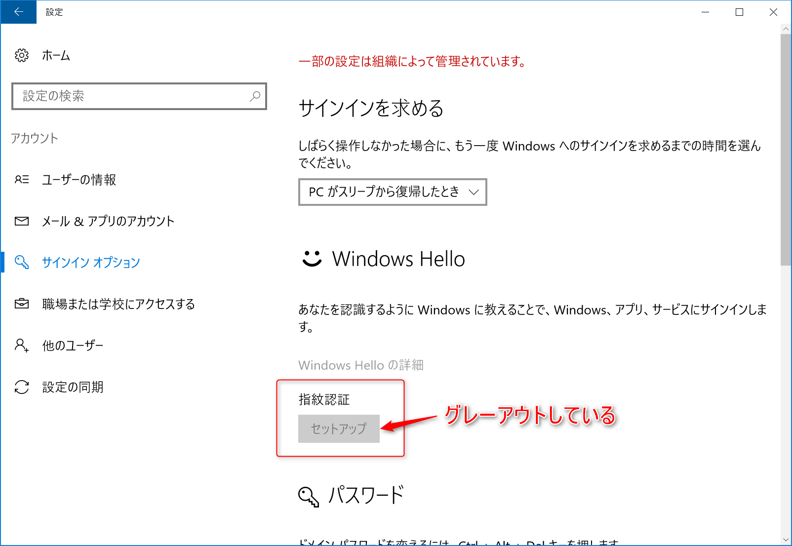

## グループポリシーを変更

左下のWindows マークをクリックし、キーボードで `gpedit.msc` と入力し、ローカルグループポリシーエディタを開きます。

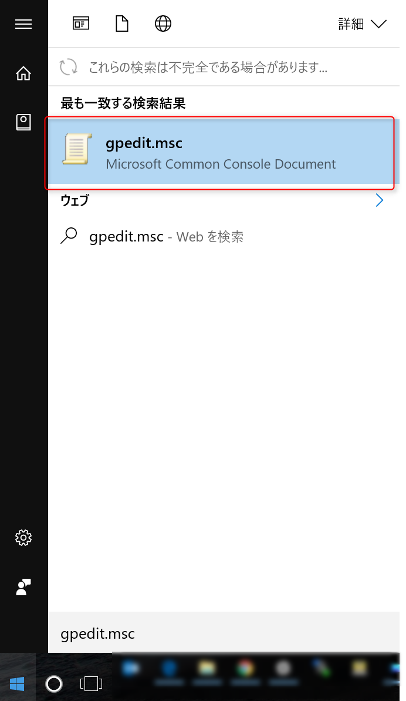

コンピューターの構成→管理者テンプレート→システム→ログオンを開き、**便利なPINを使用したサインインをオンにする**をダブルクリックで開きます。

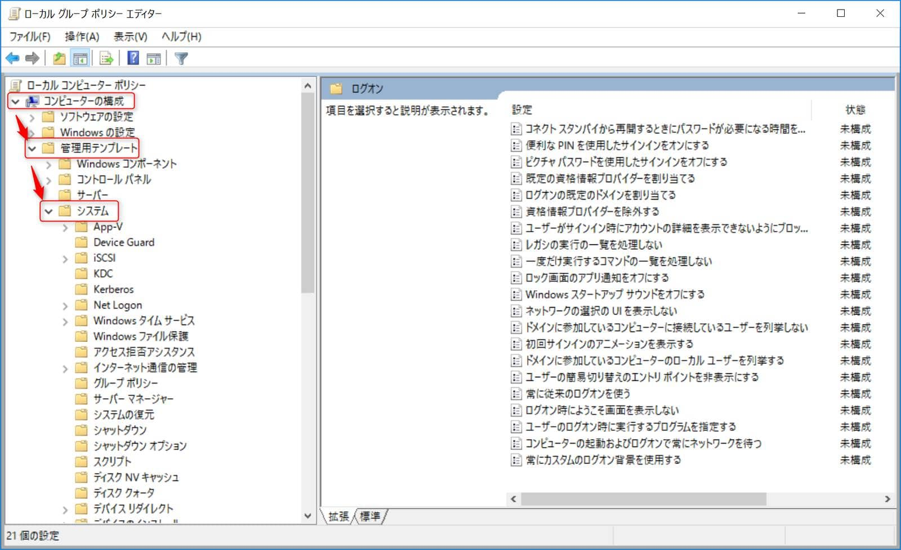

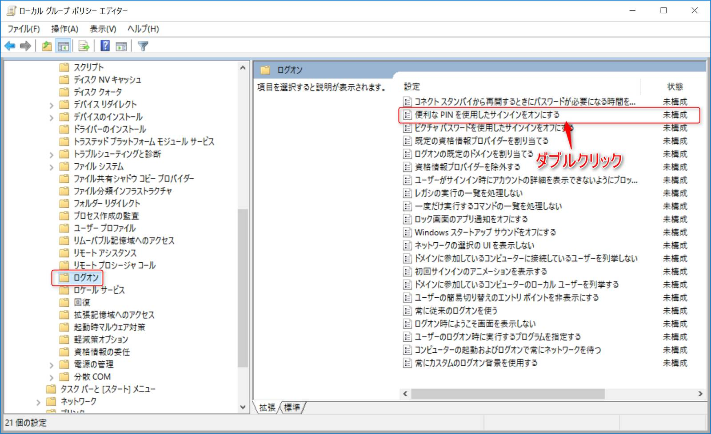

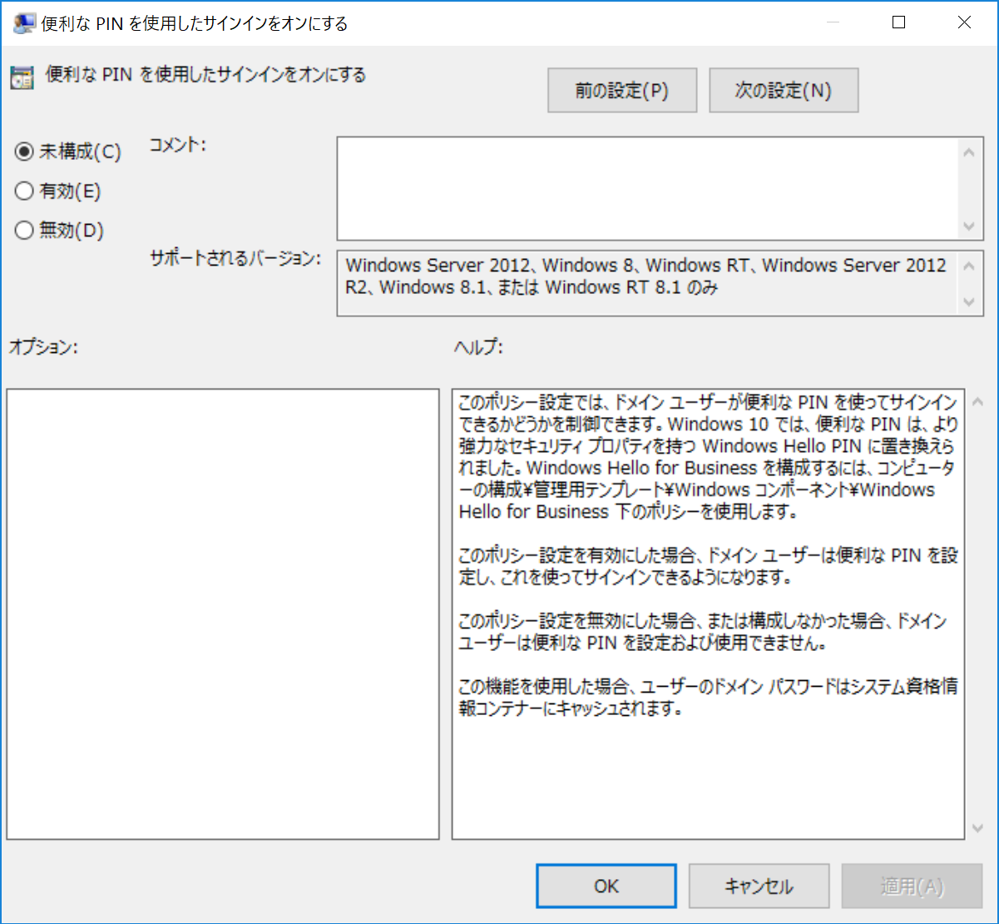

**未構成から、有効にチェックを変更**し適用を押します。

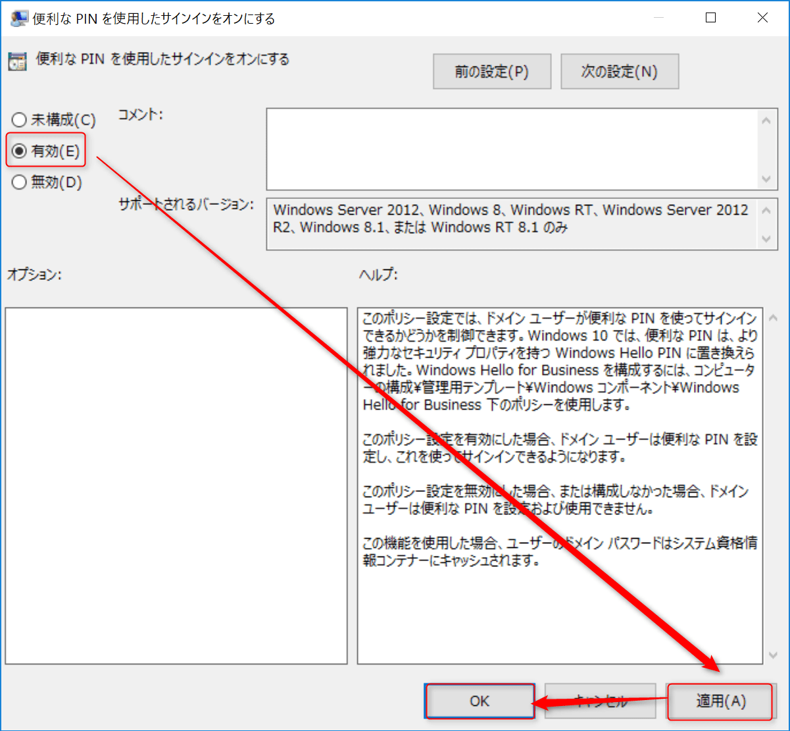

## Windows Hello が設定できることを確認

再度設定画面まで進め、設定できるようになっていることを確認します。

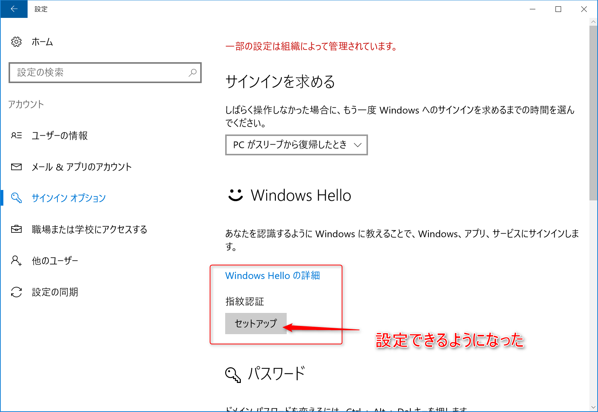

## Windows Hello を設定してみる

セットアップから開始します。

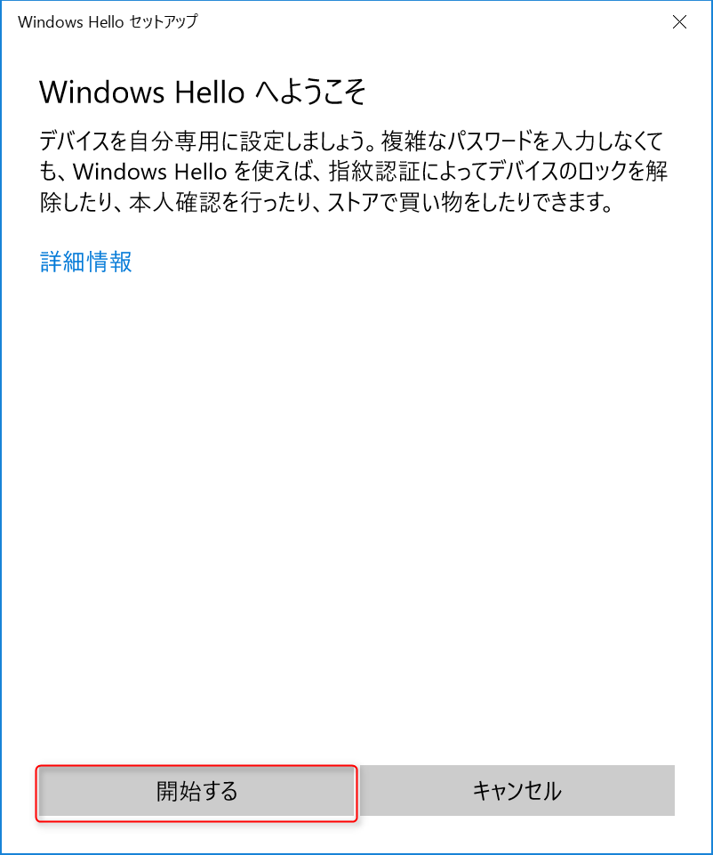

指紋を登録します。

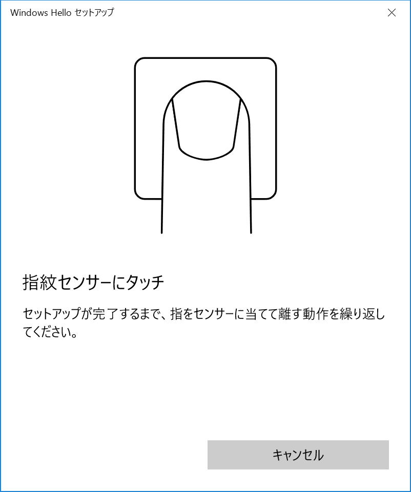

別の角度から登録します。

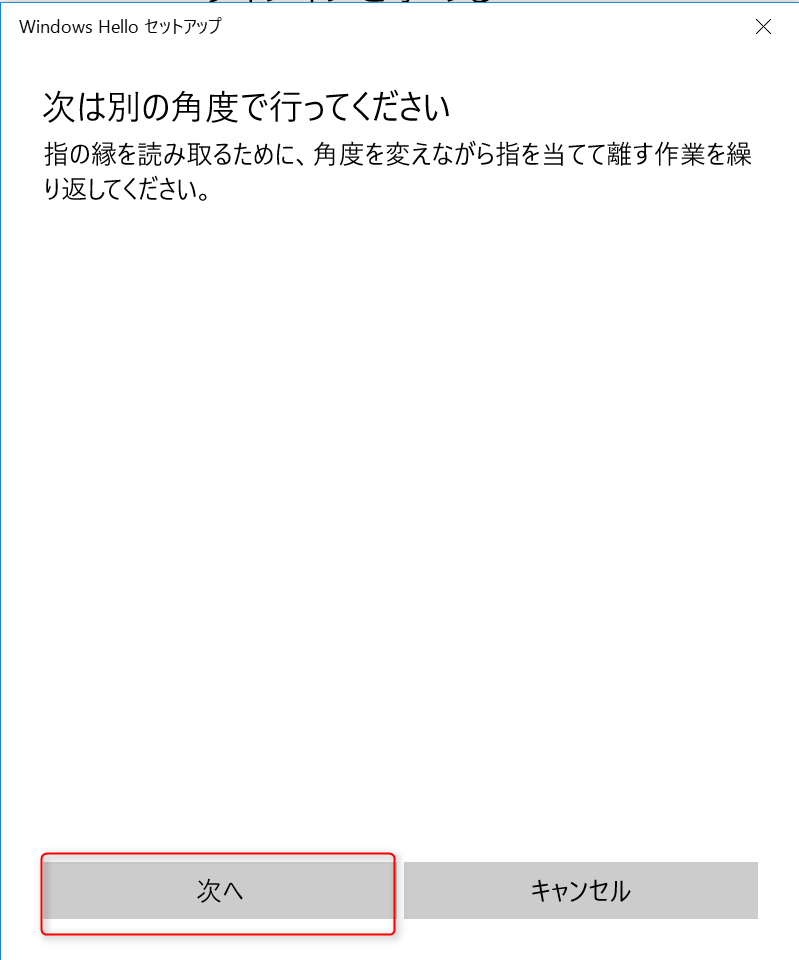

PINコードを登録するために、Windowsログインのパスワードを求められます。

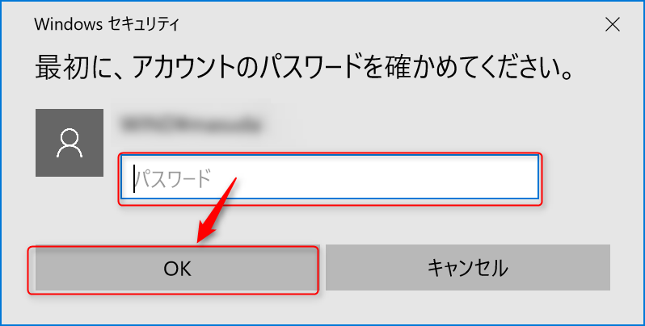

PINコードを登録し、設定完了です。

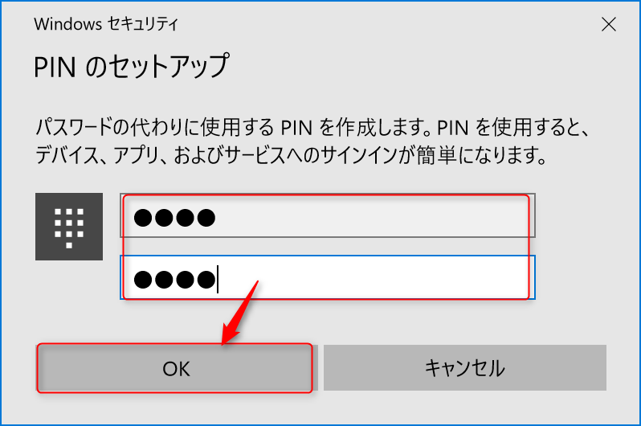

## あとがき

ひと昔前に指紋認証を使おうと思うと、認証するためのデバイスを別途購入してUSBでPCに接続して、ということをしていました。

今時は指紋認証デバイスが標準でPCに付属していることも多く、Windows HelloのようにOS標準で認証ソフトウェアを提供してくれているのでよい時代になりました。

非常に便利なので是非みなさんもご利用ください。

それでは、次の記事でお会いしましょう。