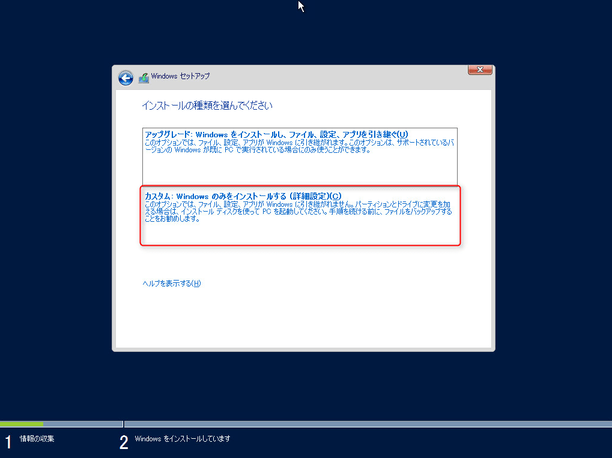
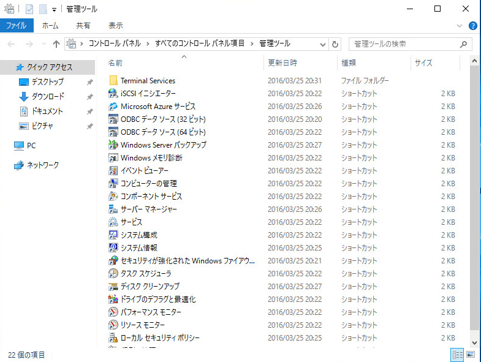

今回は、2016年の夏頃にリリースされてると言われているWindows Server 2016 のPreviewバージョンをインストールしてみました。

弊社は、Microsoft BizSparkに参加しているので、MSDN上から入手しています。
インストール時点では **technical_preview_5** でした。

BizSparkは、マイクロソフトが提供するスタートアップ支援のプログラムで開発ツールやクラウド環境などを 3 年間無償で利用できるというものです。

## インストール
CDから起動すると、Windows Server 2012と同様な画面から始まりました。

今すぐインストールを選択します。ここも2012とほぼ同じですね。

セットアップが始まり、

お、ライセンスキーが求められた。今回は入力しないで進みます。

とりあえず、今回はGUI操作をしたいので、上から2番目の**(Desktop Experience)**を選択で進みます。
**1番上の選択肢は、2012 R2 までは Server Coreと呼ばれていたもので、ログインするとコマンドプロンプトが開かれているタイプです。**

お決まりのライセンスの同意があり、

今回は新規なので、カスタムを選択します。

新規から、全ての領域を適用して進みます。

次へでインストールを開始します。

完了するまで待ちます。
ここまでは、特に2012と大きな違いはないですね。
途中でライセンスが求められることぐらいでしょうか。

## 初期設定

起動してきました。
パスワードを設定します。

↓

## 操作してみた感想

ログイン画面はこんな感じです。あまり変わってないですかね。

↓

ログイン直後のデスクトップ画面はWindows 10そのもの！

サーバマネージャーはあまり変化はないです。

スタートメニューもWindows 10そのものですね。

コントロールパネル。

管理ツール。

発売日は、2016年夏頃のようです。

ちなみに、Windows2012のサポートが切れるのは**2023/01/10**です。
[参照](https://support.microsoft.com/ja-jp/lifecycle?C2=1163)

Windows10に日々触れておけば特に操作感のとまどいはないと思います！
