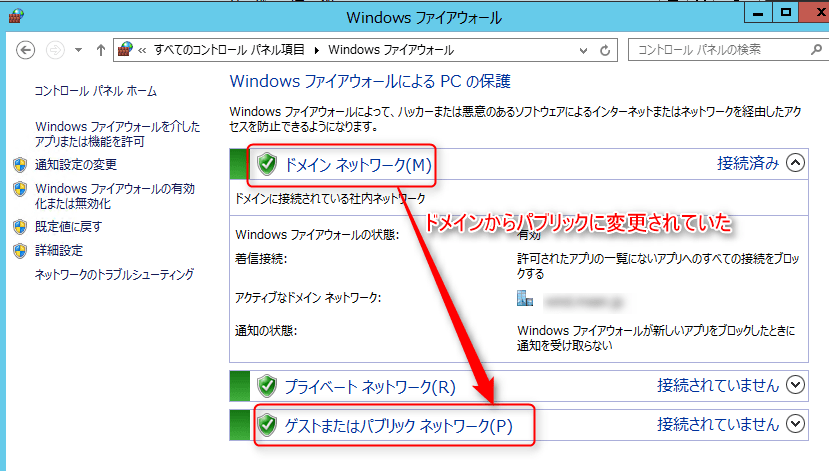

こんにちは。

今回は、過去の構築で解決までに時間がかかった事例を紹介します。

## トラブル内容
Windows Server 2012 R2では、以下のように **ネットワークアダプタの種別** というものが存在します。（Windows Server 2008 R2 も同様です。）

種別には、**プライベート、パブリック、ドメイン（ドメイン参加時のみ）の3種類** があります。

初期構築後、サーバをドメインに参加させ、上記画像のように無事ネットワークアダプタの種別はドメインになっていました。

構築のなかで再起動が発生することはよくありますが、**再起動から復帰するとネットワークアダプタの種別がドメインではなくパブリックになっている**ことがわかりました。

気づいたきっかけは、再起動後にリモートデスクトップ(RDP)がつながらなくなったことでした。

確認すると、Windowsファイアウォールの設定でドメインネットワークのみRDPを許可していたので再起動後の種別変更でつながらなくなっていました。

## 原因
調査の結果、**システム起動時 (NLAサービス起動時) にドメインコントローラと通信ができなかったためにパブリックネットワークと判断されていました。**（NLA (Network Location Awareness) サービスは、ネットワーク構成の変化を監視しているサービスです。）

サーバのリンクアップ後よりドメインコントローラへARPリクエストを送信し続けていますが、ドメインコントローラからARPレスポンスが得られない状況となっていました。

この間にNLAサービスによるネットワークアダプタの種別選定処理が実行されていますが、ARP解決の失敗に起因し、NLAサービスにて **ERROR_NO_SUCH_DOMAIN** エラーが記録され、その結果パブリックプロファイルが選択されていました。

今回のケースでは、システム起動 (リンクアップ) から約30秒後に解消されていることも分かりました。

## 解決に向けて
ARPレスポンスが返らないことが根本要因と分かりましたので、ネットワーク機器や ドメインコントローラまでの通信経路の観点に絞り込み解決策を確認しました。

**ARP解決に時間が掛かる現象**についてネットワーク機器で物理回線が通信可能になるまでに時間が掛かることに起因しており、**スパニングツリーのPort Fast機能を有効化することで改善**したという事例が複数報告されていることが分かりました。

上記事例を元に、サーバとドメインコントローラが接続されているネットワークスイッチ(SW)のポートに対してPort Fast機能を有効にしたところ再起動後も正常にネットワークアダプタの種別はドメインとなっていることを確認しました。

**Port Fast機能を有効にしたポートを★で表記**
サーバ
｜
(サーバが接続されているポート)★
【ネットワークSW】
(ドメインコントローラが接続されているポート)★
｜
ドメインコントローラ

## あとがき
今回の事例において、弊社構築範囲はトラブルに見舞われたサーバ単体でした。

ネットワーク側を担当している会社は別でしたが、日頃から付き合いがあることもあり、お客さまとの連携を含めてスムーズに対処できました。

実際の構築現場ではシステム全てを1社で実現していることは珍しく他社との折衝がどうしても発生します。

そういった際に、日頃のお付き合いから、変更・修正もスムーズに出来たりということがありますがまさに今回はその例でした。

他社さまへ変更依頼をお客さま経由で実施すると、「その変更は別費用だ！」と言われてしまうことも実際の現場には存在します・・・。

次回記事でお会いしましょう。