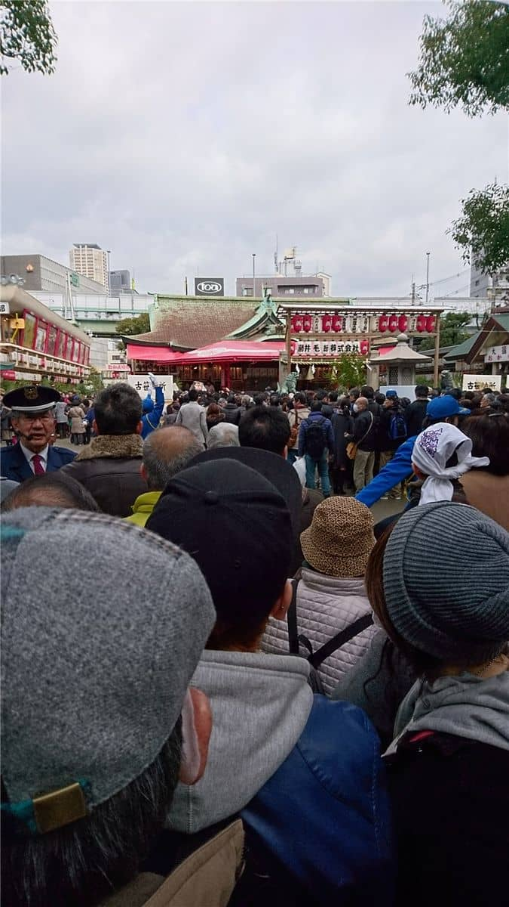
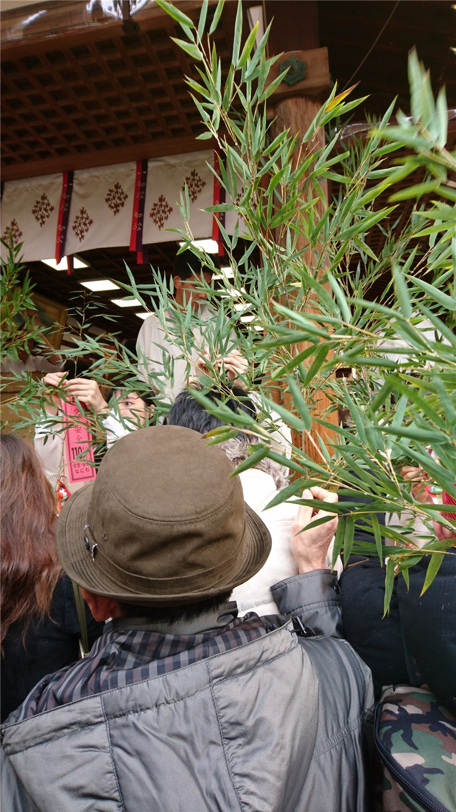
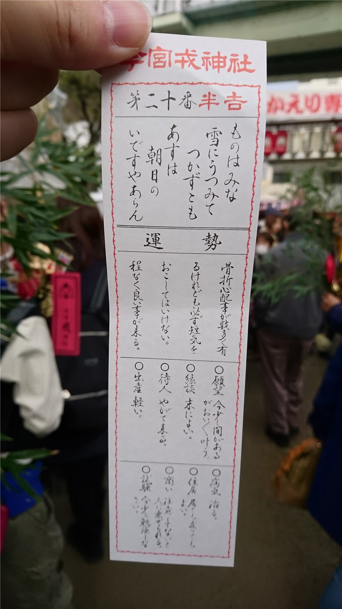
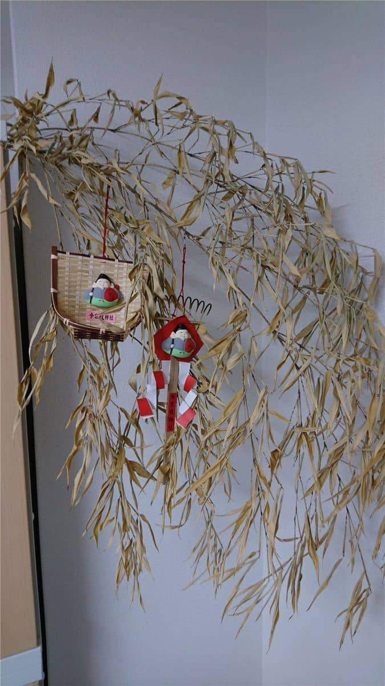
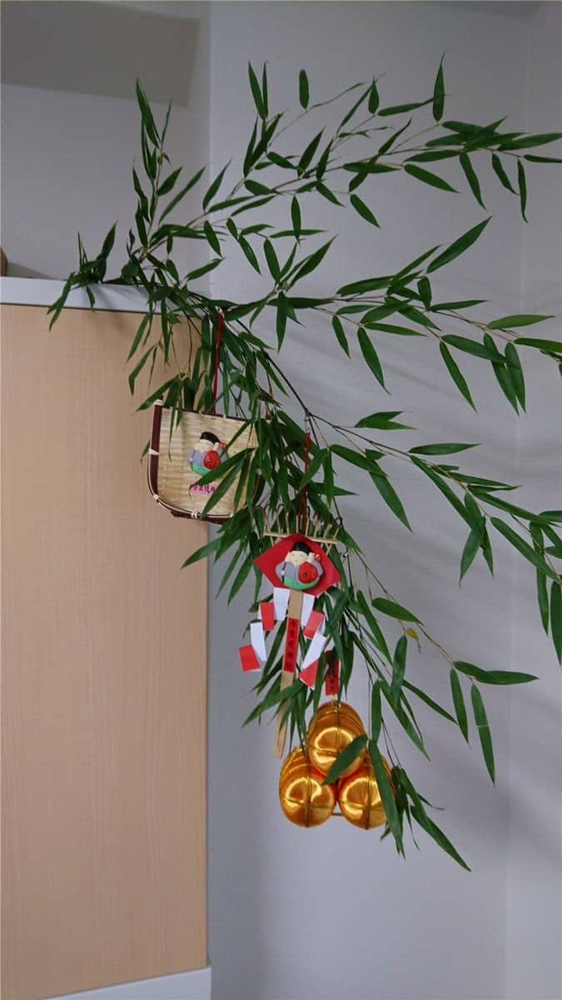
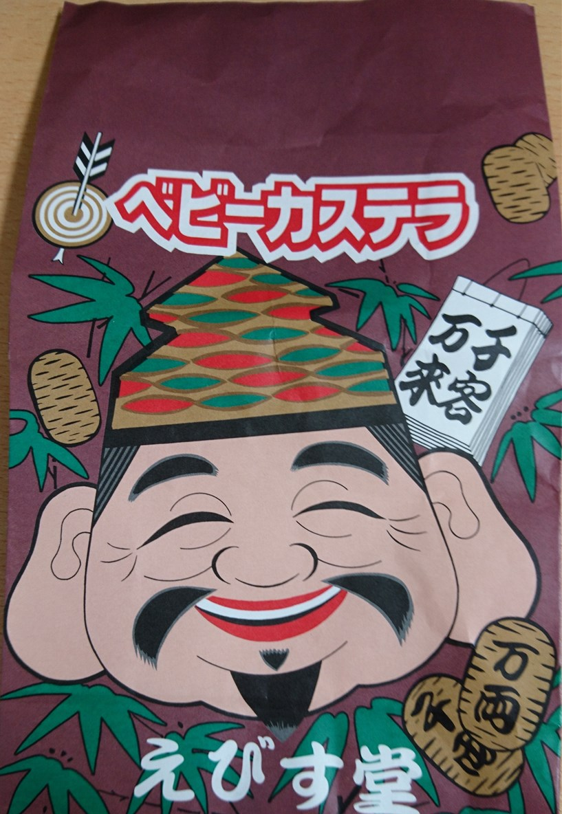

新年あけましておめでとうございます。
本年もよろしくお願いいたします。

さて、1/9(月祝)に十日戎（今宮戎神社）に参拝にいってきました。
「商売繁盛で笹もってこい」の音声が耳に残りますよねｗ

## 参拝
午前中に参拝しましたが、やはりすごい人でした。

死闘の末、笹をゲットし子宝に並びました。

初みくじも引きました！（半吉・・・ｗ）

## 1歩1歩

MS Engineering設立後、去年(2016年)から参拝を始めました。
この時期は、決算前で去年は1期目から2期目に進む前でした。

2期目に向けて！ということもあり、去年の子宝は「熊手」と「箕」の**2つ**にしました。
それがこちらです。
1年間、福を集めてくれました^^

今年(2017年)は、3期目に向けて「熊手」と「箕」と「金の俵」の**3つ**にしました。

来年(2018年)も4つ飾り付けて投稿できるように頑張っていきたいと思います！

## あとがき

境内の周りには露天がいっぱい出ていますが、えびす堂のベビーカステラがおいしいです。
すごく並びますが。。

袋もめでたい^^

今年の今宮戎のスケジュールは、1月9日と10日が終日、11日は0時まで参拝できるようです。

2017年もスタッフ一同頑張って参りますのでどうぞよろしくお願いいたします！
それでは次回の記事でお会いしましょう。
