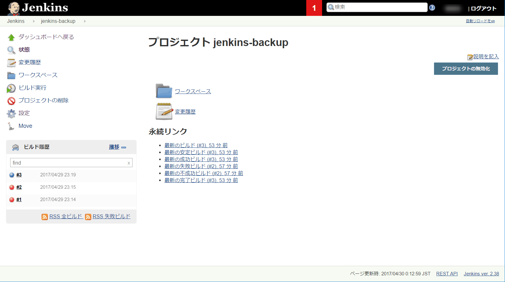
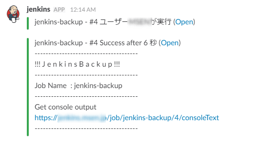

こんにちは。

Jenkins記事が続いておりますｗ

今回は、JenkinsのバックアップをJenkinsのプロジェクトでバックアップをとり、その結果をSlackに通知する方法を紹介したいと思います。

関連する記事：[Azure上のCentOS7にJenkinsを構築](https://mseeeen.msen.jp/jenkins-on-centos7-on-microsoft-azure)
関連する記事：[JenkinsとSlackを連携する＋GitHub連携準備](https://mseeeen.msen.jp/jenkins-on-centos7-on-microsoft-azure)

## 前提状況
1. Slack連携ができていること。
1. バックアップ先の領域が準備されていること。今回は、ファイルサーバをマウントしたパスを`/mnt/backup`としています。

## Jenkinsにプラグインをインストール

バックアップに利用するプラグインをインストールします。

1. **Jenkinsの管理**→**プラグインの管理**と進み、フィルターに**Exclusive Execution Plugin**と入力しインストールします。以下の参考画像はインストール済みのため出ておりません。（インストール済みに出ます）
<a href="images/backup-jenkins-by-himself-1.png"></a>

## ジョブを作成する

バックアップ用のスクリプトを公開されている方がおられますのでありがたく使わせていただきました。
* [jenkins-backup-script](https://github.com/sue445/jenkins-backup-script)

1. **新規ジョブ作成**から、**ジョブの名称**を入れ、**フリースタイル・プロジェクトのビルド** を選択し**OK**で進みます。
<a href="images/backup-jenkins-by-himself-2.png"></a>

1．ソースコード管理の部分は**Git**にチェックをいれ、Repository URLに`https://github.com/sue445/jenkins-backup-script.git`を入力します。続けて、Branch Specifierに`0.0.3`と入力します。
<a href="images/backup-jenkins-by-himself-3.png"></a>

1. ビルド・トリガの部分は**定期的に実行**にチェックをいれ、`0 3 * * *`と入力します。これは毎日AM3:00に実行するという意味になりますので、適宜変更してください。
<a href="images/backup-jenkins-by-himself-4.png"></a>

1. ビルド環境の部分は**ビルドを排他的に実行**にチェックを入れます。
<a href="images/backup-jenkins-by-himself-5.png"></a>

1. ビルドの部分は**ビルドの手順の追加**から**シェルの実行**を選び、以下のように入力します。
 ```
./jenkins-backup.sh $JENKINS_HOME /mnt/backup/backup_`date +"%Y%m%d%H%M%S"`.tar.gz
 ```
続けて、**ビルドの手順の追加**から**シェルの実行**を選び、`find /mnt/backup/backup_* -mtime +30 -delete`と入力します。1つめの設定はバックアップ設定、2つめの設定はバックアップファイルのローテーション設定になります。`/mnt/backup`の部分は任意です。また、ローテーションの`+30`の部分も残したい日数に変更してください。`+30`であれば、30日間保存になります。

1. ビルド後の処理は、**ビルド後の手順の追加**から**Slack Notification**を選びます。各項目任意でチェックをいれ最後のProject Channelに通知したいSlackのチャンネル名を記載します。Custom Messageの部分に、`https://URL/job/${JOB_NAME}/${BUILD_NUMBER}/consoleText`と入力するとコンソール結果がSlackに通知され確認が簡単になります。入力後に保存ボタンを押してプロジェクトを保存します。
<a href="images/backup-jenkins-by-himself-6.png"></a>

これでJenkinsの設定は終了です。

## 実行テスト
1. プロジェクト画面から、**ビルド実行**ボタンをクリックします。
<a href="images/backup-jenkins-by-himself-7.png"></a>

1. 即実行され、Slackに通知されました。
<a href="images/backup-jenkins-by-himself-8.png"></a>
コンソールログの最後を見ると**Finished: SUCCESS**となっており正常に終了していることが確認できました。

## あとがき
ビルド・トリガの部分で、`0 3 * * *`よりも、`H 3 * * *`を使用して間隔を設定してください。** という警告がでていたかと思います。

これは、AM3:00などと固定するのではなく、`H 3 * * *` と設定するのが推奨という意味です。

先ほどの設定であれば、AM3:00の1時間のどこかで実行するよ、という指定ですが、推奨の理由は、Jenkins全体でジョブの実行時間が重なった場合に、その時間に実行することができない（かもしれない）からのようです。

ここ最近、Jenkinsの便利さをじわじわ感じてきています。
それでは次回の記事でお会いしましょう。