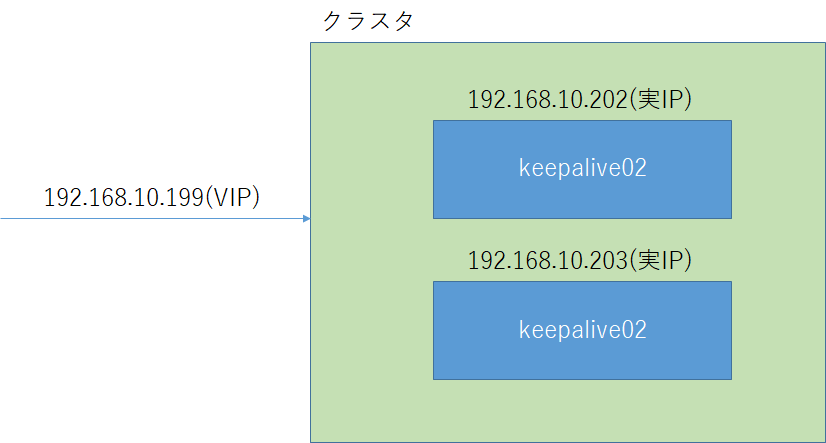

今回は **CentOS 7** で **keepalived** を利用して 2 台のサーバーをクラスタ化する方法を紹介します。

keepalived は、サーバーごと冗長化してしまう優れたサービスです。
Web サーバーや DB サーバーを冗長することにも応用できます。

今回の紹介では 2 台が 1 つのクラスタになるところまで紹介できればと思います。

## 環境
| ホスト名 | IPアドレス |
| ------- | --------- |
| keepalive01 | 192.168.10.202 |
| keepalive02 | 192.168.10.203 |

上記は、サーバーに設定する実際の IP アドレスとなります。
クラスタにアクセスするための仮想 IP(VIP) も決定しておきます。

VIP 192.168.10.199

イメージとしては以下のような環境になります。



**以降の手順は root 権限で操作しています。**

## keepalived のインストール

以下の手順は **keepalive01 と 02 の2台で同じ作業を実施します。**

`yum -y install keepalived`

## keepalived の設定

### keepalive01 (マスタ) の設定

1. オリジナルのコンフィグをリネーム
`mv /etc/keepalived/keepalived.conf{,.org}`

1. コンフィグを新規に記載
`vi /etc/keepalived/keepalived.conf`

アラート通知の部分 (notification_email) は省略していますが、以下のように設定すれば、クラスタに異常が発生した場合、通報が飛びます。

```
        notification_email {
        hogehoge@example.com
        }
        notification_email_from hogehoge@example.com
        smtp_server x.x.x.x
        smtp_connect_timeout 30
        router_id keepalive
}
```

※ x.x.x.x は SMTP サーバーの IP アドレスになります。


それでは、テストした設定ファイルは以下の通りです。

```
global_defs {
   notification_email {
   }
}

vrrp_instance keepalive {
    state BACKUP
    interface ens32
    virtual_router_id 10
    priority 100
    advert_int 1
    authentication {
        auth_type PASS
        auth_pass password
    }
    virtual_ipaddress {
        192.168.10.199
    }
}
```

**設定ファイルの補足**

1. `vrrp_interface keepalive` の **keepalive** 部分は任意の文字列で、次項のスレーブと同様の文字列を設定します。複数 interface を定義可能です。

1. `state BACKUP` の部分の **`BACKUP`**は、**`MASTER`** or **`BACKUP`** が設定できます。今回は両方を BACKUP としていますが、 MASTER を明示的に指定した場合は、1台目が停止した場合に2台目が MASTER になり、1台目が復帰した際には MASTER に戻ります。両者 BACKUP に設定した場合には、先に起動している側が MASTER となります。 MASTER が障害から復旧した際に、再度 MASTER に戻ろうとすることを**フェイルバック**と言いますが、フェイルバックの際の切替が発生することで予期せぬ瞬間停止などが発生するリスクがありますので、両者 BACKUP に設定するなど運用に応じて使い分けください。今回の紹介では、フェイルバックを防ぐため**両方で BACKUP** としています。

1. `interface ens32` の **`ens32`** 部分は `ifconfig` で出力される intarface 名を記載します。  
  ```
  ens32: flags=4163<UP,BROADCAST,RUNNING,MULTICAST>  mtu 1500
          inet 192.168.10.202  netmask 255.255.255.0  broadcast 192.168.10.255
          inet6 fe80::20c:29ff:feac:db07  prefixlen 64  scopeid 0x20<link>
          inet6 2001:a450:13:8200:20c:29ff:feac:db07  prefixlen 64  scopeid 0x0<global>
  ```
1. `virtual_router_id 10` の数字は次項のスレーブと同様の数字を設定します。

1. `priority 100` の数字は MASTER/BACKUP 構成の場合は MASTER を SLAVE より大きな値にしてください。今回は BACKUP/BACKUP 構成のため、同値です。

1. `advert_int 1` の数字は **VRRP** 信号を出す間隔（秒）になります。 VRRP は Virtual Router Redundancy Protocol の略で、経路の冗長化を目的とするプロトコルです。

1. `auth_pass` に続く文字列はパスワードとなり、次項のスレーブと同様の文字列を設定します。  

1. `virtual_ipaddress` の IP アドレスは環境の部分で定義した VIP のアドレス (192.168.10.199) となります。

上記の補足は、次項のスレーブ設定でも同様の意味になります。

### keepalive02 (スレーブ) の設定

1. オリジナルのコンフィグをリネーム
`mv /etc/keepalived/keepalived.conf{,.org}`

1. コンフィグを新規に記載
`vi /etc/keepalived/keepalived.conf`
設定する内容は以下の通り。
**アラート通知の部分 (notification_email) は省略しています**

```
global_defs {
   notification_email {
   }
}

vrrp_instance keepalive {
    state BACKUP
    interface ens32
    virtual_router_id 10
    priority 100
    advert_int 1
    authentication {
        auth_type PASS
        auth_pass password
    }
    virtual_ipaddress {
        192.168.10.199
    }
}
```

## keepalived の起動

設定が完了したところで **keepalived** を起動してみます。
その前に VIP で設定した 192.168.10.199 に Ping を飛ばしてみます。

```
> ping 192.168.10.199

192.168.10.199 に ping を送信しています 32 バイトのデータ:
192.168.10.210 からの応答: 宛先ホストに到達できません。
192.168.10.210 からの応答: 宛先ホストに到達できません。
192.168.10.210 からの応答: 宛先ホストに到達できません。
192.168.10.210 からの応答: 宛先ホストに到達できません。

192.168.10.199 の ping 統計:
    パケット数: 送信 = 4、受信 = 4、損失 = 0 (0% の損失)、
```

届きませんね。

それでは、続けて keepalive01 と keepalive02 で サービスを起動します。

```
[root@keepalive01 ~]# systemctl start keepalived.service
[root@keepalive01 ~]#
```

```
[root@keepalive02 ~]# systemctl start keepalived.service
[root@keepalive02 ~]#
```

起動後に、再度 VIP に Ping を飛ばしてみます。

```
> ping 192.168.10.199

192.168.10.199 に ping を送信しています 32 バイトのデータ:
192.168.10.199 からの応答: バイト数 =32 時間 =11ms TTL=64
192.168.10.199 からの応答: バイト数 =32 時間 =11ms TTL=64
192.168.10.199 からの応答: バイト数 =32 時間 =13ms TTL=64
192.168.10.199 からの応答: バイト数 =32 時間 =10ms TTL=64

192.168.10.199 の ping 統計:
    パケット数: 送信 = 4、受信 = 4、損失 = 0 (0% の損失)、
ラウンド トリップの概算時間 (ミリ秒):
    最小 = 10ms、最大 = 13ms、平均 = 11ms
```

飛びました。

keepalived サービスが再起動しても起動されるように以下を実施します。

```
[root@keepalive01 ~]# systemctl enable keepalived.service
Created symlink from /etc/systemd/system/multi-user.target.wants/keepalived.service to /usr/lib/systemd/system/keepalived.service.
[root@keepalive01 ~]#
```

```
[root@keepalive02 ~]# systemctl enable keepalived.service
Created symlink from /etc/systemd/system/multi-user.target.wants/keepalived.service to /usr/lib/systemd/system/keepalived.service.
[root@keepalive02 ~]#
```

## 冗長テスト

1. **keepalive01** を停止して VIP に Ping を実施。

  ```
  >ping 192.168.10.199

  192.168.10.199 に ping を送信しています 32 バイトのデータ:
  192.168.10.199 からの応答: バイト数 =32 時間 =10ms TTL=64
  192.168.10.199 からの応答: バイト数 =32 時間 =13ms TTL=64
  192.168.10.199 からの応答: バイト数 =32 時間 =12ms TTL=64
  192.168.10.199 からの応答: バイト数 =32 時間 =11ms TTL=64

  192.168.10.199 の ping 統計:
      パケット数: 送信 = 4、受信 = 4、損失 = 0 (0% の損失)、
  ラウンド トリップの概算時間 (ミリ秒):
      最小 = 10ms、最大 = 13ms、平均 = 11ms
  ```
Pingが問題なく飛ぶことが確認できました。

1. **keepalive01** を起動し、 **keepalive02** を停止して、VIP に Ping を実施。

  ```
  >ping 192.168.10.199

  192.168.10.199 に ping を送信しています 32 バイトのデータ:
  192.168.10.199 からの応答: バイト数 =32 時間 =17ms TTL=64
  192.168.10.199 からの応答: バイト数 =32 時間 =11ms TTL=64
  192.168.10.199 からの応答: バイト数 =32 時間 =14ms TTL=64
  192.168.10.199 からの応答: バイト数 =32 時間 =12ms TTL=64

  192.168.10.199 の ping 統計:
      パケット数: 送信 = 4、受信 = 4、損失 = 0 (0% の損失)、
  ラウンド トリップの概算時間 (ミリ秒):
      最小 = 11ms、最大 = 17ms、平均 = 13ms
  ```

逆のパターンでも Ping が飛ぶことが確認できました。

## あとがき

実際に弊社では、 **keepalived** を利用してリバースプロキシを運用しています。
これまで、何度かメンテナンスで片系を停止していますが、サービスは継続できています。

少し許容範囲を大きくすれば、「高価なロードバランサ、あまり使わないサポート・・・」から卒業し、大幅なコストダウンが見込めるかもしれません(笑)

機会があれば、応用についても紹介していきたいと思います。

それでは次回の記事でお会いしましょう。