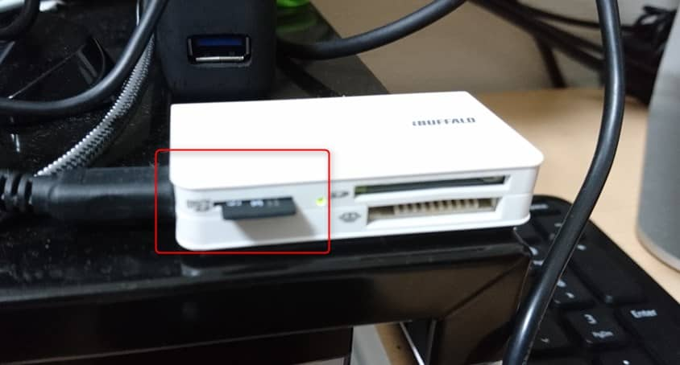
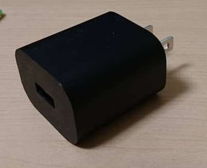
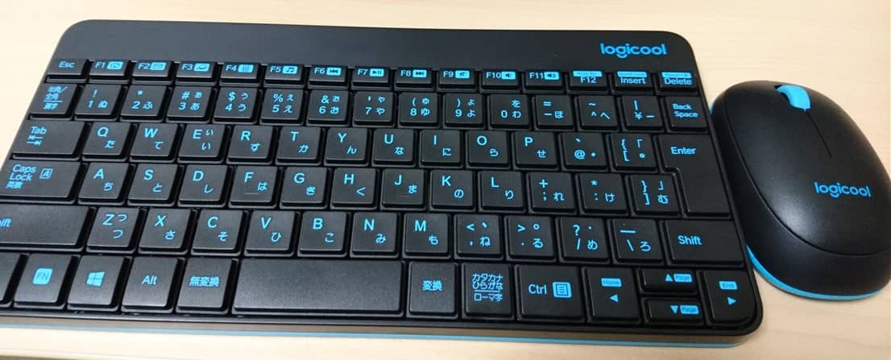
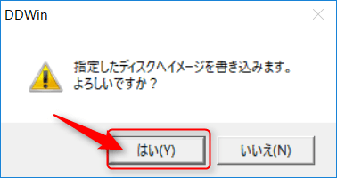
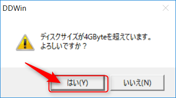

こんにちは。

今となっては知らない人が少なくなってきた、Raspberry Pi の最新モデル、**Raspberry Pi 3 Model B**（UD-RP3）で **CentOS 7** を動かしてみたいと思います。

ラズパイといえば Raspbian か NOOBS ですが、なぜ CentOS か・・・。慣れているから。それだけの理由です！ｗ

たまたまヨドバシカメラで見かけたのでアイ・オー・データの1年保証がついてるものにしました。6,240円でした。

スペックなどは [こちら](http://www.iodata.jp/product/pc/raspberrypi/ud-rp3/) から参照してください。

箱は、こんな感じです。
<a href="images/centos-7-on-raspberry-pi-3-1.jpg"></a>

アンボックスすると、これまた楽しさを引き出してくれる梱包ですｗ
<a href="images/centos-7-on-raspberry-pi-3-2.jpg"></a>

本体基板はこんな感じです。ほぼ名刺サイズ。
<a href="images/centos-7-on-raspberry-pi-3-3.jpg"></a>

## 準備するもの

1. Raspberry Pi 3本体

1. 作業用端末（今回はWindows10で実施しました。）

1. micro SDカード（SANDISK SDSDQ-032G-J35Uを利用しました。こちらもヨドバシで2,430円でした。）
<a href="images/centos-7-on-raspberry-pi-3-4.jpg"></a>

1. micro SDカードリーダー
<a href="images/centos-7-on-raspberry-pi-3-5.jpg"></a>

1. スマホなどでおなじみのMicro USB 充電ケーブル

1. 前項のMicro USBケーブルに電源共有できるもの（以下の画像のようなものです。）
<a href="images/centos-7-on-raspberry-pi-3-6.jpg"></a>

1. Raspberry Pi 3を操作するUSB接続のキーボードとマウス（以下のモバイルの手持ちを利用しました。）
<a href="images/centos-7-on-raspberry-pi-3-7.jpg"></a>

1. HDMI出力のできるモニタ

準備するものを並べると多いように思いますが、ほとんど手持ちですみました。

このあたりの周辺機器がない場合は RS で [スターターキット](http://jp.rs-online.com/web/p/processor-microcontroller-development-kits/8968119/) が販売されていますので、これを利用するとはじめやすいと思います。

## 準備するソフトウェア

1. 7Zip　[こちら](https://sevenzip.osdn.jp/) からダウンロードしてインストールしてください。

1. DD for Windows [こちら](http://www.si-linux.co.jp/techinfo/index.php?DD%20for%20Windows#s74c46f6) からダウンロードし、解凍して使える状態にします。
書き込むmicro SDが候補に出てこないことがあるため、互換設定を実施します。**DDWin.exe** を右クリックし、プロパティへ進みます。
<a href="images/centos-7-on-raspberry-pi-3-8.png"></a>
互換設定にチェックを入れ、**Windows XP(Service Pack 3)**に設定します。
<a href="images/centos-7-on-raspberry-pi-3-9.png"></a>

1. Raspberry Pi用のCentOS7 イメージ [こちら](https://buildlogs.centos.org/centos/7/isos/armhfp/) からダウンロードしてください。今回は以下を利用しました。
<a href="images/centos-7-on-raspberry-pi-3-10.png"></a>

1. 3．でダウンロードした、CentOSのイメージを解凍します。（解凍先はデスクトップ）
<a href="images/centos-7-on-raspberry-pi-3-11.png"></a>
<a href="images/centos-7-on-raspberry-pi-3-12.png"></a>

## micro SDカードにイメージを書き込み

1. micro SDカードをカードリーダーに差し込みます。（今回はFドライブでカードリーダーが認識されています。）

1. **DDWin.exe** を実行します。対象のディスクには自動でFドライブが選択されていました。右側のファイル選択をクリックします。
<a href="images/centos-7-on-raspberry-pi-3-13.png"></a>

1. ファイルの種別をAll filesに変更し、デスクトップ上のイメージファイルを指定します。（今回は、**CentOS-Userland-7-armv7hl-Minimal-1611-test-RaspberryPi3.img**です。）
<a href="images/centos-7-on-raspberry-pi-3-14.png"></a>

1. 書き込みを選択します。
<a href="images/centos-7-on-raspberry-pi-3-15.png"></a>

1. いっぱい聞かれますが、全て はい で答えます。
<a href="images/centos-7-on-raspberry-pi-3-16.png"></a>
<a href="images/centos-7-on-raspberry-pi-3-17.png"></a>
<a href="images/centos-7-on-raspberry-pi-3-18.png"></a>

1. 完了するまで待ちます。
<a href="images/centos-7-on-raspberry-pi-3-19.png"></a>

## いよいよ起動

1. 書き込みが完了した、micro SDカードをRaspberry Piに装着します。裏面のここです。
<a href="images/centos-7-on-raspberry-pi-3-20.jpg"></a>
今回のバージョンからカチっとならなくなっています。故障が多く改善点とのことです。

1. HDMIケーブルでモニタに接続し、Micro USBから電源供給をします。（電源ボタンはないので、供給した瞬間に電源ONになります。）
コンセントを接続すると電源が入ります！
<a href="images/centos-7-on-raspberry-pi-3-21.jpg"></a>

1. 立ち上がり！なんと、20秒ぐらいで立ち上がります(笑) 見た目通りファンもなにもないので、無音です。 root の初期パスワードは、**centos** と設定されています。無事ログインでき、成功です。
<a href="images/centos-7-on-raspberry-pi-3-22.jpg"></a>

## 起動後の処理

前項までで、無事CentOSが起動したのですが、この状態ではいくつか使えない点があり、以下の流れで初期設定を実施します。

### キーマップを変更する。

キーマップが英字になっていて vi で入力してもまともに終了できなくなります。
**:が打てない！** という良くあるやつです。

root でログイン後、以下のコマンドを順次実行してください。
現在の状態では、コピペできないので、手打ちで・・・。

`localectl set-keymap jp106`
`localectl set-keymap jp-OADG109A`
`localectl set-locale LANG=ja_JP.utf8`

上記で、キーマップがいつもうち慣れた日本語になりました。
`localectl` を実行すると設定が確認できます。

以下となっているはずです。
```
System Locale: LANG=ja_JP.utf8
VC Keymap: jp-OADG109A
X11 Layout: jp
X11 Model: jp106
X11 Options: terminate:ctrl_alt_bksp
```

### タイムゾーンを変更する

以下のコマンドを実行します。

`timedatectl set-timezone Asia/Tokyo`

また、ネットワークに未接続であれば、一旦手動で時刻を合わせておきましょう。
`date -s "03/13 0:00 2017"`

### root パーティションを拡張する

インストール直後は / パーティションが2GBしかありません。
READMEのとおり、以下のコマンドを実行します。

`/usr/local/bin/rootfs-expand`

実行直後に再起動することなく、拡張が完了します。

利用できる準備は整いました。あとは思う存分、遊んでください！

## あとがき

記事を書きながら実施したので1時間ぐらいかかりましたが、準備さえすれば作業の中で一番長くかかるのはCentOSのイメージダウンロードと、micro SDカードの書き込みで、一瞬でCentOS7が動作する状態までの作業が完了します。

いろいろ、社内研究用として利用する予定ですが、この子は、現在別で動作している社内監視サービスを移行しどの程度実用できるか実践してみようと考えています。

もちろん、OSが稼働後のサービス立ち上げはanbibleですｗ

手持ち品が多いのも理由ですが、トータルコストは、本体とSDカードの**8,670円**でした。
これなら気軽にチャレンジできるのではないでしょうか。

また、Raspberry Piでは色々と遊べる書籍やWebサイトが公開されており、YouTubeでも多数の方々が実演をされています。
興味がおありは方は是非是非触ってみてください。

それでは次回の記事でお会いしましょう。