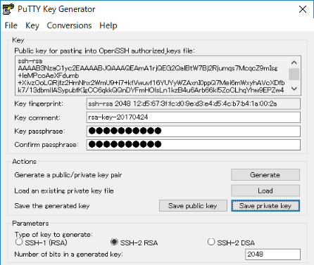

こんにちは。

Microsoft Azure上にCentOS7を構築する方法を紹介します。
今回の紹介では、作成したCentOSにSSH接続できるところまでを記載します。

## 事前準備

1. Microsoft Azureアカウントの作成。

[https://azure.microsoft.com/ja-jp/free/](https://azure.microsoft.com/ja-jp/free/)

1. サブスクリプションの作成。
ログイン後、以下の鍵マークからサブスクリプションを作成します。
はじめて作成の場合、**無料試用版**のサブスクリプションとなると思います。

1. 鍵ペアの作成
Putty Key Generator (Puttyge.exe) などを利用し、Azure上の仮想マシンにログインするための鍵ペアを生成し、手元に秘密鍵と公開鍵を保存します。

## 仮想マシンを作成

1. ログイン後の画面から、**Virtual Machines** を選択します。

1. 追加を選択します。

1. 検索窓に、**centos**　と入力し**CentOS-based 7.3**を選択します。

1. 作成を選択します。

1. 各項目を入力し、進みます。**名前**は任意でOKですが、今回はJenkins用にする予定なのでこの名称にしています。**VMディスクの種類**は安価なプランを選択するため、HDDを選択します。**SSH公開キー**は事前準備で作成した鍵ペアの公開キーの内容をテキストで表示させ、コピー＆ペーストします。**リソースグループ**はわかりやすいグループ名を新規作成します。**場所**は初期設定のままとしました。無料試用版のサブスクリプションでは西日本などはプランに含まないようで選択できませんでした。

1. プランの選択で、安価なプランを選択するために、**全て表示**を選択してから、今回は1つだけ上のプランの**A1 Basic**を選択しました。

1. 全て標準設定のまま**OK**を選択します。

1. 検証に成功したことを確認し、**OK**を押します。

1. 作成が完了するのを待ちます。大体5分ぐらいで完了しました。

## SSH接続

1. 仮想マシンの概要から、**パブリックIPアドレス**を確認します。

1. Teratermなどのターミナルソフトを利用し、前項で控えたパブリックIPを入力し、事前準備で作成した秘密鍵、仮想マシン作成時に指定したユーザー名でログインします。

1. 接続できました。`sudo` はインストール直後から設定されています。

## あとがき

執筆時点で、新規アカウントの場合は20,500円分の無料クレジットが付与されていました。

お試しにしてはさすが太っ腹なMicrosoftですね！無料クレジット分だけでも試す価値はありではないでしょうか。

それでは次回の記事でお会いしましょう。