こんにちは。

今回は、Hyper-Vで構築した仮想マシンの名前をキレイに変更する方法を紹介します。

仮想マシンを構築後、用途が変更になったり、間違っていたり、名前を変更したくなるケースがあると思います。

今回の紹介では、**qnd-clientlog** という名称から **qnd** に変更する方法を紹介します。
また、対象OSがWindows Serverのためコピーという方法をとるとライセンスの再認証が発生する可能性があります。
そのため、今回は一意のIDを維持して変更することを目的とします。

これには少し一手間かかりますが、頑張りましょう。

※注意：本紹介では仮想マシンを削除したりリスクある作業が発生します。弊社のテストでは動作を確認しておりますが実施にあたっては自己責任でお願いします。

## 仮想マシンの名前は変更できる、それでも・・・

Hyper-Vマネージャーから名称を変更することはできます。
<a href="images/change-hyper-v-virtual-machine-name-1.png">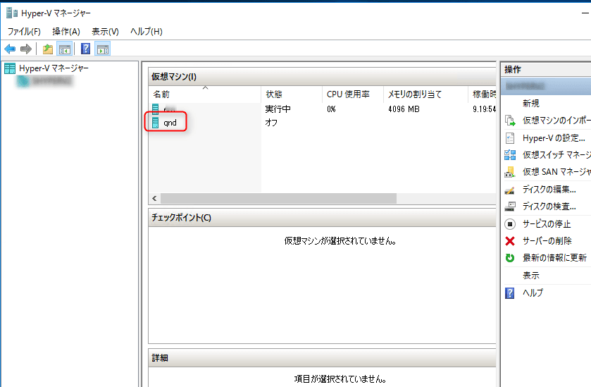</a>

それでも、保存先のフォルダ名は変わりません。
<a href="images/change-hyper-v-virtual-machine-name-2.png">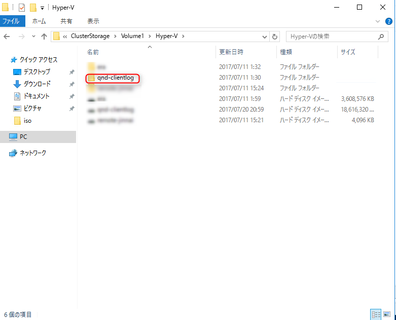</a>

## 面倒だけどキレイに変えましょう
作業は仮想マシンが動作しているホストサーバー上で実施します。

1. 対象の仮想マシンを停止します。

1. Hyper-Vマネージャーを開き、**変更後の名前**に変えます。
<a href="images/change-hyper-v-virtual-machine-name-3.png">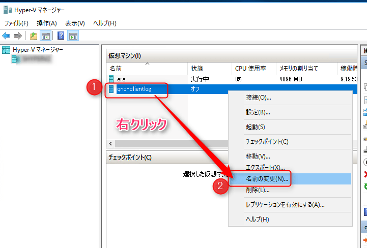</a>

1. **エクスポート**を選択し、**同じ保存先フォルダ**を選択します。D:\配下で動作しているのであればD:\を選択します。
<a href="images/change-hyper-v-virtual-machine-name-4.png">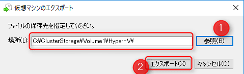</a>

1. Hyper-Vマネージャーの状況から進捗状況を確認できます。別ウィンドウで進捗ステータスはでません。
<a href="images/change-hyper-v-virtual-machine-name-5.png">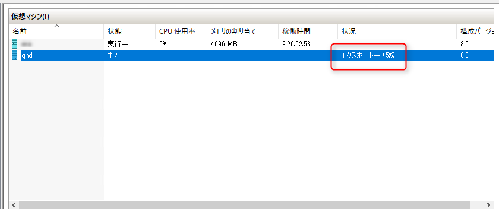</a>

1. エクスポートが完了しました。
<a href="images/change-hyper-v-virtual-machine-name-6.png">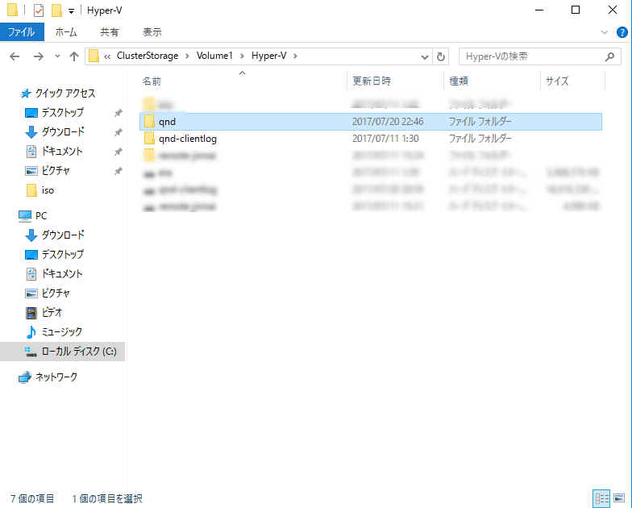</a>

1. エクスポートした仮想マシンを削除します。
<a href="images/change-hyper-v-virtual-machine-name-7.png">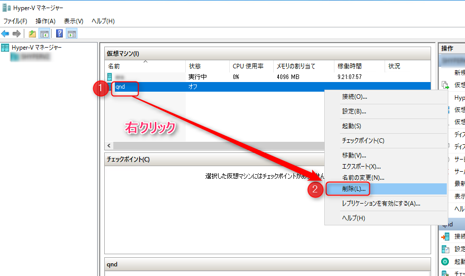</a>

1. 以下の順序でインポートを進めます。
<a href="images/change-hyper-v-virtual-machine-name-8.png">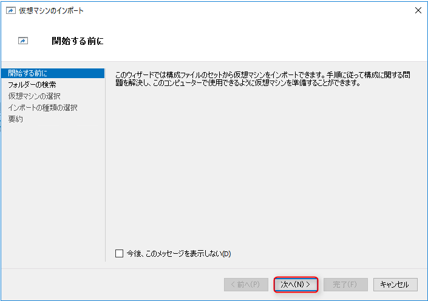</a>
<a href="images/change-hyper-v-virtual-machine-name-9.png">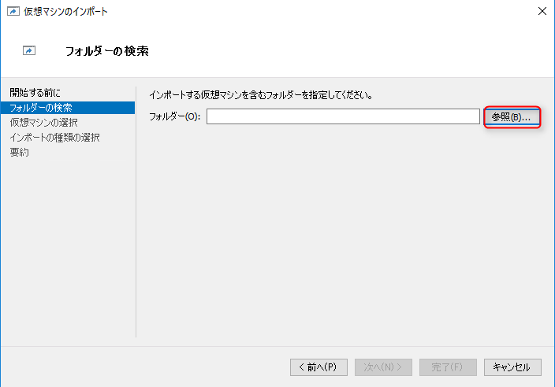</a>
<a href="images/change-hyper-v-virtual-machine-name-10.png">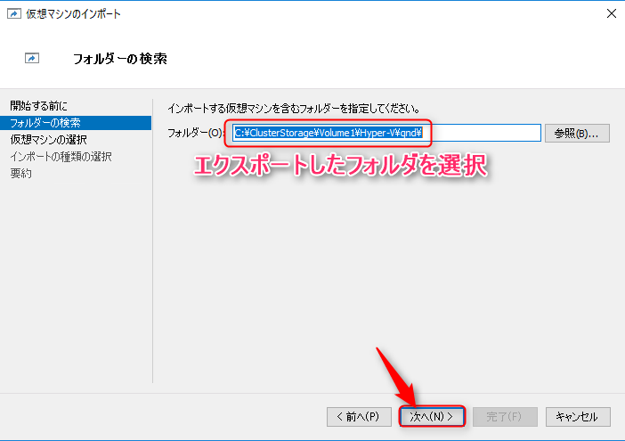</a>
<a href="images/change-hyper-v-virtual-machine-name-11.png">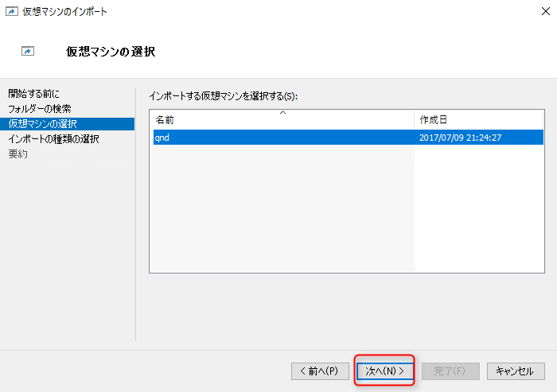</a>
**エクスポートした元の仮想マシンが残っているとエラーになります**(手順6の削除をすることでIDの重複を回避します)
<a href="images/change-hyper-v-virtual-machine-name-12.png">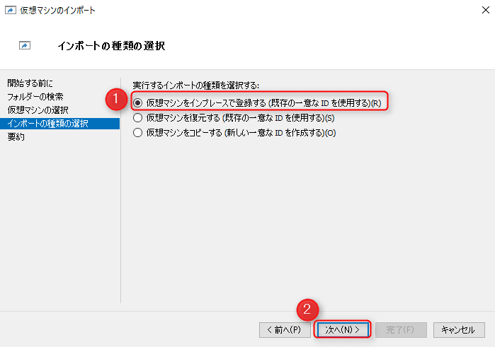</a>
<a href="images/change-hyper-v-virtual-machine-name-13.png">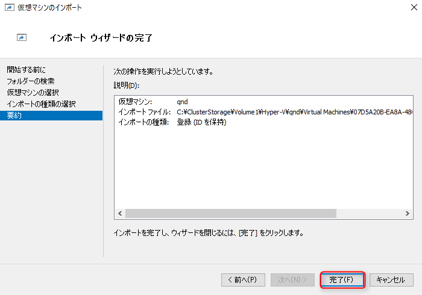</a>

1. VHDの名称を変更します。今回を例にVHDファイルは、`C:\ClusterStorage\Volume1\Hyper-V\qnd\Virtual Hard Disks\qnd-clientlog.vhdx`にあるため、これを`qnd.vhdx`に変更します。
<a href="images/change-hyper-v-virtual-machine-name-14.png">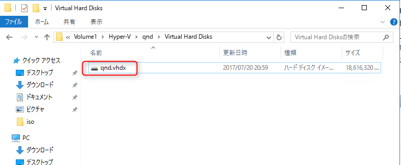</a>

1. 仮想マシンのディスク設定を変更します。以下の流れで変更してください。
<a href="images/change-hyper-v-virtual-machine-name-15.png">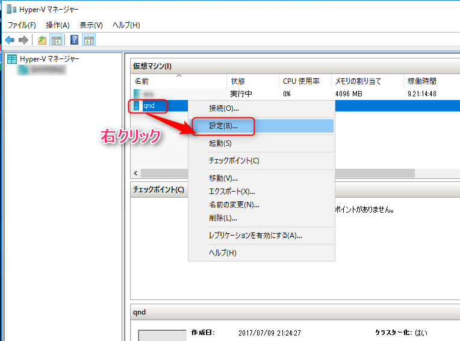</a>
<a href="images/change-hyper-v-virtual-machine-name-16.png">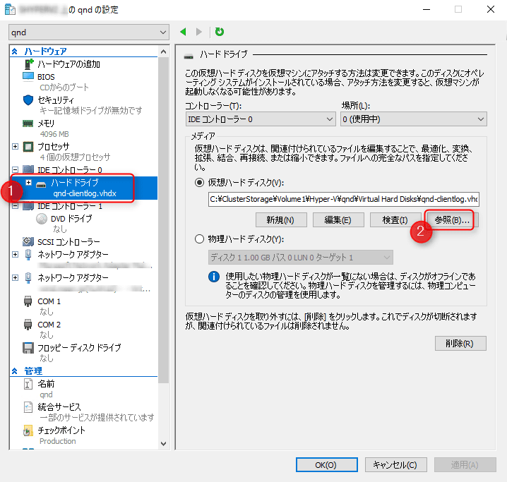</a>
<a href="images/change-hyper-v-virtual-machine-name-17.png">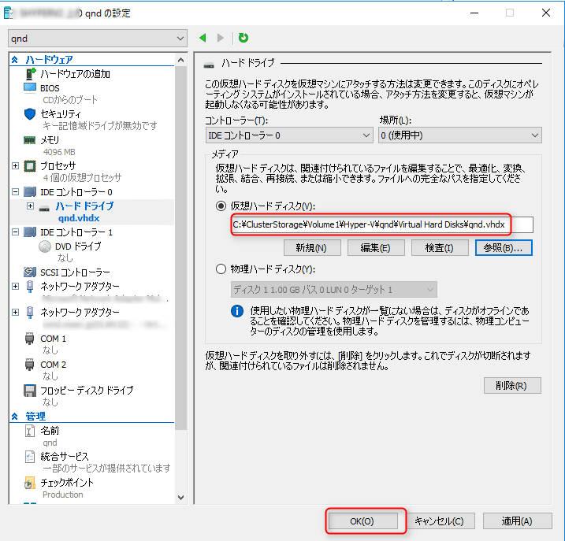</a>

1. 無事起動しました。ライセンス認証も大丈夫です。
<a href="images/change-hyper-v-virtual-machine-name-18.png">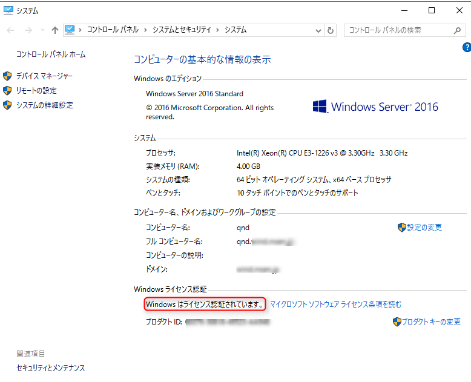</a>

## あとがき
前項インポートの手順に、**インポートの種別の選択**という部分について、今回は「仮想マシンをインプレースで登録する」を選択しましたが、これらの詳細は以下のページに記載されています。
[https://technet.microsoft.com/ja-jp/library/hh831535(v=ws.11).aspx](https://technet.microsoft.com/ja-jp/library/hh831535(v=ws.11).aspx)

それでは次回の記事でお会いしましょう、