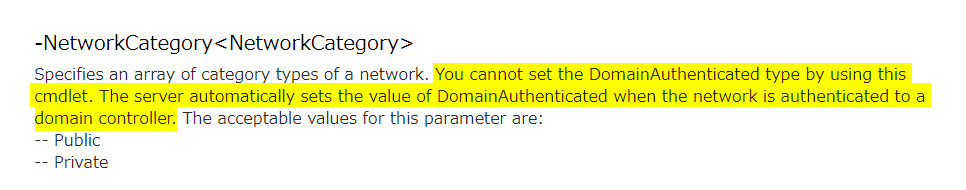
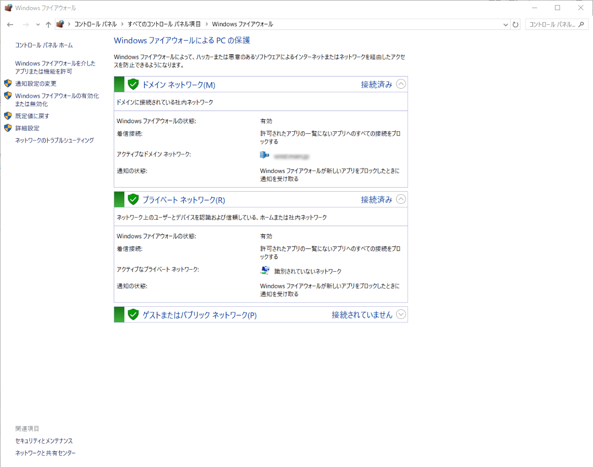

こんにちは。

今回は Windows OS で **ネットワークの場所** を PowerShell のコマンドで変更してみたいと思います。

**ネットワークの場所**とは、Windows Vista以降から導入されている概念で、端末が接続されているネットワークの種類によって設定を切り替えることで、セキュリティの向上を図ろうというものです。

この「ネットワークの場所」によって Windows ファイアウォールやファイル・プリンター共有の可否、ネットワーク上で端末が見えるようにするかどうかなどが切り替わります。

コントロール パネルでは `コントロール パネル\すべてのコントロール パネル項目\ネットワークと共有センター` から確認することができます。

「ネットワークの場所」自体の説明は下記のページが詳しいです。

[Simple questions: What are network locations in Windows? | Digital Citizen](https://www.digitalcitizen.life/network-locations-explained)

## 状態を確認する

「ネットワークの場所」の状態を確認するには PowerShell を起動して以下のコマンドを実行します。

`Get-NetConnectionProfile`

出力結果は以下のようになります。

```
Name             : dom.msen.jp
InterfaceAlias   : イーサネット
InterfaceIndex   : 12
NetworkCategory  : DomainAuthenticated
IPv4Connectivity : Internet
IPv6Connectivity : NoTraffic
Name             : 識別されていないネットワーク
InterfaceAlias   : イーサネット 2
InterfaceIndex   : 15
NetworkCategory  : Public
IPv4Connectivity : LocalNetwork
IPv6Connectivity : NoTraffic
```

`Name` が2つあるので、ネットワーク接続が2組あることが分かります。

これは以下のような状態です。

1組目： `dom.msen.jp` という名前のネットワーク接続プロファイルのネットワークの場所 (NetworkCategory) が `識別されていないネットワーク` になっている。
2組目： `識別されていないネットワーク` という名前のネットワーク接続プロファイルのネットワークの場所 (NetworkCategory) が `Public` になっている。

ネットワークの場所は以下の3種類あります。 (Windows 8.1 より前の OS では Home/Work/Public の3種類でした)

1. DomainAuthenticated (ドメイン参加している場合のみ)
2. Private
3. Public
※初期設定では下にいくほどセキュリティが弱くなります。

## ネットワークの場所を変更する

前項のイーサネット 2 の `Public` を `Private` に変更してみます。
引数には前項で確認した `Name` の部分を入力します。

コマンドは以下のとおりです。

`Get-NetConnectionProfile | where Name -eq "識別されていないネットワーク" | Set-NetConnectionProfile -NetworkCategory Private`

これでネットワークの場所が変更されているはずです。

## ドメインに参加している場合の注意点

### DomainAuthenticated は指定できない

前項にネットワークの種別は以下の3種類と記載しましたが、

1. DomainAuthenticated
2. Private
3. Public

このうち、 `DomainAuthenticated` についてはドメイン参加している場合に自動的に適用されるため、紹介しているPowerShellでは変更することができません。

Microsoftの公開情報にて **`DomainAuthenticated` が利用できない**ことが記載されています。

[Set-NetConnectionProfile](https://technet.microsoft.com/ja-jp/library/jj899565(v=wps.620).aspx)



>このコマンドレットを使用してDomainAuthenticatedタイプを設定することはできません。ネットワークがドメインコントローラに認証されると、サーバーは自動的にDomainAuthenticatedの値を設定します

`DomainAuthenticated` の選定はネットワーク有効化時に Network Location Awareness サービスにて行なわれ、そのときにドメインコントローラと通信できる状態であれば `DomainAuthenticated` が適用されるようです。

しかし、端末起動時にドメインコントローラと通信ができなかった場合、起動後に通信ができたとしても、プロファイルの再選定が行われません。

よって、運用中にプロファイルを再選定させるには、**OS 再起動**か、**ネットワーク接続の無効→再有効化**もしくは、**Network Location Awareness サービスの再起動** が必要になりますので注意してください。

### Windows ファイアウォールにご用心

Windows ファイアウォールはこの「ネットワークの場所」単位で制御されますので、適切な「ネットワークの場所」が設定されないと予期せぬ通信不具合を招くことになります。



たとえばドメイン参加しているサーバーが停電などでドメインコントローラーより先に起動してくると、ネットワークの場所がPublicに切り替わってしまい、 Windows ファイアウォールの設定が変わってしまい、トラブルになるケースがあります。

再起動しただけなのに通信ができなくなった、という場合にはこのあたりを確認してみてください。

くれぐれも起動順序に注意を。 (経験談)

それでは次回の記事でお会いしましょう。