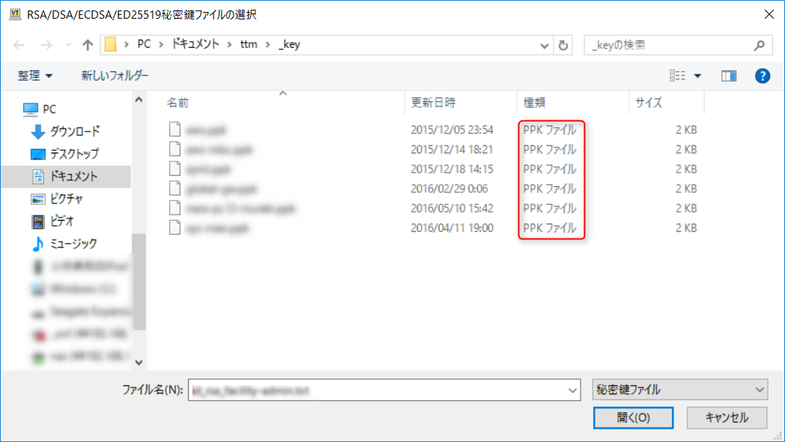
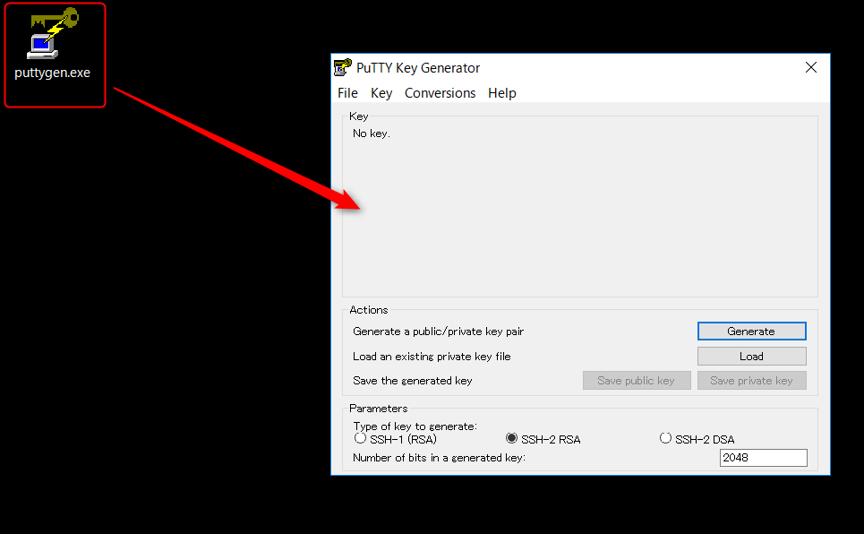
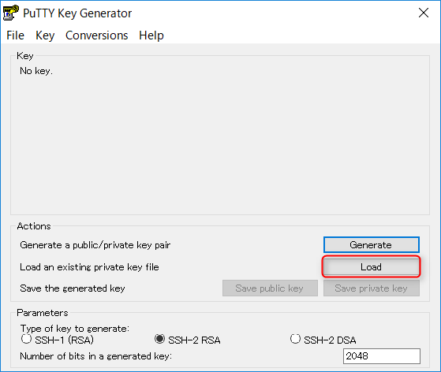
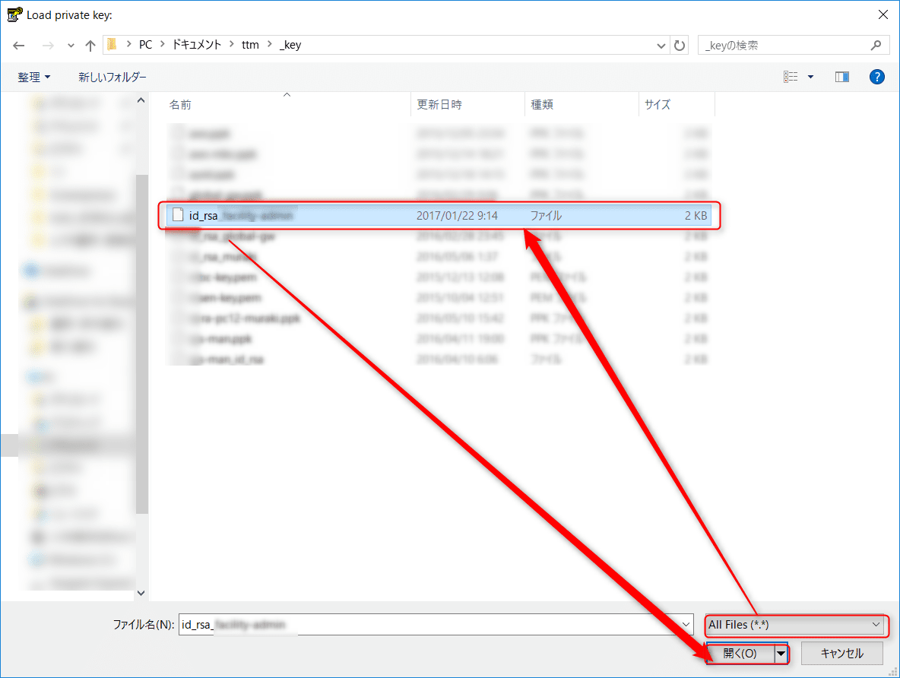
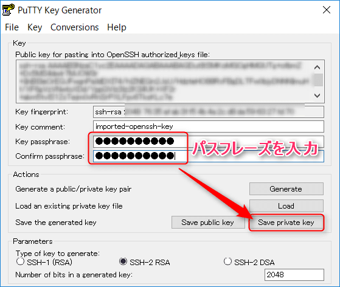
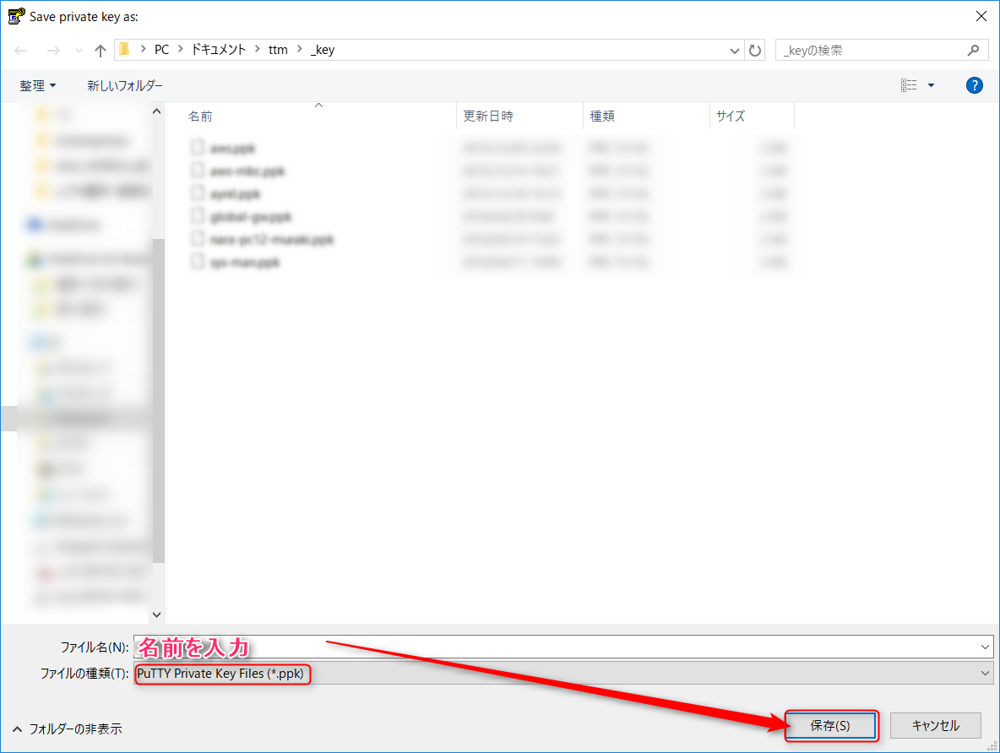

こんにちは。

よく見かける手順だと思いますが、実施する機会が少なく「いざ！」と思うと忘れていたので記事にしてみました。

CentOSなどにSSHでログインする際に、セキュリティ向上目的で公開鍵認証のみログインできるようにしている環境も多いと思います。

コンソールツールにTeraTermを利用している場合、秘密鍵の読み込みがデフォルトではPutty形式（拡張子.ppk)となっています。

Linuxの `ssh-keygen -t rsa` コマンドでキーペアを作成すると、`id_rsa` というRSA形式の秘密鍵ができます。

RSA形式も読み込めるのですが、毎回ファイル種別を変更して読み込ますのも手間・・・、ということでこれをPutty形式に変換したいと思います。

## puttygen で変換

以下より変換ツール `puttygen`  を入手します。

[http://www.chiark.greenend.org.uk/~sgtatham/putty/latest.html](http://www.chiark.greenend.org.uk/~sgtatham/putty/latest.html)

ダウンロード先から、 `puttygen.exe` を起動します。

変換元の秘密鍵を読み込みます。

読み込む形式を **AllFiles** に変更し、読み込みます。

読み込み完了を知らせるウィンドウが出た場合は、OKで進みます。

パスフレーズを入力し、保存します。

以上で変換完了です。

## あとがき

突然ですが、`putty` なんて読みますか？

公式では、 **パティ**　と読みます。
日本語読みでは、 **プティ**　や　**プッティ** と読んでしまいますが注意が必要です。

こういったソフトウェアの読みで実は間違っていて知らずうちに恥をかいている・・・。あるあるです。(笑)

それでは、次回の記事でお会いしましょう。