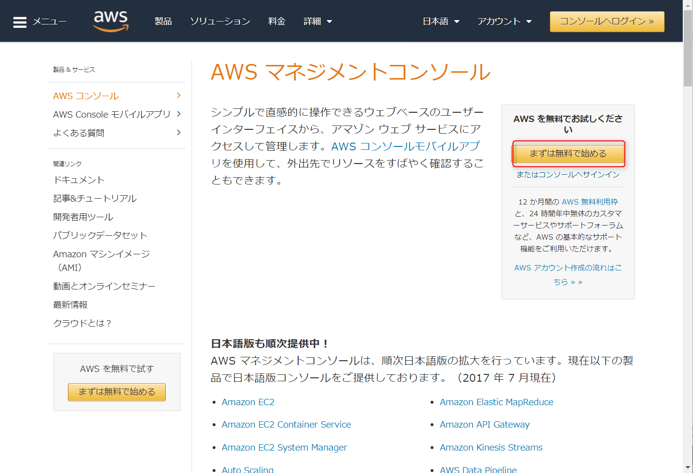
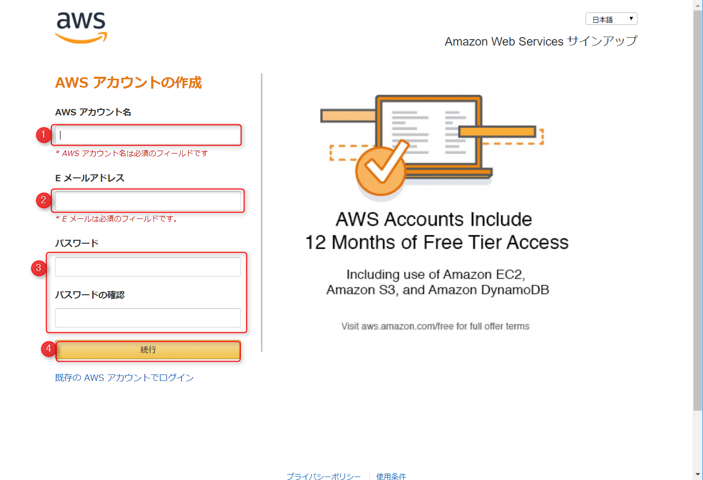
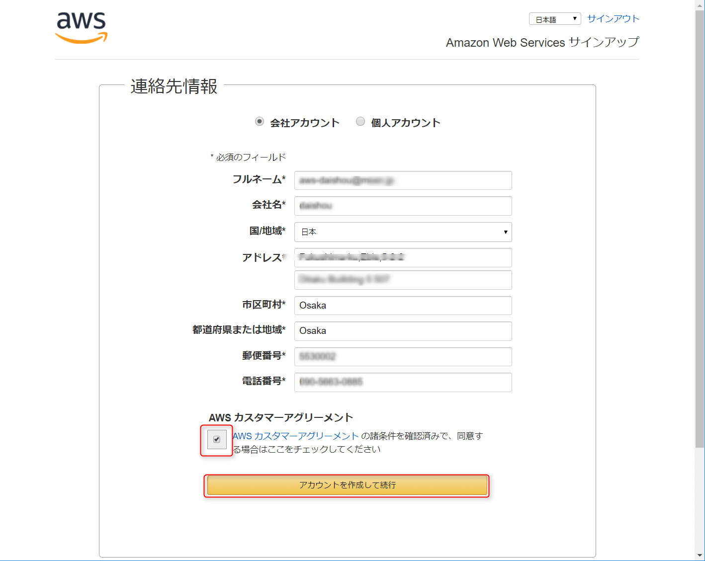
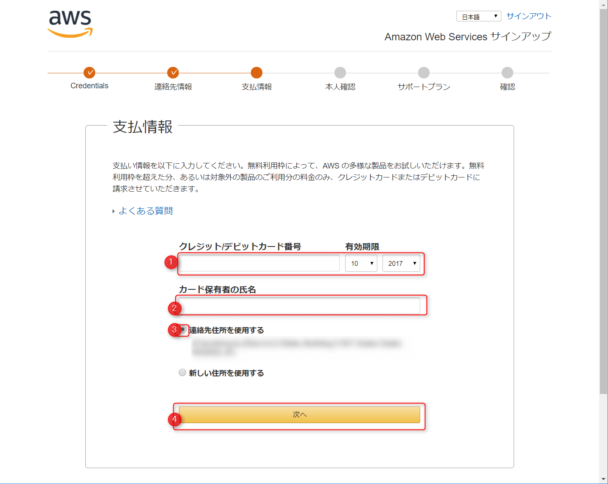
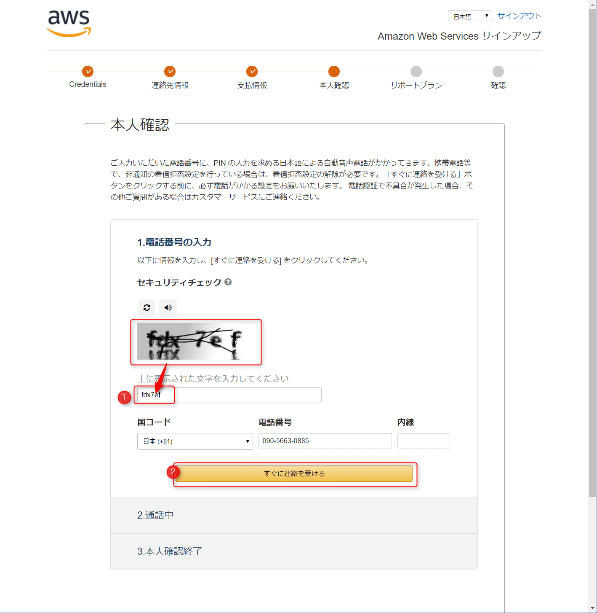
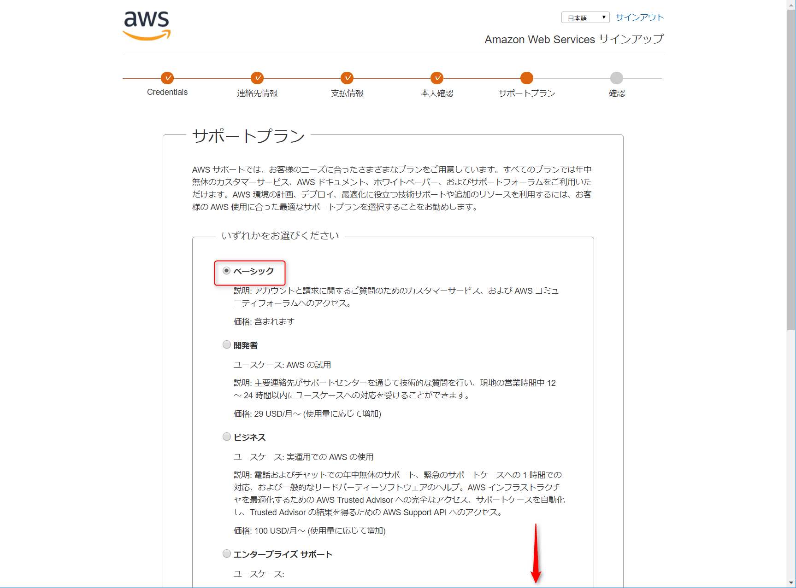
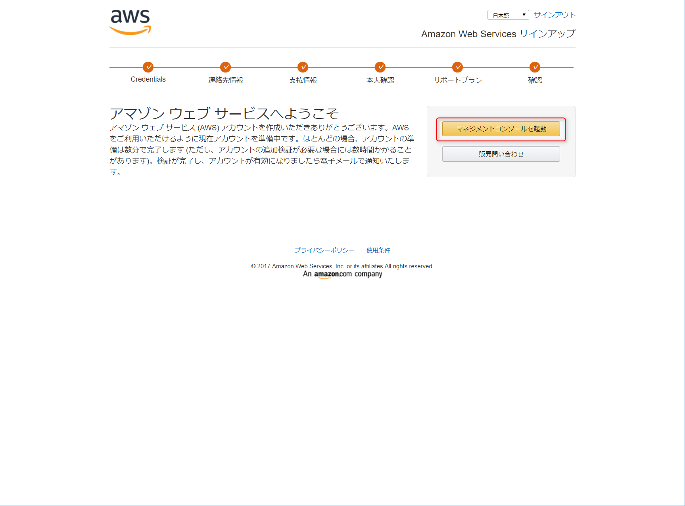
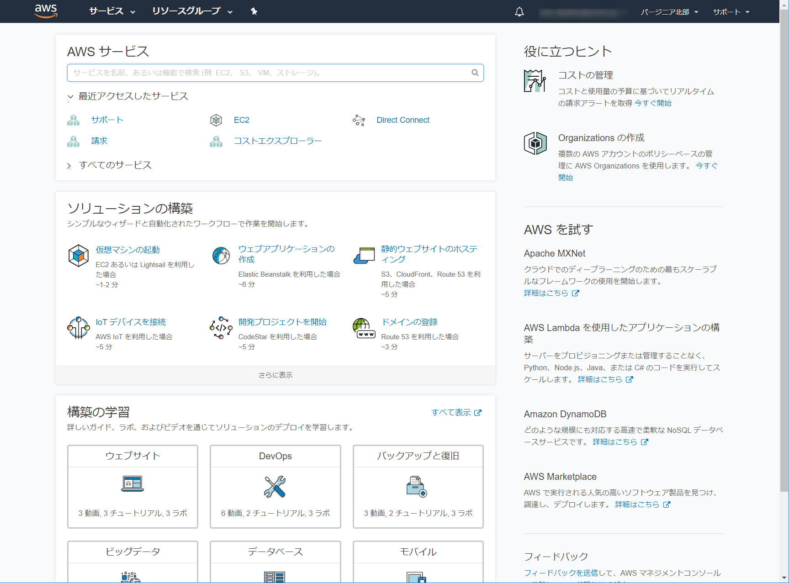
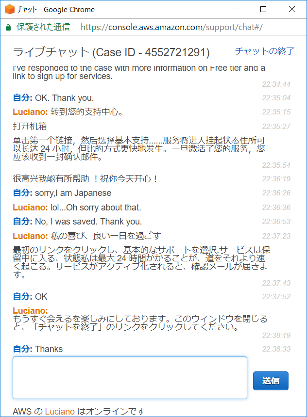

こんにちは。

本日は **AWS (Amazon Web Services) の会社アカウント**を作る方法を紹介したいと思います。

本人確認の際にすったもんだがありましたので、あとがきに書いています。どうぞお楽しみください。

## 登録の流れ

では、早速登録してみましょう。※作成にはクレジットカードが必要です。

1. [https://aws.amazon.com/jp/](https://aws.amazon.com/jp/) へアクセスし、 **まずは無料で始める** をクリックします。
<a href="images/create-aws-account-201710-1.png"></a>

1. 必要項目を入力し **続行** をクリックします。
<a href="images/create-aws-account-201710-2.png"></a>

1. 今回は **会社アカウント** として作成します。必要情報を入力し **アカウントを作成して続行** をクリック
入力項目は半角英数でないとエラーになります。このタイミングでアカウントは作成されます。
<a href="images/create-aws-account-201710-3.png"></a>

1. 支払い情報を登録します。課金されるかどうかにかかわらず **クレジットカード登録が必要** です。
<a href="images/create-aws-account-201710-4.png"></a>

1. 本人確認を行います。画面の文字を入力し、 **すぐに連絡を受ける** をクリックします。次の画面でPINコードが表示され、かかってきた電話で聞いたPINコードを入力すれば本人確認は完了です。
<a href="images/create-aws-account-201710-5.png"></a>

1. サポートプランに無料の Basic を選択し、下にスクロールし **続行** をクリックします。
<a href="images/create-aws-account-201710-6.png"></a>

1. これで登録完了です。
<a href="images/create-aws-account-201710-7.png"></a>
<a href="images/create-aws-account-201710-8.png"></a>

## あとがき

実は、登録手順の5 本人確認でアルファベットを何度打っても先に進まない事態に見舞われました。

それで、問い合わせをしようとページを進め、すぐに解決させたかったのでチャットを選択しようと見ると、作業をしていた時間が22時頃だったためか、日本語でのチャットは選択できず、英語でのチャットだけが受け付け可能でした。

思い切って・・・英語を選択しチャット開始。

画面横にはGoogle翻訳2ページ待機。（英→和と、和→英用ｗｗ）

```
オペレーター：電話番号を教えてくれ
私：+81 90 xxxx xxxx 
**電話なる→無視するｗｗｗ**
私：I'm sorry I can not speak English.（英語話せません）
オペレーター：気にしなくていいよ。
**また電話なる→思い切ってでる**
**英語で何やら言っているが、E-mailを教えてくれといってるよう**
**あたふたしてると電話を切られたｗｗｗ**
私：xxx@xxx.xxx （メールアドレスを伝える）
オペレーター：ありがとう、アクティベートが終わったよ。
私：Thank you. (ありがとう）
```

と、こんな感じで無事アクティベートができました。

後にこの電話は会話したかったのではなく、メールアドレスを確認するだけだったと悟りました。

そして、まだ続きが・・・
オペレーターのLucianoさんは、どうも僕のことを中国出身と勘違いしたようで、そこからは中国語でチャットがｗ

でも、途中で日本人であることを伝えると、すぐさま日本語に。
日本語はおかしいのですが、恐るべしAmazonオペレーター。。

一連のやりとりがこちら。

<a href="images/create-aws-account-201710-9.png"></a>

英語、話したい・・・。

そんなわけで・・・、また次回の記事でお会いしましょう。
