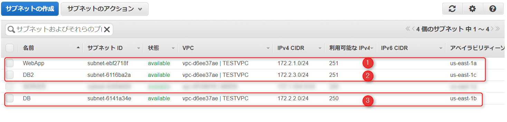

こんにちは。

[以前のRDS関連の記事](https://mseeeen.msen.jp/how-to-use-rds-from-ec-2/)で、RDSインスタンスを MySQLエンジンで起動し、EC2から接続しました。

記事中にVPCにサブネットを2つ作成して→DBサブネットグループを作成したVPCサブネット2つを指定して作成する、という手順がありますが、これと同じ状態でRDSのエンジンに**Amazon Aurora**を指定すると、エラーになることが分かりました。

エラーの内容は以下のとおりです。

>Your subnet group doesn't have enough availability zones for a storage cluster. You must have at least two availability zones to map to a storage cluster. (Service: AmazonRDS; Status Code: 400; Error Code: InvalidVPCNetworkStateFault; Request ID: 16a30138-b71f-11e7-af24-45dd75bc6c86)

なぜだ・・・なぜだ・・・と、数日はまっていたのですがスタッフの助けもあり解決しました。

原因は、**Amazon Auroraにはアベイラビリティーゾーンが3つ必要**ということでした。

早速、VPCサブネットをもう1つ追加し、DBサブネットグループを再作成しました。

この状態でAuroraを指定すると無事作成することができました。

AWSの技術サポートは有料のため、無課金で進めるにはこういったハードルは自力で解決する必要があります。

ただ、RDSの構築時に自動でサブネットグループを作成した場合はアベイラビリティグループも自動的に3つ登録されるようになっているので、このような問題は発生しにくいと思います。

解決に至った中で確認した、Amazonのサポート記事を再度確認するとやはり3つ必要ということを確認できました。

以下に記事引用で紹介します。

- [Amazon Aurora DB クラスターの作成 - Amazon Relational Database Service](http://docs.aws.amazon.com/ja_jp/AmazonRDS/latest/UserGuide/Aurora.CreateInstance.html)

こちらの記事冒頭には、

>Amazon Aurora DB クラスターは MySQL と、3 つのアベイラビリティーゾーンにコピーされたデータを単一の仮想ボリュームとして表現するクラスターボリュームと互換性があるインスタンスで構成されます。DB クラスターには、プライマリインスタンスと Aurora レプリカの 2 種類のインスタンスがあります。

とあります、また文中にも、

>Aurora の DB クラスターのクラスターボリュームは常に 3 つのアベイラビリティーゾーンにまたがっていることに注意してください。

とあり、3つ必要だということが分かります。

- [How to Create a VPC for Use with Amazon Aurora - Amazon Relational Database Service](http://docs.aws.amazon.com/AmazonRDS/latest/UserGuide/Aurora.CreateVPC.html)

こちらの記事では、実際にDBサブネットグループを作成する画面キャプチャが掲載されていて、3つのアベイラビリティーゾーンが指定されて作成されていることが確認できます。

ちなみに料金的には3倍や6倍になることはないようです。

- [よくある質問 - Amazon Aurora（リレーショナルデータベース）｜AWS](https://aws.amazon.com/jp/rds/aurora/faqs/)

>Q: Amazon Aurora はデータベースの各単位を 3 つのアベイラビリティーゾーンにかけて 6 個レプリケーションするということですが、実際のストレージ料金は、料金表ページに書かれている料金の 3 倍または 6 倍になるということですか?
>いいえ。Amazon Aurora のレプリケーションは料金に含まれています。料金はデータベースがデータベースレイヤーで消費したストレージに応じて発生します。Amazon Aurora の仮想化ストレージレイヤーで消費したストレージではありません。

それでは次回の記事でお会いしましょう。