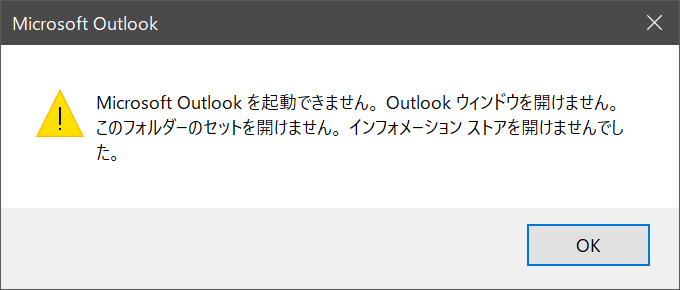
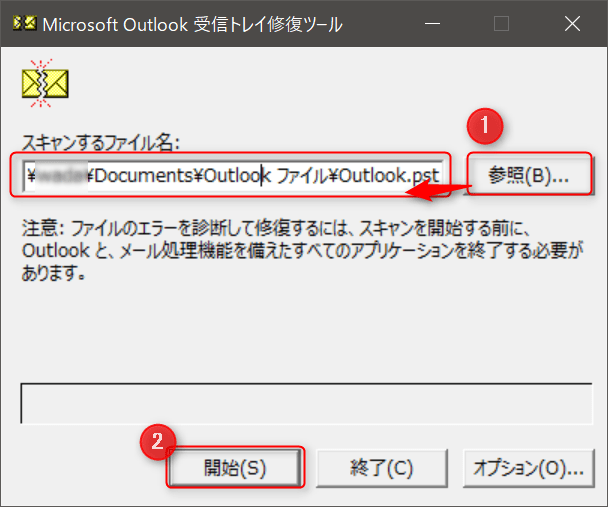
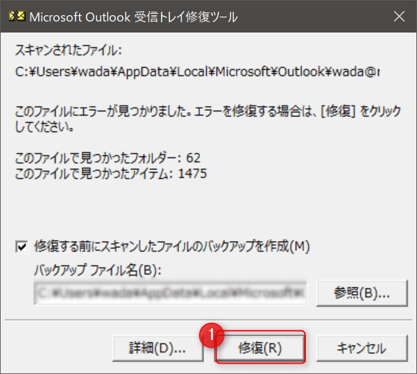
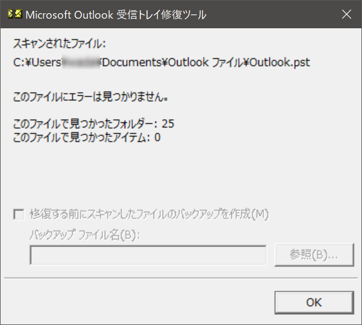
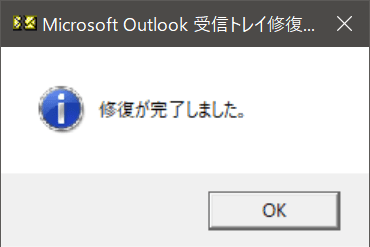
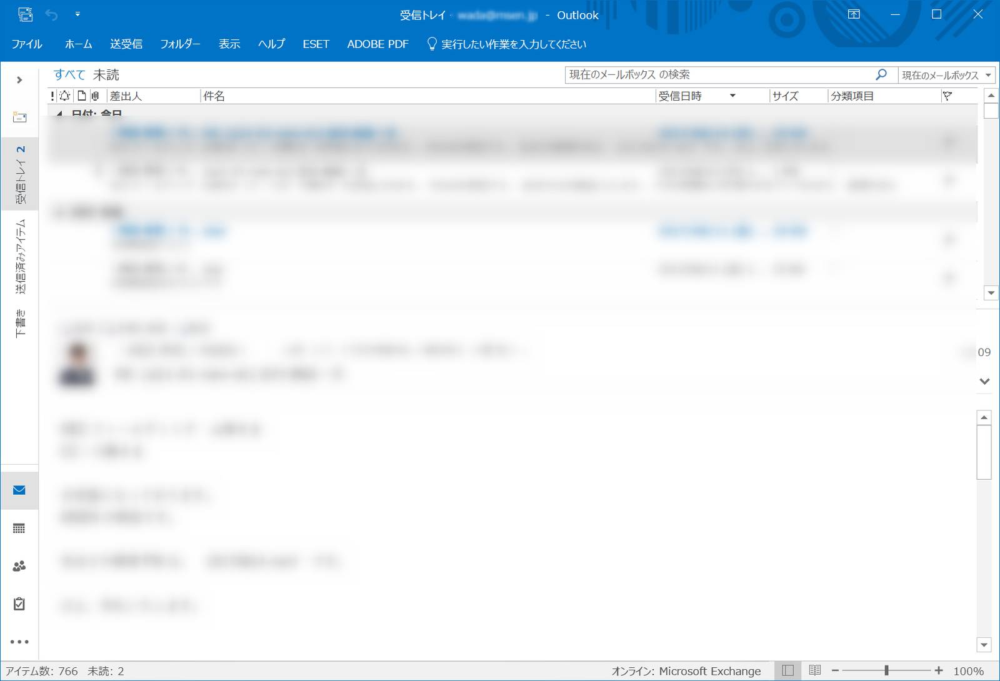

こんにちは。

弊社はメールにOffice365を利用しており、PCでの受信は主にOutlookを使って利用しているのですが、先日契約しているライセンス種別を変更したところ、以下のエラーでOutlookアプリが開かなくなりました。

>Microsoft Outlookを起動できません。Outlook ウィンドウを開けません。このフォルダーのセットを開けません。インフォメーション ストアを開けませんでした。

とにかくいろいろ開けないみたいです。
早速復旧に向けてチャレンジしましょう。

環境は、**Windows 10** + **Outlook2016**です。

## Outlook 個人用フォルダー ファイル (.pst) を修復する

1. 修復ツールを開きます。`C:\Program Files (x86)\Microsoft Office\root\Office16\SCANPST.EXE`
1. 参照から、PSTファイルを指定し、開始をクリックします。

PSTファイルは、標準設定では各ユーザーの ドキュメント フォルダに存在します。
ユーザー名が **username** とすると、**C:\Users\username\Documents\Outlook ファイル\Outlook.pst** にあります。
1. **修復する前にスキャンしたファイルのバックアップを作成** にチェックを入れた状態で、**修復** をクリックします。バックアップファイルは、同じフォルダにできます。

もし、エラーがなければ以下のような結果になります。

1. 修復が完了し、無事Outlookが開きました！

発生原因は定かでないのですが、同じエラーの方は試して見る価値はありそうです。
それでは次回の記事でお会いしましょう。