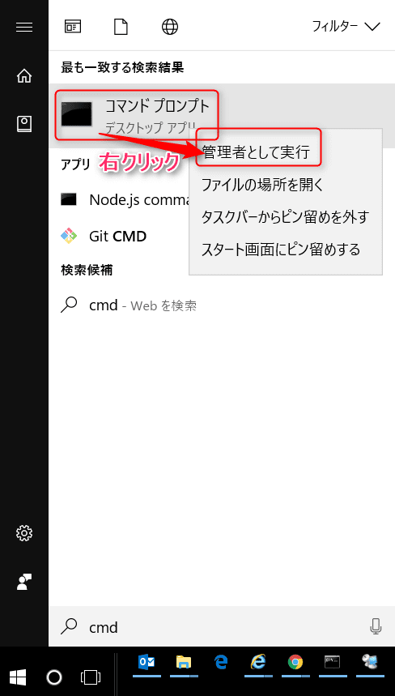
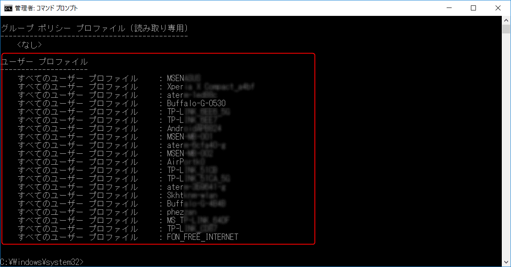
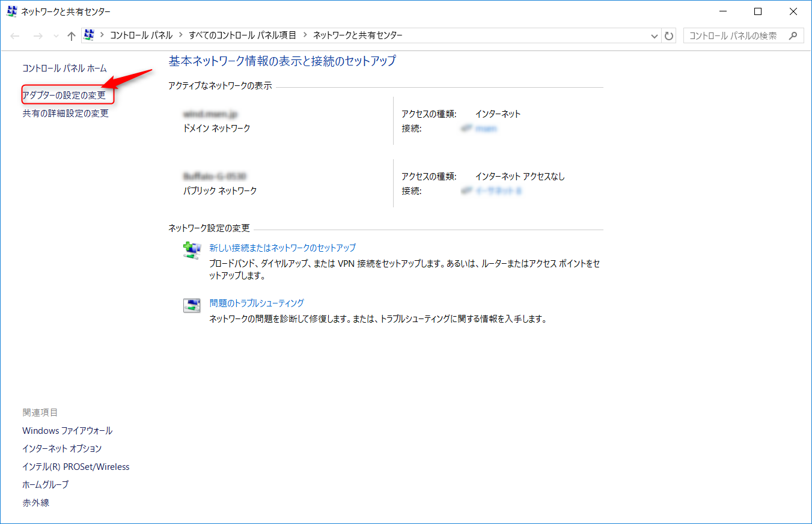
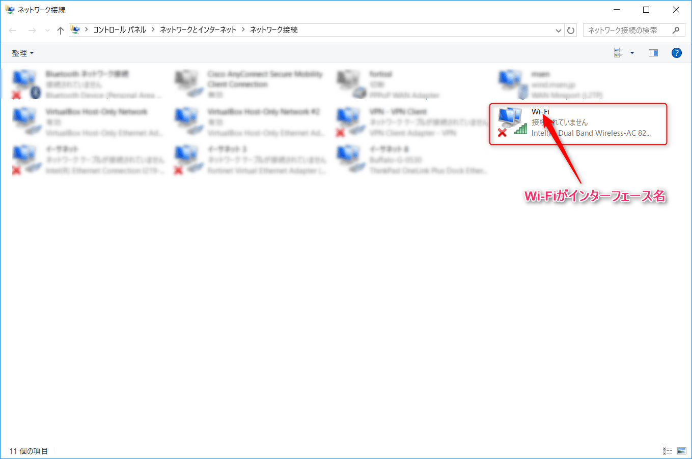
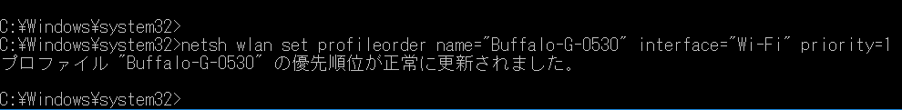
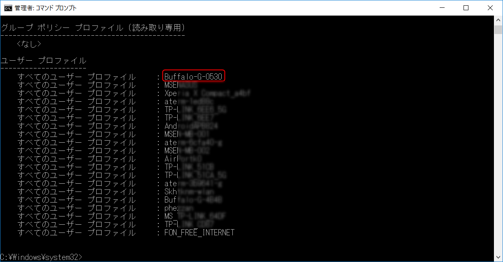
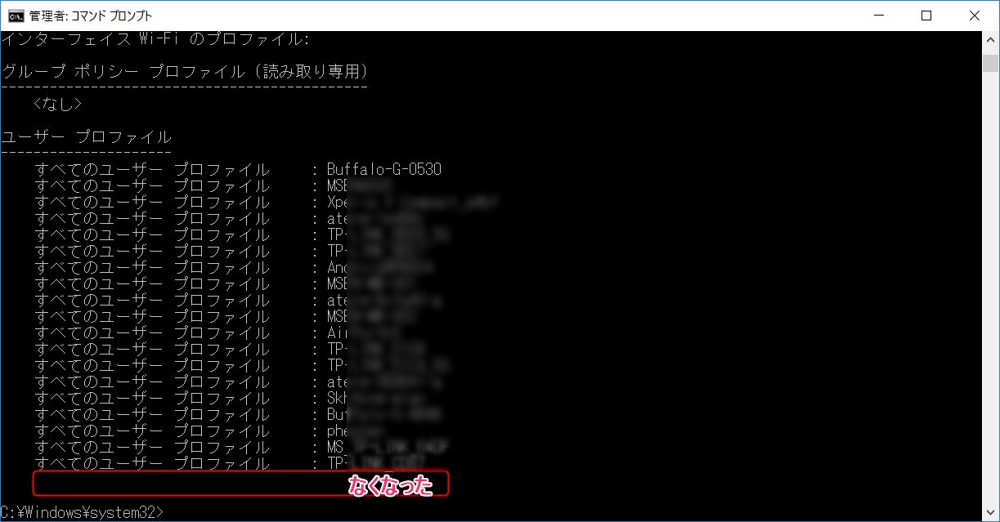

こんにちは。

今回の記事は、**無線LAN アクセスポイントの接続順序を変更**する方法を紹介します。

現代はネットワーク社会なので、自宅で無線に接続、外出先でテザリング、ポケットWi-Fiなどなど、いろいろなアクセスポイントに接続しますよね。

過去に接続したことがあるアクセスポイントの受信範囲にはいると、自前のポケットWi-Fiにつないでるのに奪われてしまう、なんてことがあるあるだと思います。

そんなときのために、現在どのような順番で優先になっているのか、どのようにして優先順を変えるのか、またあとがきでは削除する方法まで紹介したいと思います。

## 現在の優先順序確認

1. 画面左下のWindows マークをクリックし、`cmd` と入力し、コマンドプロンプトを右クリックから管理者として実行をクリックします。ユーザーアカウント制御の確認が出た場合は、はい を押して進みます。

1. コマンドプロンプトに、`netsh wlan show profiles` と入力します。すると、接続順の結果が出力されます。

## 接続順序の変更

前項で確認した一覧の、上から4つめの **Buffalo-G-0530** を優先順位1にしたいと思います。

1. 無線の接続インターフェース名を確認します。右下のタスクバーから、ネットワークアイコンを右クリックし、ネットワークと共有センターを開く、を選択します。

1. アダプタの設定の変更を選択し、Wi-Fiの接続を確認します。以下の手順で、`Wi-Fi` がインターフェース名であることがわかりました。

1. 前項で開いたコマンドプロンプトに、 `netsh wlan set profileorder name="無線の名前" interface="インターフェース名" priority=1`　と入力します。今回の目的に当てはめると、`netsh wlan set profileorder name="Buffalo-G-0530" interface="Wi-Fi" priority=1` となります。入力結果は以下のとおりです。

1. 再度確認すると、一番上に来ていることがわかります。

少々手間がかかりますが、確認だけでもしてみると面白いかもしれません。

## あとがき

本当に今の時代は、PCをもっていても、インターネットに接続できないと不便で仕方ないですよね。

あるお客さま環境では業務PCは一切インターネットに接続できない制限があり、特定の仮想環境だけでインターネットを接続できる状態にしてるところがあるのですが、その接続環境が大人気で仮想環境がパンクしている、というのを聞いたことがあります。

ビジネスホテルやカフェでは無料で無線環境（Wi-Fi）を提供しているところが多く見られて手軽ですよね。

そんなアクセスポイントにどんどん繋いでると、知らず知らずのうちに行く先々のアクセスポイントに接続されていて結果パソコンをセキュリティリスクにさらしている、なんてこと言えると思います。

本記事で紹介した無線の一覧から、今後つなぐことがない場合や、覚えのないアクセスポイントは削除することをおすすめします。

前項までのコマンドプロンプトから、以下のコマンドで削除できます。

`netsh wlan delete profile name="無線の名前"`

実際に、`netsh wlan delete profile name="FON_FREE_INTERNET"` を実行しました。

確認してみます。

無くなりましたね。

一度、無線接続を整理してセキュリティを高めてはいかがでしょうか。

それでは、次回の記事でお会いしましょう。