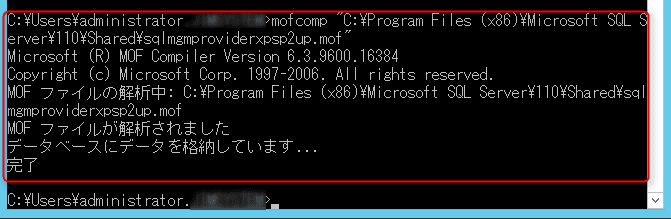
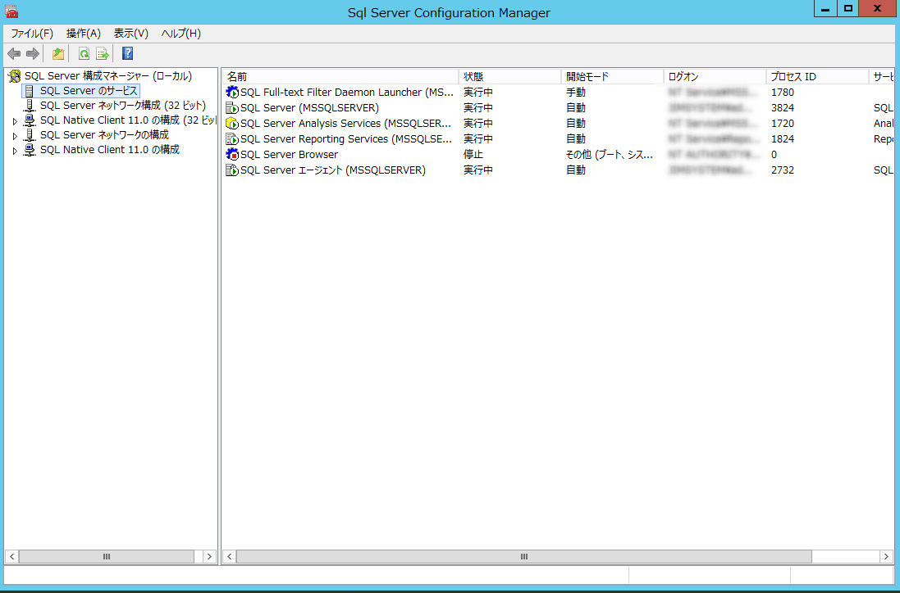

こんにちは。

評価環境でSQL Server構成マネージャーを開くことが多いのですが、ある日突然、構成マネージャーを開こうとすると、

>WMIプロバイダーに接続できません。権限がないかサーバーにアクセスできません。SQL Server 2005以降のサーバーは、SQL Server構成マネージャーでのみ管理できます。無効なクラスです [0x80041010]

となり開けなくなり、困っていました。

<a href="images/fix-sql-management-console-cant-open-1.png"></a>

システムは環境は、以下のとおりです。

```
OS  : Windows Server 2012 R2
SQL : SQL Server 2012 (64ビット)
管理コンソール  : バージョン6.3(ビルド9600)
```

## 対処は簡単

以下の流れであっさり解決しました。

1. `C:\Program Files (x86)\Microsoft SQL Server\110\Shared\sqlmgmproviderxpsp2up.mof` が存在することを確認する。

1. コマンドプロンプトを開き、以下のコマンドを実行する。
`mofcomp "C:\Program Files (x86)\Microsoft SQL Server\110\Shared\sqlmgmproviderxpsp2up.mof"`
<a href="images/fix-sql-management-console-cant-open-2.png"></a>

1. これで開くようになりました！
<a href="images/fix-sql-management-console-cant-open-3.png"></a>

## あとがき
前項で実行した`mofcomp`は、`MOFファイル(Managed Object Format)` (MOF) をコンパイルするコマンドのようです。
[公式にコマンドの説明ページがありました。](https://msdn.microsoft.com/ja-jp/library/aa392389(v=vs.85).aspx)

弊社の環境で、このような現象が発生した原因は定かではないのですが、[公式ページ](https://support.microsoft.com/ja-jp/help/956013/error-message-when-you-open-sql-server-configuration-manager-in-sql-se)には、以下のように書かれていました。

何かアンインストールしたかな・・・。

>この問題は、SQL Server 2008 のインスタンスをアンインストールする際に WMI プロバイダが削除されることが原因で発生します。SQL Server 2008 の 32 ビット インスタンスおよび 64 ビット インスタンスは、同じ WMI 構成ファイルを共有します。 このファイルは、%programfiles(x86)% フォルダにあります。

複数のページを見ると、バージョンなどによってmofファイルのパスが異なるようなことも見受けましたのでバージョンにより変わる可能性がありますので要注意です。

それでは次回の記事でお会いしましょう。