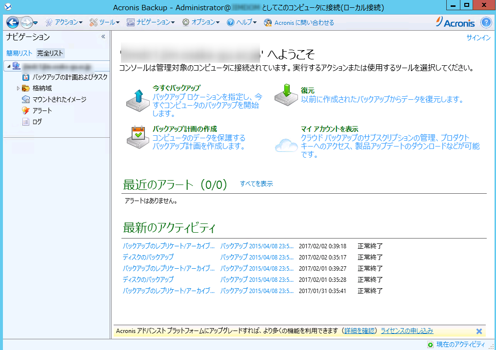
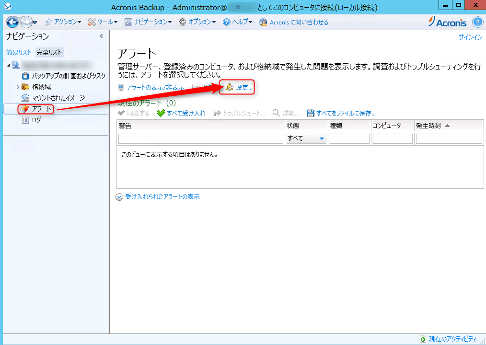
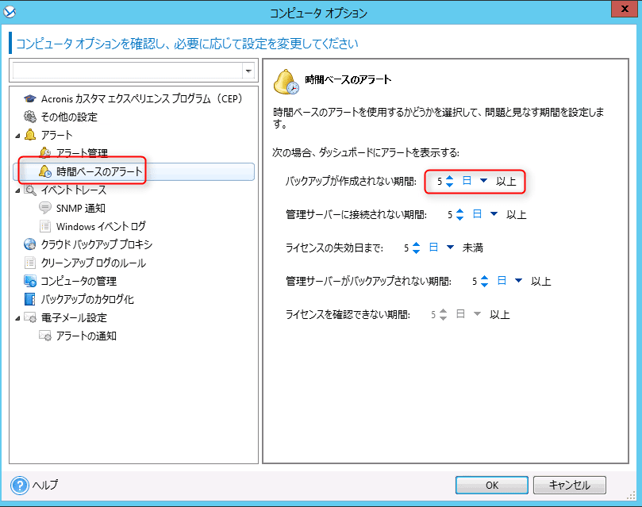
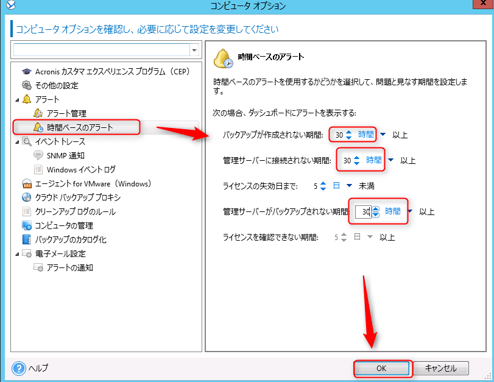

こんにちは。

Acronis というソフトウェアをご存じでしょうか。私の関連する案件ではよく使われるバックアップソフトウェアです。

バックアップは非常に重要なものなので、失敗するとアラートを飛ぶように設定することは一般的かと思います。

ただ、Acronisの標準設定では失敗してから5日経過したあとにアラートがやってきます。

5日間は長すぎると思いますのでこの設定を変更する方法を紹介します。

## 変更方法

Acronis Backup 11.5で紹介しています。

まずは、Acronisの管理コンソールを開きます。

アラートメニューを開き設定を開きます。

時間ベースのアラートを選択し、5 日以上という部分を変更します。
以下の画面は標準設定状態です。

毎日バックアップを採取している環境のため、1日と設定すると正常にとれているのにも関わらず、アラートが飛ぶことが確認できました。

そのため、少し長く**30時間と設定**しました。
この機会にその他も併せて変更しました。

設定後は OK を押して完了です。

## あとがき

弊社は、GitHubやGitLabを活用しており、今ではこれら抜きでは仕事ができませんが、GitLab.comが操作ミスでデータベースを喪失したという記事をみかけました。

* [GitLab.comが操作ミスで本番データベース喪失。5つあったはずのバックアップ手段は役立たず、頼みの綱は6時間前に偶然取ったスナップショット](http://www.publickey1.jp/blog/17/gitlabcom56.html)

ここには、人的ミスでDBを削除してまった、とっていたはずのバックアップがうまく機能していなかった、とあります。

この記事をみて、**バックアップって大切やな** とメンバーで話していました・・・。
コメントで**明日は我が身**とあったのも印象的でした。

それでは次回の記事でお会いしましょう！