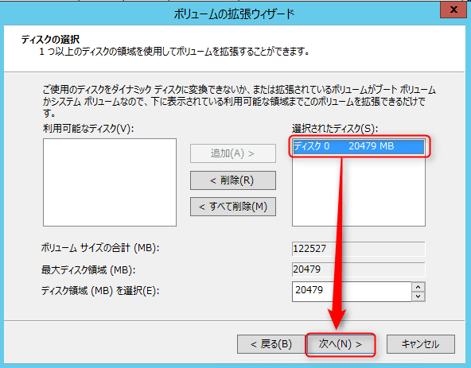

こんにちは。

今回は、**Hyper-Vで構築した仮想マシンのCドライブを拡張**する方法を紹介します。

想定されるケースとしては、作成時は100GBで十分だと思って仮想マシンを作成したものの、運用を続けるうちに容量が足りなくなった・・・などが考えられるかと思います。

それでは早速拡張しましょう。

## 環境
* 仮想ホストサーバー：Windows Server 2016 
* Hyper-Vマネージャーのバージョン：10.0.14393.0
* 仮想マシン：Windows 2012 R2（以降、**対象**と表記）

## 事前確認

1. 対象のサーバーにログインし、拡張前のディスク容量を確認します。99.6GBであることが確認できます。

1. 対象のサーバーをシャットダウンします。

## 拡張手順（Hyper-V マネージャー上から作業）

1. 対象仮想マシンを選択した状態で、**右クリックから 設定** をクリックします。

1. 仮想マシンの設定画面が開きますので、**左側の一覧**から **ハードドライブ** を選択し、**メディア - 仮想ハードディスク - [編集** をクリックします。

1. 拡張のためのウィザードとなり、以下のような流れで進めます。
**次へ**をクリックします。

**拡張**を選択し、**次へ**　※ここで拡張が表示されていない場合は拡張をすることができません。

拡張後のディスク**総容量を入力**し、**次へ**で進みます。容量は、仮想ディスクが格納されている領域の枯渇に注意して指定してください。

内容を確認し、**完了**をクリックします。完了を押した瞬間に拡張が実行されます。

**OK**で設定画面を閉じます。

1. 対象サーバーを起動します。

## 拡張手順（対象サーバーにログインして作業）

1. 管理者権限のユーザーでログインします。

1. **管理ツール→コンピュータの管理→ディスク管理**と進みディスクを確認します。

1. Cドライブを選択し、**右クリックからボリュームの拡張**を選択します。

1. 拡張のウィザードを進めます。
**次へ**をクリックします。

選択されたディスクを確認し**次へ**をクリックします。

**完了**をクリックし終了します。拡張作業は今回の20GB増量では一瞬で終わりました。

1. 拡張されていることを確認します。

1. 対象にログインし、作業前の99.6GBから119GBに拡張されていることが確認できます。

## あとがき

今回紹介した拡張作業にあたって、Hyper-Vマネージャーからの作業時にはサーバーの停止が発生しますが、Windows Serverにログインしてからの拡張作業ではサーバーの停止は発生しません。

評価環境で実施した限りではハードルの高い作業ではありませんが、念のためバックアップしてから作業をされることをおすすめします。

それでは次回の記事でお会いしましょう。