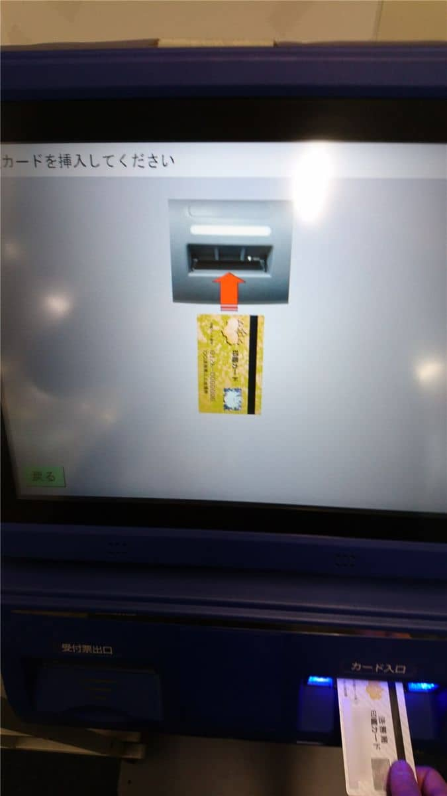
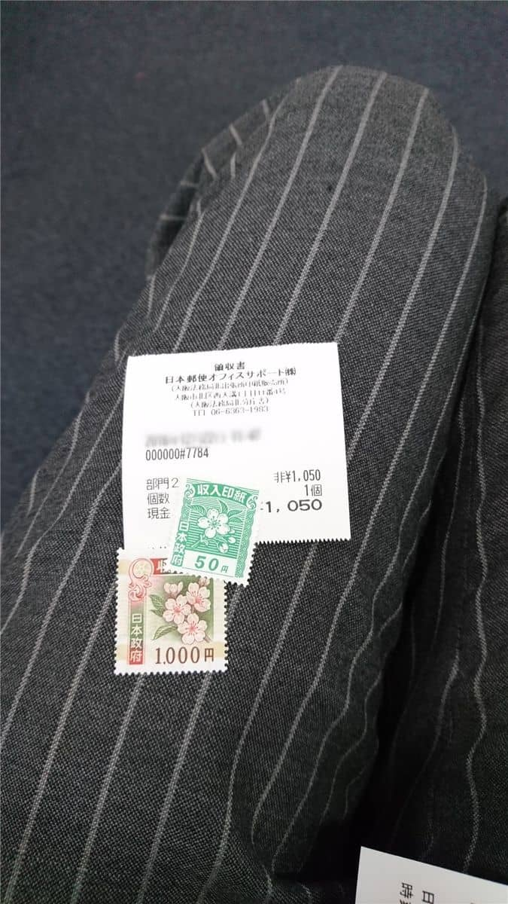

こんにちは。

久しぶりの奮闘記です。
奮闘してないわけではないのですが・・・(笑)

さて、今回は会社を運営していると幾度となく取得することになる履歴事項全部証明書や印鑑証明書取得の流れについて紹介します。

## 法務局にいく

証明書取得は大阪法務局（本局）にいかなくても、出張所で取得が可能です。
弊社の本社登記は大阪市福島区のため、対象の出張所は北出張所になります。

[大阪法務局 北出張所（きたしゅっちょうしょ）](http://houmukyoku.moj.go.jp/osaka/table/shikyokutou/all/kita.html)

## 到着から申請まで

今回のご紹介では、履歴事項全部証明書と印鑑証明書の取得です。

無料の駐車場が準備されています。(B1Fに位置します）
車で行くことが多いので助かります。

エレベーターでB1Fから2Fまで上がります。

印鑑カードを準備します。

2Fに入ってすぐ左側にこのような機械があります。
この機械で申請します。

同じ大阪ですが【管轄外】から進みます。
本社がある大阪市福島区を探して入力を進めます。
入力を進めるとカード挿入を求められます。

続けて必要な証明書を選択します。
1つの手続きで1種類ずつの手続きになります。
部数はこの後で指定できるようになっています。

1種類終われば、続けて申請するボタンがありますのではじめからの必要はありません。

申請が終わると、最後に手続き者の名前を入力し完了です。
履歴事項全部証明書と印鑑証明書を1通ずつ申請で1050円と受付票が出てきました。

部屋の奥に印紙販売所があるので、「1050円分の印紙ください」という感じで声をかけ買います。

ここまでで、申請手続きは完了で椅子に座ってしばし待ちます。

## 受け取り

待っていると、機械の最後で入力した名前でマイク呼び出しを受けます。
証明書だけであれば、5分も待たないと思います。

呼ばれた受付に行き、法人カードを見せ、指定された紙に印紙を貼ります。

これで、無事証明書を取得できました。

## あとがき

駐車場はありますが、各窓口横にある印を自分で押す必要がありますので忘れないようにしましょう。

株式発行などの手続きは本局に行く必要がありますので事前に電話などで確認すると確実かと思います。

参考になれば嬉しいです。

奮闘の頻度をあげなければ・・・(笑)
それでは、次回の記事でお会いしましょう。