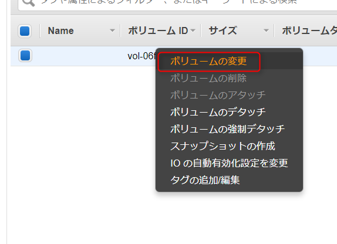
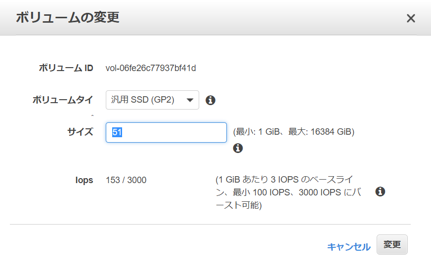
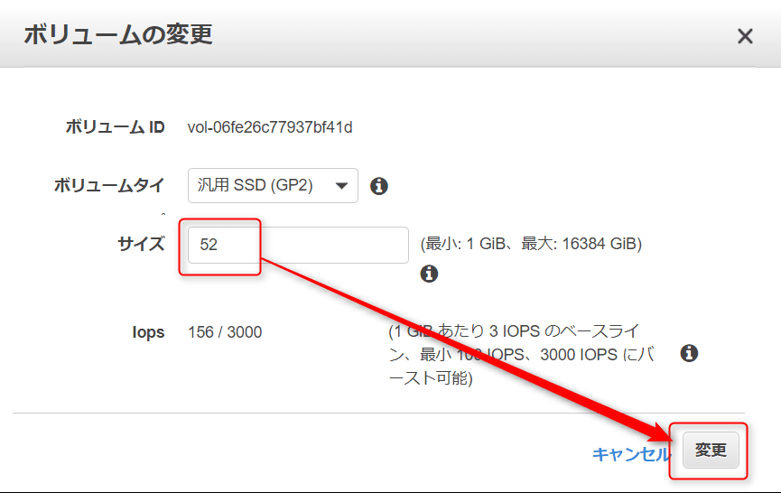
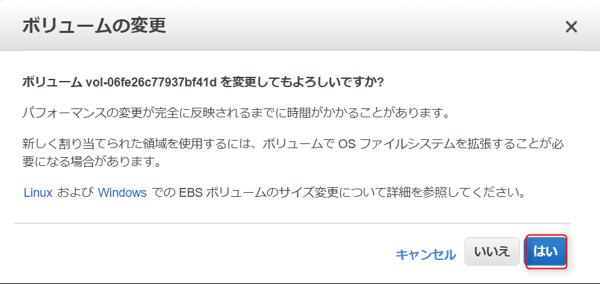
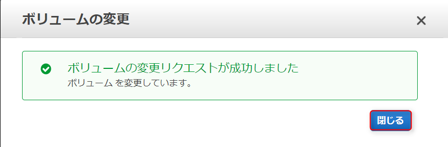
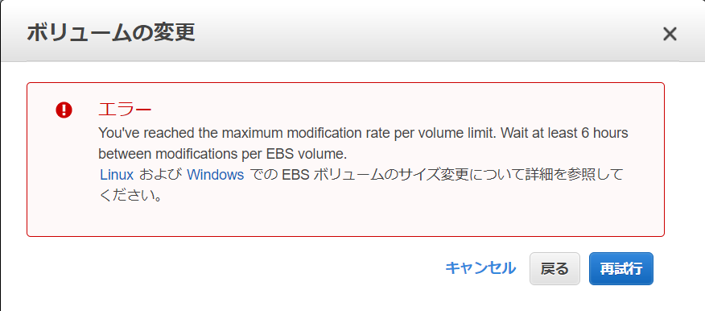

こんにちは。

今回は、AWSのEC2に構築したインスタンスに対してハードディスク（ストレージ）容量を増やす方法を紹介します。

OSは**Amazon Linux**です。

## 増量前

増量前の`df -m` の結果は以下のとおりです。

```
# df -m
Filesystem     1M-blocks  Used Available Use% Mounted on
devtmpfs             993     1       992   1% /dev
tmpfs               1001     0      1001   0% /dev/shm
/dev/xvda1         51275  1246     49932   3% /
```

`/dev/svda1` の **51275** に注目です。

## 増量手順

1. AWSの管理コンソールにログインします。

1. **EC2→ボリューム**と進みます。

1. 変更するボリューム上にマウスカーソルを合わせ、右クリックから**ボリュームの変更** に進みます。


1. 51GBから52GBに増量します。インスタンスは起動状態で実行可能です。

↓


1. 確認に応答します。

↓


1. インスタンスを再起動します。

1. 増量後の`df -m` の結果は以下のとおりです。
```
# df -m
Filesystem     1M-blocks  Used Available Use% Mounted on
devtmpfs             993     1       992   1% /dev
tmpfs               1001     0      1001   0% /dev/shm
/dev/xvda1         52283  1246     50940   3% /
```

**52283** に上がってますね！


## あとがき
あまりに簡単で感動しました(笑)

ただし、**拡大は出来るが、縮小はできないこと**、**一度変更すると6時間空けないと連続で変更できない** ということが確認されたので注意が必要です。



それでは次回の記事でお会いしましょう。

